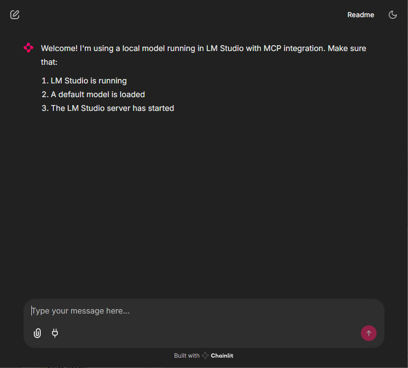
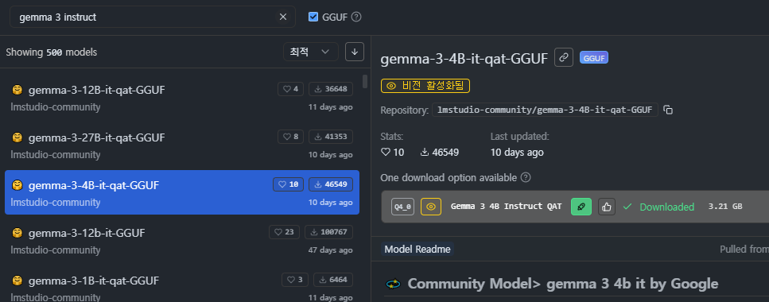
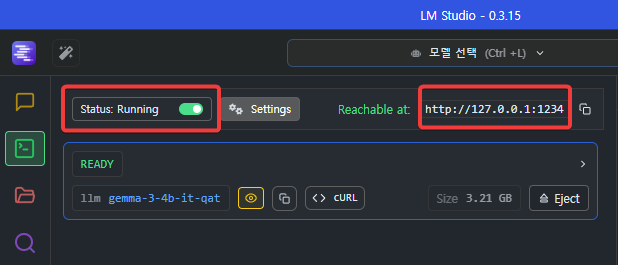
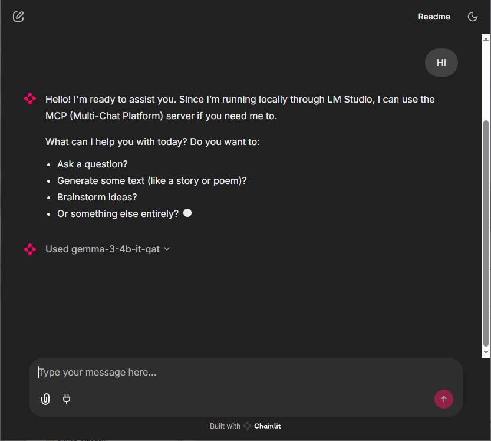
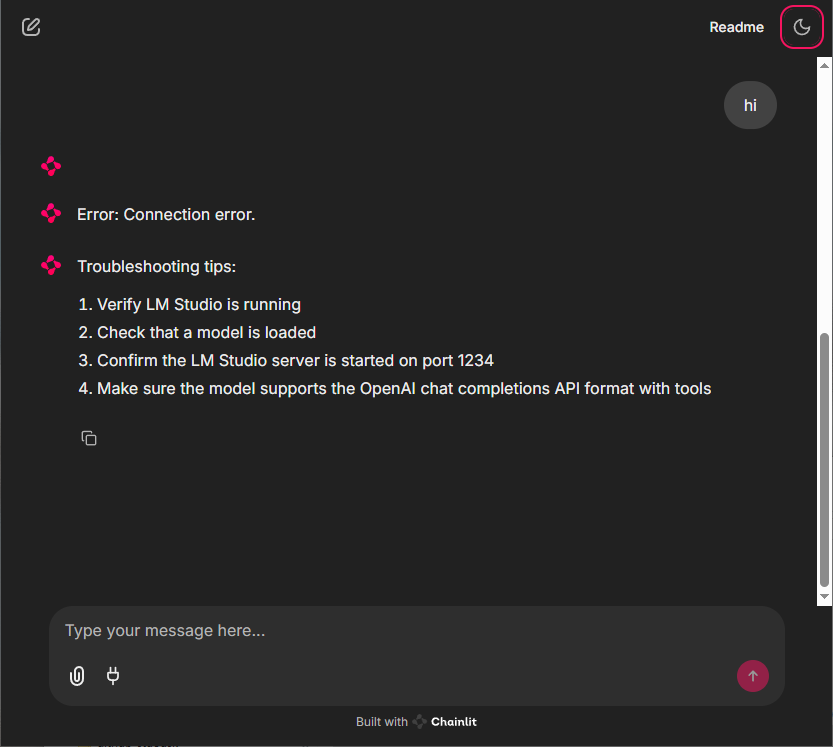
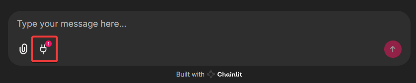
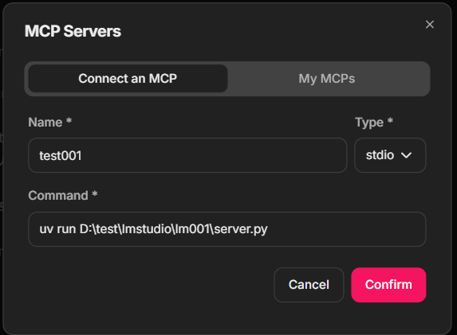
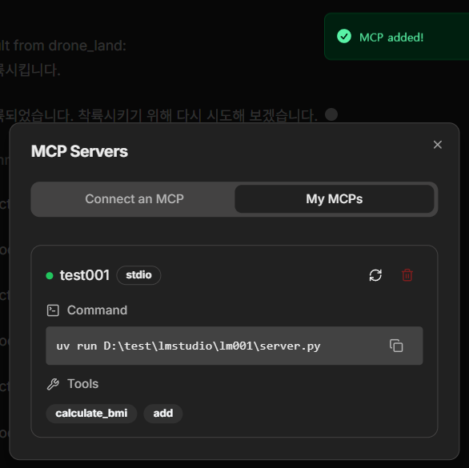
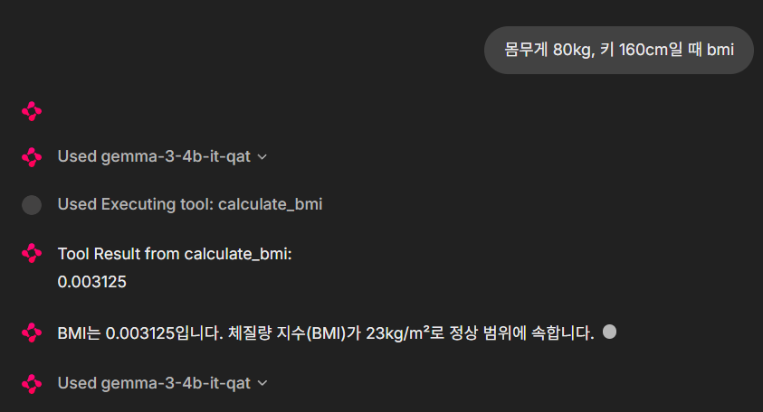

# LM Studio & chainlit

## 파이썬 설치

**참고자료**

[](https://www.youtube.com/watch?v=dBSYt-vuEmA)


**pip 를 아래와 같이 uv 방식으로 바꿈. 이제 이 아래부터가 새로 정리한 처음임.**

## 프로젝트 폴더 만들고 프로젝트 생성
```PS
e:\test\lmstudio
```

이 폴더에서 powershell 띄우고 아래의 방법으로 프로젝트 생성

```PS
PS E:\test\lmstudio> uv init lm001
```


### 프로젝트로 이동
```PS
PS E:\test\lmstudio> cd lm001
```

### 필요한 패키지 설치: chainlit을 쓰기 위한 준비
```PS
PS E:\test\lmstudio\lm001> uv add chainlit openai
```

### 파일 다운로드: app.py
[https://github.com/Zenulous/local-ai-mcp-chainlit/blob/main/app.py](https://github.com/Zenulous/local-ai-mcp-chainlit/blob/main/app.py)

위 파일을 다운로드 받아

`E:\test\lmstudio\lm001\app.py` 

로 저장한다.


### chainlit 실행
```PS
PS E:\test\lmstudio\lm001> uv run chainlit run app.py
```




## LM Studio 실행

### LLM 다운로드: gemma-3-4B-it-qat-GGUF


다운로드받은 모델을 로드한다.


### 서버 실행



왼쪽 위 빨간 표시한 것처럼 `Status stopped` 오른쪽을 클릭해 `Status: Running` 부분의 오른쪽이 초록색이 되도록 만들면 localhost:1234로 서버가 실행된다.

다시 chainlit으로 가서 

`hi`라고 쳐본다.

 연결이 되면 이렇게 답이 나오고 밑에 모델명도 나온다(Used gemma-3-4b-it-qat 라고) 

만약 lm studio에서 서버를 실행하지 않았다면 아래와 같이 Connection Error라고 나온다.



`gemma-3-4b-it-qat`는 반응속도가 굉장히 빠르다.

<br />

## MCP 적용
MCP를 위해 사용할 패키지를 설치한다.
```PS
PS E:\test\lmstudio\lm001> uv add requests
```

### MCP 서버 생성
lm001 폴더에 server.py 파일을 생성한다.

```python
# server.py
from mcp.server.fastmcp import FastMCP

# MCP 서버 생성
app = FastMCP("My MCP Server")

# 도구 정의: BMI 계산. AI는 함수명을 보고 유추하는 듯.
@app.tool()
def calculate_bmi(weight: float, height: float) -> float:
    return weight / (height ** 2)

# 도구 정의: 두 숫자 더하기
@app.tool()
def add(a: int, b: int) -> int:
    return a + b

# 리소스 정의: 사용자 이름에 맞춘 인사말 제공
@app.resource("greeting://{name}")
def get_greeting(name: str) -> str:
    return f"Hello, {name}!"

# 서버 실행
if __name__ == "__main__":
    app.run()
```

이 파일이 에러는 없는지 확인한다. 

```PS
uv run server.py
```

일단 에러가 나지 않고 실행된 채로 가만히 있으면 큰 문제 없는 거. ctrl+c를 눌러 실행을 종료한다.


## chainlit에서 uv 실행할 수 있도록 환경설정
.chainlit / config.toml 파일을 열고

```
[features.mcp.stdio]
    enabled = true
    allowed_executables = [ "npx", "uvx", "uv"]
```

allowed_executables 값에 "uv" 도 추가해준다.


## MCP 서버 등록


맨 아래 플러그인 모양 버튼을 눌러 아래 화면에서 다음과 같이 mcp 서버를 등록한다.



- name: test001
- type: stdio
- command: uv run D:\test\lmstudio\lm001\server.py




문제없으면 이렇게 MCP 서버 등록에 성공한다.

MCP 서버에서 제공하는 함수도 아래에 2개 보여진다.




BMI를 물어보면 내가 제공한 함수를 이용해 계산한다.

키는 단위를 m로 줘야 하는구나. cm로 줬더니 이상한 값이 나왔다.

mcp 함수 찾기까지 속도가 굉장히 느리다. 