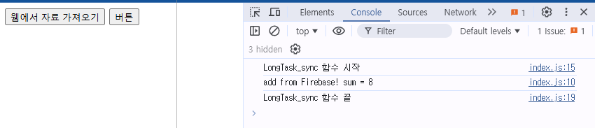

# 자바스크립트 비동기화

자바스크립트 비동기화는 Promise 클래스와 async/await로 대표된다.

현재까지는 도저히 자바스크립트 비동기화를 이해 못하고 있다. 

fetch() 같은 비동기화 함수를 쓰면 굳이 Promise 클래스나 async 키워드 없어도 그냥 바로 비동기가 된다. 오히려 fetch() 함수를 쓰면 동기화 방식으로 할 수 없는 거 같다. 

## 현재까지 해 본 것

먼저 firebase Cloud Function에서 함수를 하나 만들었다. 

firebase Cloud Function의 index.js 파일을 통쨰로 보면, 

``` js
const {onRequest} = require("firebase-functions/v2/https");
const logger = require("firebase-functions/logger");

 exports.add = onRequest((request, response) => {
    logger.info("add!", {structuredData: true});

    const a = request.query.a;
    const b = request.query.b;
    const sum = parseInt(a) + parseInt(b);

    const wakeUpTime = Date.now() + 5000;
    while (Date.now() < wakeUpTime) 
    {

    }    

    response.send("add from Firebase! sum = " + sum);
  });
 ```

 이렇게 add 함수를 만들었고, 5초후에 결과를 보내주도록 만들었다. 

그리고 내 로컬에 node.js 같은 거 없이 그냥 index.html과 index.js 파일을 만들었다. 

**index.html**

``` html
<!DOCTYPE html>
<html lang="en">
<head>
    <meta charset="UTF-8">
    <meta name="viewport" content="width=device-width, initial-scale=1.0">
    <title>Document</title>
    <script src="index.js"></script>
</head>
<body>
    <button onclick="LongTask_async()">웹에서 자료 가져오기</button>
    <button onclick="javascript:alert('버튼 눌림')">버튼</button>
</body>
</html>
```

**index.js**
``` js
function LongTask()
{
    var request = new XMLHttpRequest();
    request.open('GET', 'http://127.0.0.1:5001/asynctest002/us-central1/add?a=1&b=7', false);
    request.send();

    console.log(request.responseText);
}  

function LongTask_async()
{
    console.log("LongTask_sync 함수 시작");
    const promise = new Promise((resolve, reject) => {
        LongTask(); 
    });
    console.log("LongTask_sync 함수 끝");
    
}
```



이렇게 해 놓고, 

```
firebase emulators:start
```

라고 하면 이걸 deploy 하지 않고도 local에서 바로 테스트할 수 있다. 
5001번 포트에서 열린다.

여기서 XMLHttpRequest() 함수는 동기화 함수이다.  
이 상황에서 어떻게 해도 LongTask 함수의 내용을 동기적으로 처리할 수가 없다. 무조건 5초 기다린다.

반면에 XMLHttpRequest()가 아니라 애초에 비동기화 함수인 fetch() 함수를 이용하면 어떻게 해도 동기화로 처리할 수가 없다. 이거 어떻게 해야 하냐. 


## 알게 된 것.
Promise는 비동기화를 가능하게 해주는 클래스가 아니다. 그냥 비동기로 처리되는 것들에 대해 callback을 관리하고 쉽게 쓸 수 있도록 해주는 클래스였던 것.

자바스크립트도 별 거 없다. UI와의 비동기화를 하고 싶으면 타이머써야 한다.


async 예약어는 비동기화를 가능하게 해주는 예약어가 아니다. 그냥 Promise를 쉽게 쓸 수 있게 해 주는 역할만 한다.

그리고 자동으로 Promise로 리턴하게 해준다. return 1 이라고 하면 1을 Promise로 감싸서 리턴해준다.

await는 비동기화 함수 앞에서만 쓸 수 있는데 그걸 동기화되도록 쓰는 거. 죄다 쓰면 도대체 왜 비동기화 하는 거냐.