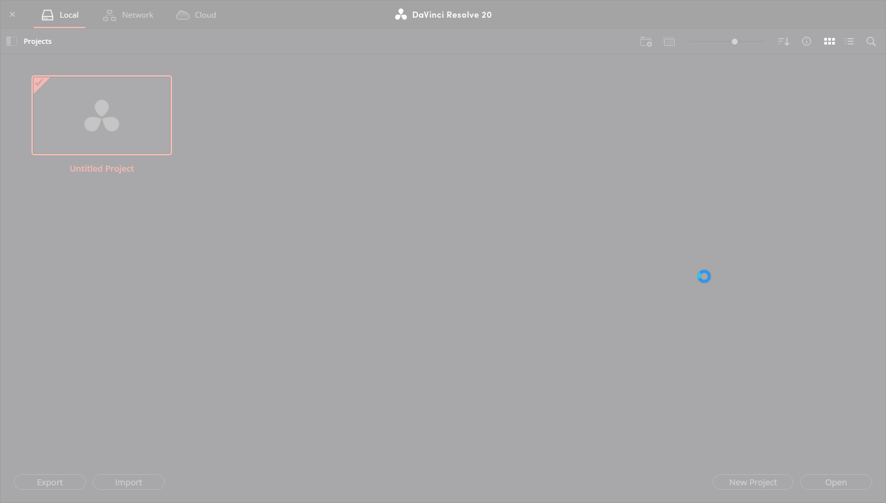
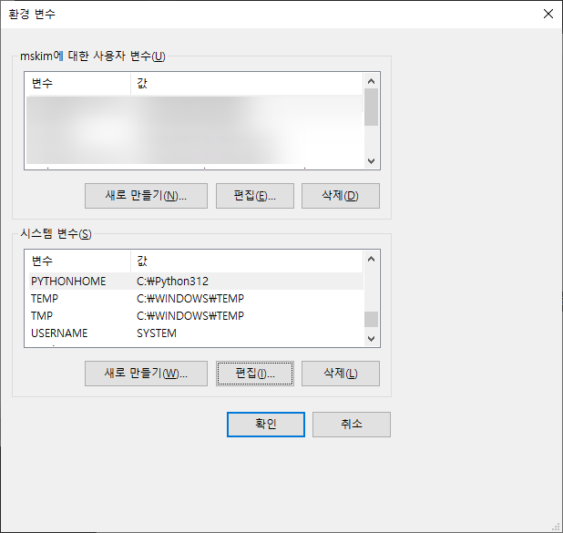
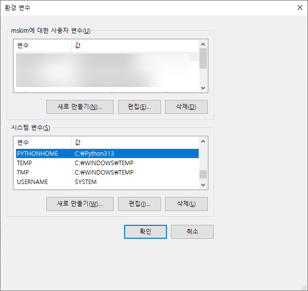

# davinci resolve

다빈치리졸브가  프로젝트 관리자까지만 오면 멈춰버린다.

이렇게 응답없음이 된다. 

찾아보니 가상데스크톱이 있으면 이렇게 된다고 한다. 그래서 가상데스크톱 하나를 지웠는데 문제가 계속 되었다. 

원인은 파이썬 버전때문이었다. 

다빈치리졸브 20은 파이썬 3.12까지 지원한다. 

최근에 파이썬 3.13을 설치한 게 문제였던 거 .

파이썬을 지우거나 할 필요없이

시스템 환경변수에 `PYTHONHOME`을 새로 추가하고 파이썬 3.12 의 위치로 설정해주면 바로 해결된다. 이런게 문제였다니.

이 문제는 `PYTHONHOME의 값을 다시 파이썬 3.13버전의 위치로 설정해주면 바로 다시 나타난다.

파이썬 버전만 맞춰놓으면 가상데스크톱을 켜 놓아도 잘 된다. 