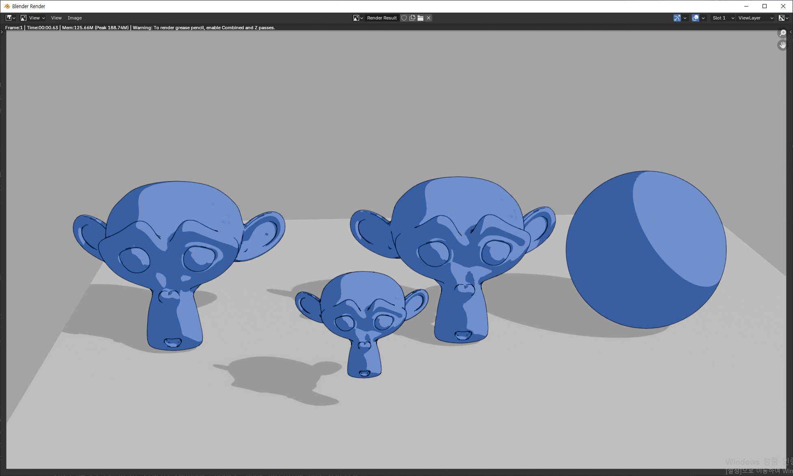
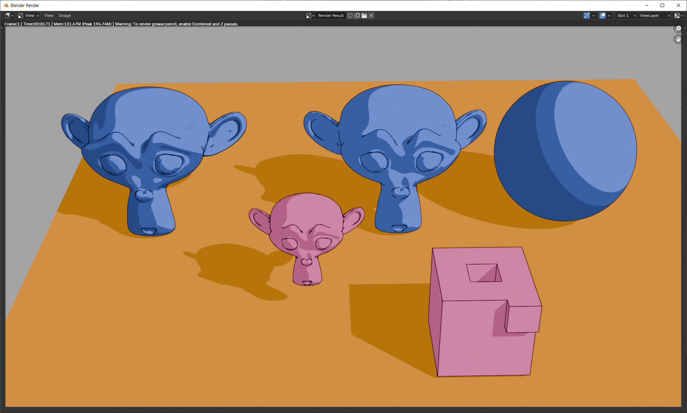
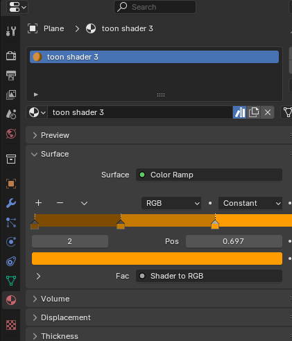

# blender

## toon shader

### 그림자 연하게 하기 1: world 조정

1. light를 sun으로 바꾸고 각도를 0도로 해서 fall off가 되지 않도록 한다.
2. light의 세기를 5 정도로 작게 한다. world의 밝기에 따라 조정한다. 
3. world를 밝게 한다. 그림자가 연해진다.

### 그림자 연하게 하기 2: 바닥의 재질을 color ramp로 해서

plane위에 그림자 부분이 그려지는 것도 material의 영향을 받는다. 

위와 같이 plane의 material을 color ramp로 잡아주면 바닥 전체는 가장 밝은 색으로 표현되고(world를 밝게 설정해서 전반적으로 밝으니까), 그림자 부분은 중간에 있는 색으로 표현된다.