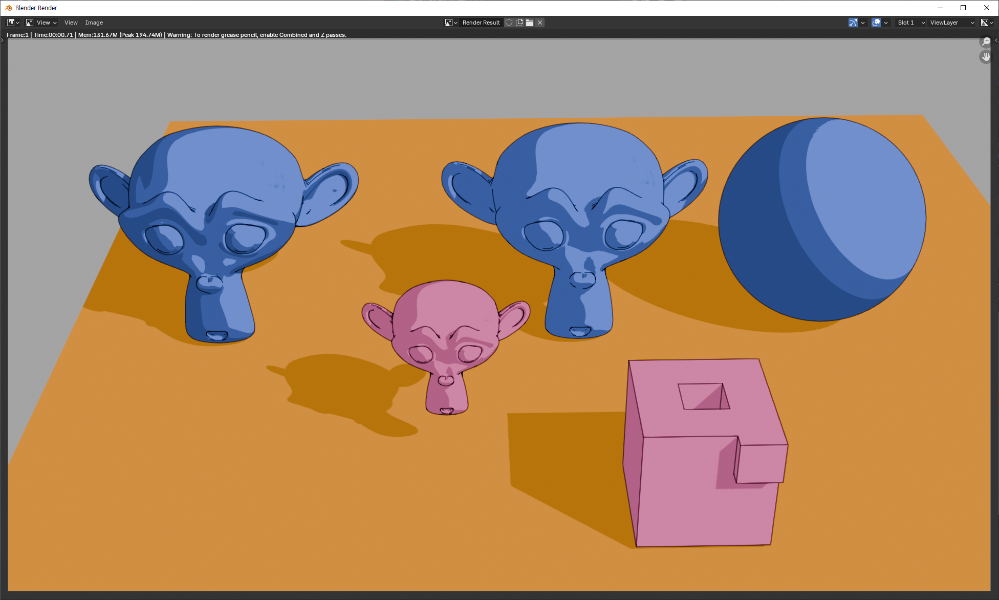
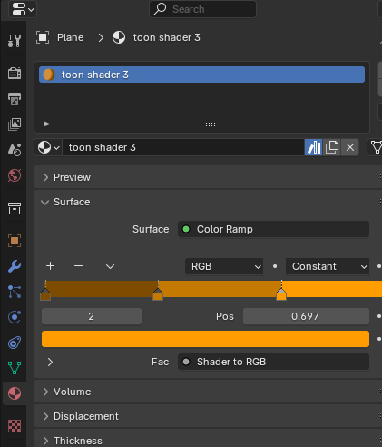

# toon shader

## shader

## 그림자 연하게 하기 

### w1: world 조정

1. light를 sun으로 바꾸고 각도를 0도로 해서 fall off가 되지 않도록 한다.
2. light의 세기를 5 정도로 작게 한다. world의 밝기에 따라 조정한다. 
3. world를 밝게 한다. 그림자가 연해진다.

### w2: 바닥의 재질을 color ramp로 해서

plane위에 그림자 부분이 그려지는 것도 material의 영향을 받는다. 

위와 같이 plane의 material을 color ramp로 잡아주면 바닥 전체는 가장 밝은 색으로 표현되고(world를 밝게 설정해서 전반적으로 밝으니까), 그림자 부분은 중간에 있는 색으로 표현된다.

## blender 4.2 그림자 fall off 아예 없애기(EEVEE)

rays값과 steps값을 모두 1로 하면 sun의 angle값과 상관없이 fall off를 없앨 수 있다.

## 테두리 선그리기

테두리 선은 기본적으로 grease pencil로 그린다.

1. 같은 선으로 그릴 객체들을 같은 collection으로 묶는다.

2. grease pencil을 추가(Shift + A, Grease Pencil > Blank)하고 별도의 collection으로 묶는다.

여기까지 하면

3. GPencil에 `Line Art` Modifier를 추가하고 아래와 같이 설정한다.

4. 오른쪽 오브젝트인 sphere를 보면 선이 삐뚤빼뚤 그려졌는데 실제로는 카메라로 보면 이 선은 그려지지 않는다. 하지만 만약 다른 오브제트에서 이렇게 선이 그려지는 문제를 해결하려면 `subdivision surface` modifier를 추가해준다.

특이하게도 edit 모드에 있는 오브젝트는 render 했을 때 선이 그려지지 않는다.