# 설치

## 환경
- 작성: 2025.08.28.
- windows 10
- visual studio code

## visual studio에서의 작업

flutter 플러그인을 설치한다.

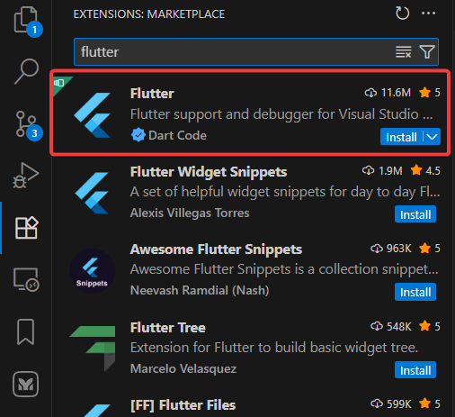

설치한 다음, plugin 창을 닫고, `Ctrl + Shift + P`를 눌러 명령 팔레트를 열고, 

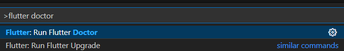

`flutter doctor`를 입력, `Flutter: Run Flutter Doctor` 를 실행한다.

flutter doctor이 개발환경을 점검하고 해야 할 일들을 알려준다.

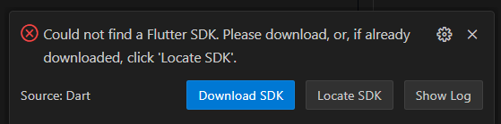

오른쪽 아래에 이렇게 나왔다. flutter sdk를 설치하라고 한다. 만약 이미 flutter sdk를 가지고 있으면 `locate SDK` 버튼을 눌러주면 된다. 나는 아예 없으니 `Download SDK`를 눌러 다운로드부터 하겠다. 

어느 폴더에 할 건지 위치를 물어보는데 `C:\sdk` 라고 하자. 자동으로 `flutter` 가 붙는다. 그래서 만약 `C:\sdk\flutter`라고 하면, `C:\sdk\flutter\flutter`가 된다. 

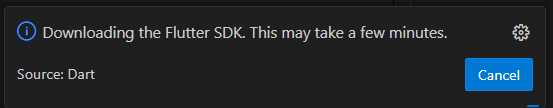

자동으로 다운로드 받고, 

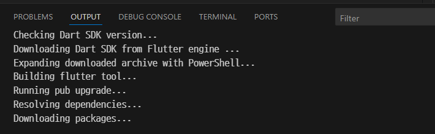

뭔가 설치도 알아서 한다.

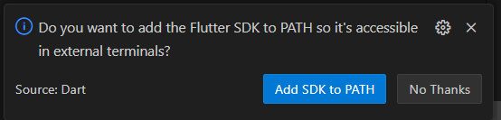

설치가 끝나면 path에 등록하겠냐고 물어본다. [Add SDK to PATH] 를 눌러준다.

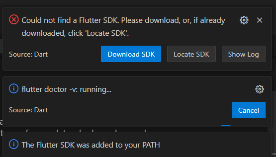

설치가 끝난 줄 알았는데 이런 메시지가 또 나온다.(맨 위)

그래서 이번엔 [Locate SDK] 버튼을 눌러주고,

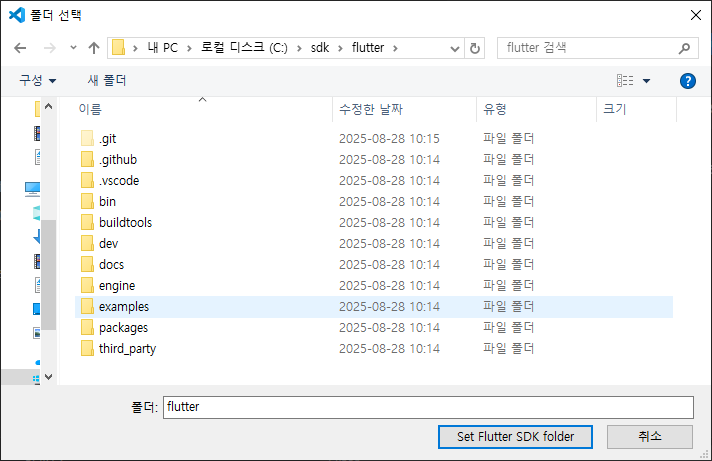

`C:\sdk\flutter`를 선택해 줬다.

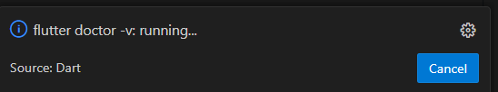

그럼 또 flutter doctor가 뭔가 일을 하고, 끝난 거 같다.


## flutter 프로젝트 생성

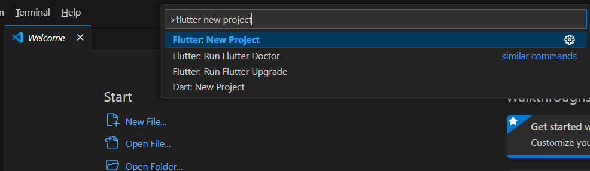

`Ctrl + Shift + P`를 눌러준다. 그리고 `flutter new project`를 입력하고 선택하면,

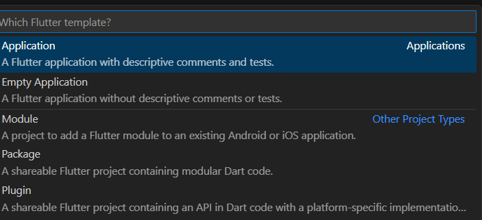

뭘 만들건지 물어본다. 여기서 `Application`을 선택했다.

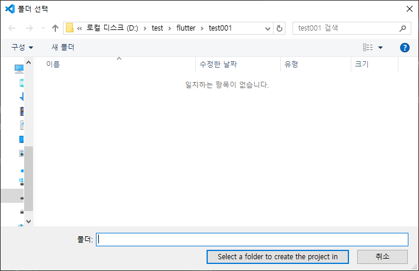

그럼 프로젝트 폴더를 물어본다.

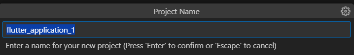

프로젝트 이름을 물어본다. (일단 기본값 그대로 줬다)

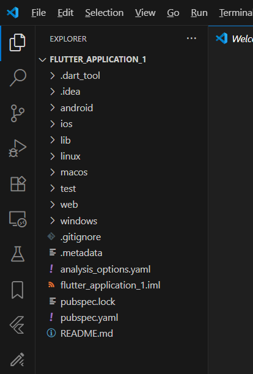

그럼 이렇게 프로젝트가 생성된다.


## flutter 프로젝트 실행

vscode의 오른쪽 아래를 보면 `No Device`라는 버튼이 있다. target이 정해져 있지 않다는 뜻이다.

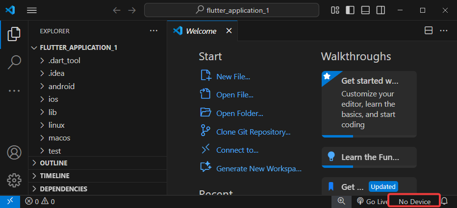

이 버튼을 눌러서

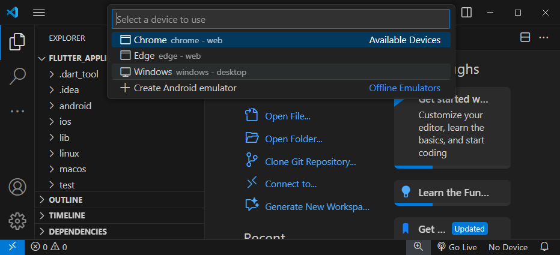

타겟을 Windows로 정해보자.


다행히도 이렇게 잘 바뀌었다.

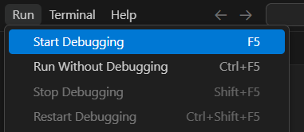

프로그램을 실행하려면 `Run > Start Debugging`을 하거나 `F5`키를 누른다.


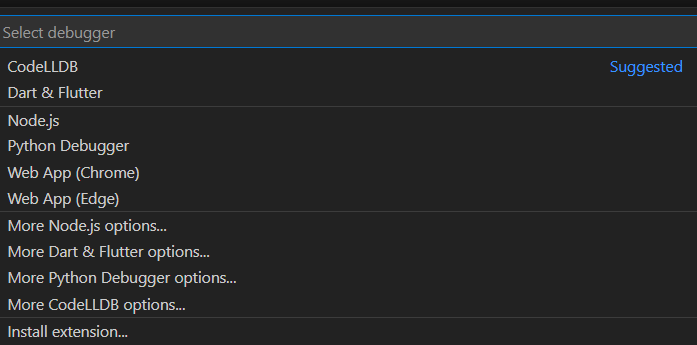

잠시 후 디버거를 선택하라는데 CodeLLDB 옆에 `suggested`가 붙어 있으니 이걸로 하자.

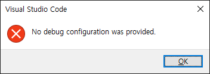

suggested의 배신으로 이런 메시지를 받게 되었다. [OK] 버튼을 누르면

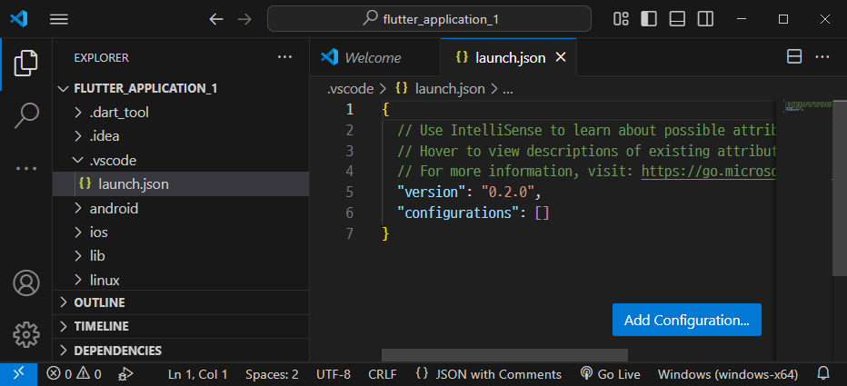

이런 환경설정으로 이동한다.

[Add Configuration] 버튼을 누르면, 

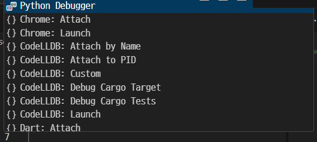

이런 화면이 나오는데, 여기서 밑으로 스크롤을 내려준다.

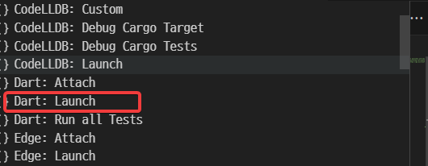

우리는 새로 프로젝트를 실행하니 `Dart: Launch`를 해준다. 만약 기존에 돌고 있던 프로세스에 디버거를 붙이는 거면 attach를 선택해 준다.

`launch.json`파일을 저장하고 다시 `F5`키를 누르면 실행된다.

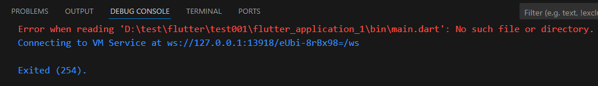

```
Error when reading 'D:\test\flutter\test001\flutter_application_1\bin\main.dart': No such file or directory.
Connecting to VM Service at ws://127.0.0.1:13918/eUbi-8rBx98=/ws

Exited (254).
```

그런데 이렇게 에러가 난다. 

가만 보면 프로젝트명\bin\main.dart가 없다는데 여기 가봐도 저런 파일 없다. 이 문제는 flutter의 entry를 잘못 설정해 줘서 생긴 문제다.

`.vscode/launch.json` 파일을 열어서 수정해야 한다. 기본 entry는 `lib/main.dart`이다. 

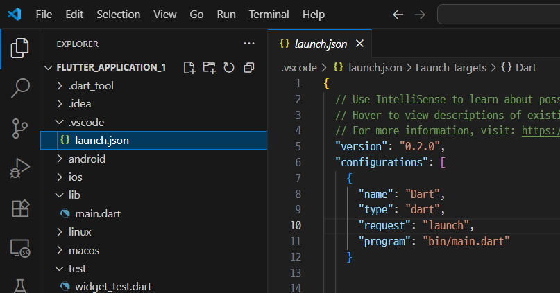

```json
      "program": "bin/main.dart"
```    

이 부분을 

```json
      "program": "lib/main.dart"
```    

이렇게 고쳐주고 다시 F5 키를 누르면, 

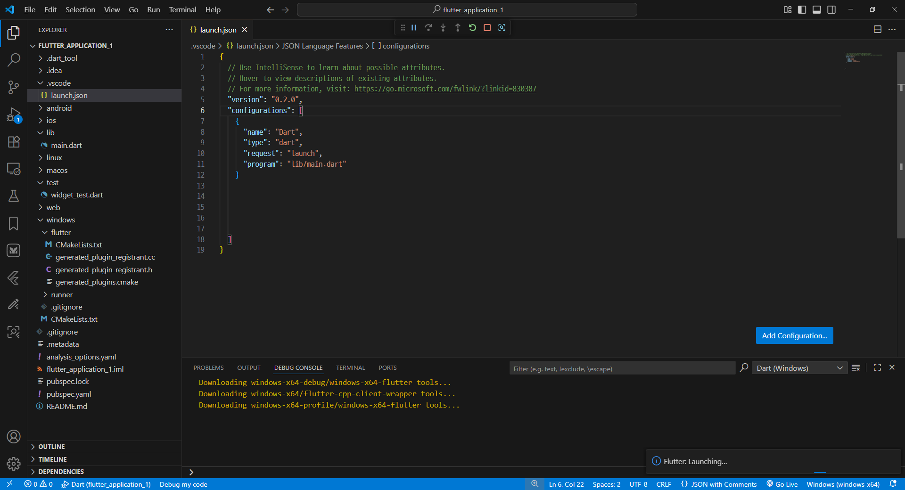

아래쪽 노란색으로 보이는 것처럼 윈도우 실행용 tool 들을 다운로드 받고 실행한다.

building에도 한참 걸린다. 

다 끝난 거 같은데 아마 아무 것도 안 나타난다. 오른쪽 아래에 뭔가 또 선택하는 게 나왔었는데 금방 사라져서 못 봤다.

암튼 다시 `F5`키를 눌러보면, 

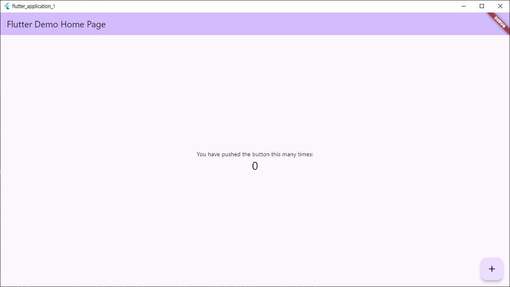

이런 프로그램이 나타난다.

`D:\test\flutter\test001\flutter_application_1\build\windows\x64\runner\Debug\` 에 실행파일 `flutter_application_1.exe`이 있고, 따로 실행해보면 실행 잘 된다. 
