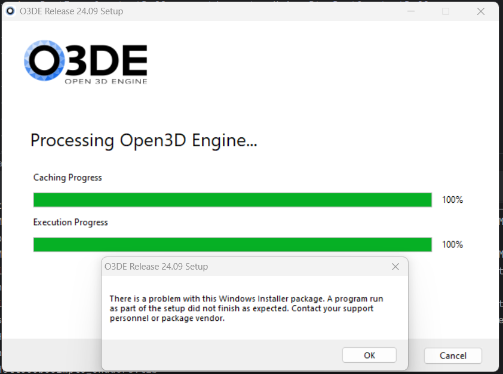
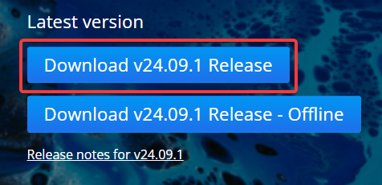
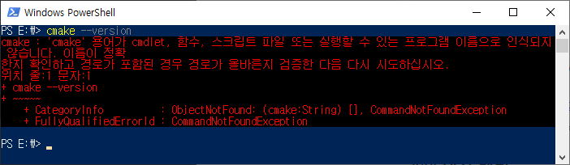
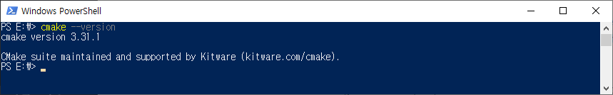
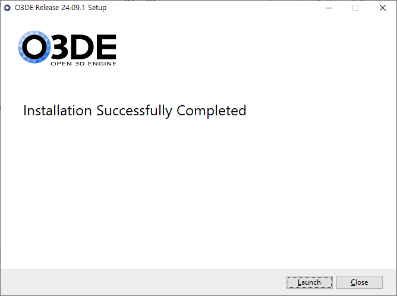

# O3DE 설치하기

## 다운로드
url: https://o3de.org/download/

## 최소 요구사항
O3DE requires Windows 10 64-bit (versions 1809, 10.0.17763 or later)

- 2.5 GHz Intel or AMD processor with 4 or more physical cores
- 8 GB RAM
- DirectX 12, Vulkan-compatible, or Metal-compatible video card with 2 GB VRAM minimum
  - NVIDIA GeForce GTX 1060 with driver version 471.11 or later
  - AMD Radeon Pro 560 or higher with latest drivers
  - Intel HD 630 or higher with latest drivers
  - Shader Model 6.2 (or Shader Model 6.3 to use raytracing features)
  - 4 GB VRAM recommended
- 40 to 100 GB of free disk space
- 1366 x 768 px screen resolution
- (Recommended) Microsoft Visual Studio 2019 or 2022.
- Visual Studio C++ Redistributable
- **CMake 3.22.0 or later**

## 나의 설치 경험
https://github.com/o3de/o3de/issues/18376  

나도 정확히 위 URL의 글과 같은 현상이 나타났다. 

### 내가 했던 일
- Offline 버전이 아닌 웹에서 다운로드 받는 인스톨러를 다운로드 받아 설치
  
  

  저 에러 나타남.

- 위 이미지의 아래에 있는 offline 버전 다운로드받아 설치
여전히 저 에러 나타남.

- 보니까 맨 마지막의 CMake가 설치되어 있기는 한데 버전이 3.22보다 한참 낮음(정확히는 기억 안남)

  - 만약 CMake가 없다면 이렇게 보일 것.
    
    
    

### 문제 해결
- CMake 최신 버전으로 offline 버전 재설치
  
  

  여전히 저 에러 나타남
  
- 관리자 권한으로 offline 버전 재설치.

  문제 해결

  

  ## 다른 컴퓨터에서

  GONG 컴퓨터에서는 설치할 때 offline 버전 설치했지만 관리자 권한으로 설치하지 않았는데 한방에 잘 설치됨. 헐.