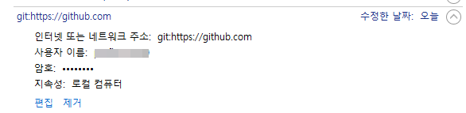
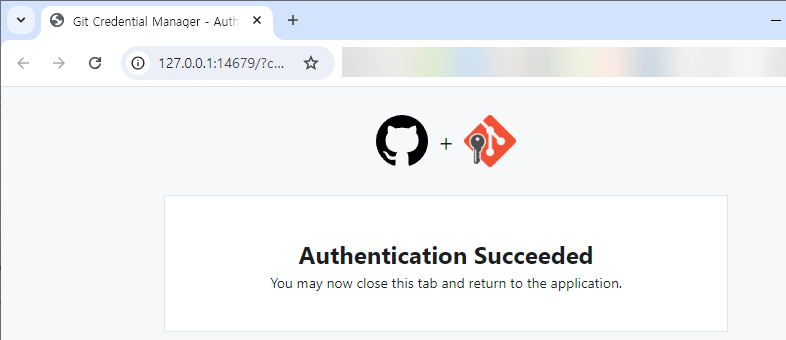
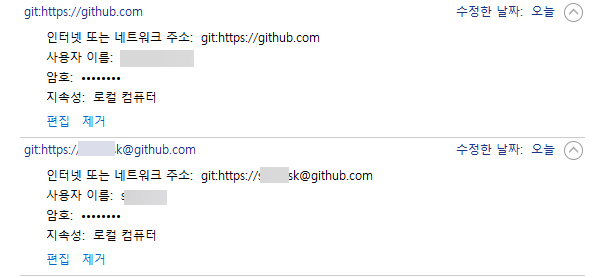
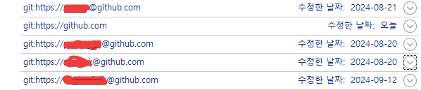

# github private repository에 git bash에서 접속하기

git bash에서는 github와 통신할 일이 있을 때 로그인이 필요하면 자동으로 로그인 화면을 띄여준다 함.

그런데 나는 그런 화면이 나오질 않음.

```shell
$ git pull
remote: Repository not found.
fatal: repository 'https://github.com/userID/project.git/' not found
```

이런 식이다.

그래서 아래와 같이 해 보았다.

제어판 > 사용자 계정 > 자격 증명 관리자 > Windows 자격 증명 > 일반 자격 증명 
에서 github가 들어간 모든 아이템 삭제

그랬더니 로그인 창이 나왔다. 


browser를 이용한 로그인을 했다. 

아.. 그런데 select user인가 하는 창이 아니라 로그인을 하라는 창이 나온다. 이건 또 내가 원하는 건 아닌데.. 나는 아이디 목록이 쭉 나오고 그 중 하나를 선택하는 걸 하고 싶다. 암튼.

그랬더니 다시  


이렇게 일반 자격 증명에 하나가 추가되었다.


그리고 git pull을 해 보았더니

```shell
$ git pull origin
fatal: unable to connect to cache daemon: Unknown error
Already up to date.
```

이렇게 fatal error가 나왔다. 

이건 아무래도 

```shell
git config --global credential.helper cache
```

로 설정해 놔서 생긴 문제인거 같았다. 그래서

```shell
git config --global credential.helper store
```
로 해주었다. 그랬더니

```shell
$ git pull
Already up to date.
```

이 에러는 없어졌다.

다른 아이디에서 clone한 곳에 가서 git pull을 해 보았다. 그랬더니 


이 창이 또 나온다. 

아까 아이디로 github 로그인하고 열어놨던 브라우저를 닫고 방금 전 git pull을 한 아이디로 새로 브라우저를 열고 로그인했다.



이렇게 로그인에 또 성공했다.

그리고 다시 windows 자격 증명을 확인해 봤더니 



이렇게 하나가 추가되었다. 위 그림에서 밑에가 새로 추가된 거다. 

좀전에 추가될 때는 아이디가 따로 나오지 않았는데 방금 전 추가될 때는 id@github.com 식으로 추가되었다.

이 상태에서 다시 아까 아이디로 clone 한 local directory로 가서 git pull 해 보았다.


헐 드디어 내가 원하던 select an account가 나왔다.

진짜 몇달동안 고민하던 문제가 해결되었다.

그런데 이렇게 해 놓고 보니까 굳이 includeif 를 할 필요가 없는 거였네.어차피 select an account가 나와서 그 중 하나를 고를텐데... 

.. 라고 쓰고 좀 사용하다 보니 이게 아니다. 

```
$ git commit -m "update"
Author identity unknown

*** Please tell me who you are.

Run

  git config --global user.email "you@example.com"
  git config --global user.name "Your Name"

to set your account's default identity.
Omit --global to set the identity only in this repository.

fatal: unable to auto-detect email address (got 'eugene@DESKTOP-seersssQ.(none)')
```

라는 에러가 났다. 

바로 includeif 해서 해결함.


-- 추가 (2024. 9. 15.) --  

여기부터
제어판 자격증명에서 github 관련된 자격증명을 지운 후에 github 로그인 창이 나오게 하려면

`C:/Program Files/Git/etc/gitconfig` 파일에서 아래와 같은 설정이 있어야 하는 거 같다.

```
[credential]
	helper = C:/Program\\ Files\\ \\(x86\\)/Git\\ Credential\\ Manager/git-credential-manager.exe	
```

여기까지 다 잘못되었음. 저렇게 하지 않아도 github 로그인 창이 나온다.	

이렇게 자격증명이 되어야 여러 개의 아이디를 사용할 수 있나 보다.  


<br/>
<br/>

-- **추가(2024. 10. 5.). 최종 해결** --

제어판 자격증명에 github 관련 자격증명이 

git:https://github.com

하나만 있을거다.  \[일반 자격 증명 추가\] 버튼을 눌러 하나를 더 추가한다.

- 인터넷 또는 네트워크 주소 : git:https://ID@github.com
- 사용자 이름: 아무거나
- 암호: 아무거나

일단 저렇게 인터넷 또는 네트워크 주소 를 넣어 놓은다. ID는 저렇게 그냥 ID라고만 하면 된다. 

git:https://github.com
외에 또 다른 일반 자격 증명이 있기만 하면 된다.

그리고 다시 안 되던 private repository에 가서 git pull 해 보면 


이 창이 나올텐데, 이 때 \[Add a new account\] 를 선택해서 새로운 git ID를 추가하면 된다. 드디어 해결.
