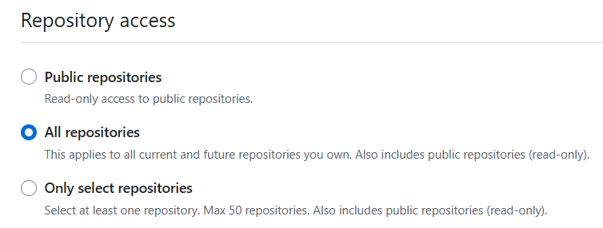
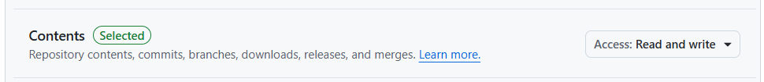

# linux에서 접속(token)

github에 만든 코드를 linux server cli에서 접속하려면 ssh 등의 방법도 있지만 token을 사용하는 방법도 있다. 

참고: [https://docs.github.com/ko/authentication/keeping-your-account-and-data-secure/managing-your-personal-access-tokens](https://docs.github.com/ko/authentication/keeping-your-account-and-data-secure/managing-your-personal-access-tokens)

## 토큰만들기
1. github에서 오른쪽 맨 위 사용자 아이디 프사를 클릭한다.
2. settings를 클릭한다.
3. 맨 아래 <> Developer settings를 클릭한다.


4. Personal access tokens / Fine-grained tokens를 선택한다.
5. 위 그림에서 [Generate new token] 버튼을 눌러 새 토크을 만든다.
6. 토큰을 만드는 화면에서 repository access를 설정할 수 있는데, 보안을 위해 Only Select repositories를 선택하거나 그 위 All repositories를 선택한다.


7. 그 아래 permissions에서 아래와 같이 contents에 access 권한을 줘야 일단 접속이 되고 clone 등을 할 수 있다.


이렇게 만들어진 토큰은 만들 때 딱 한 번 보여주고 그 다음부터는 보여주지 않으니 어디에 잘 복사해 놔야 한다.


## 토큰 사용하기

clone 하기
```ps
git clone https://github.com/<USERID>/<PROJECT>.git

username 을 물어보면 username을 답하고,  
password 를 물어보면 토큰 값을 붙여넣기 하면 된다.
```

이렇게 password에 넣는 값은 console에 남지 않기 때문에 안전하게 사용할 수 있다.

이렇게 리포지토리에 토큰이 걸려 있어도 이전처럼 윈도우에서 브라우저를 이용한 접속(git-credential-manager.exe 를 이용한)은 계속 사용할 수 있다.