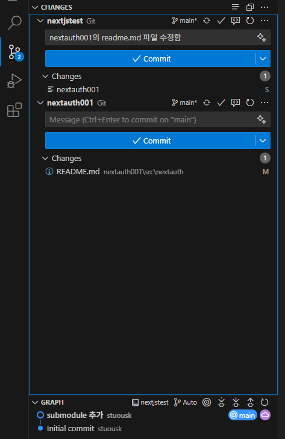
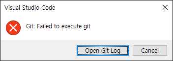
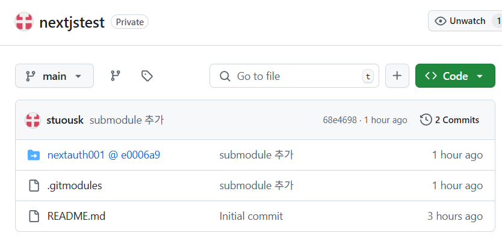

# git

## 새 프로젝트 N을 만들면서 기존 프로젝트 O를 N 아래에 두고 싶을 때

### O 프로젝트를 submodule로 선언
submodule 기능을 사용하면 된다.

```ps
N 프로젝트 루트 > git submodule add <프로젝트 O Git URL> <O를 위한 폴더 이름>
```

예를 들면

```ps
N 프로젝트 루트 > git submodule add https://github.com/stuo/nextauth001.git nextauth001
```

N 프로젝트의 루트에 .gitmodules 파일 생성된다.

```
[submodule "nextauth001"]
	path = nextauth001
	url = https://github.com/stuo/nextauth001.git
```

이제 commit 하면 됨.

<br />

### N / O 폴더에서만 수정하고 N 폴더의 루트에서 커밋하면 N에만 반영될까 O에만 반영될까 N과 O 모두 반영될까.

이걸 알아야 submodule을 정확하게 이해하는 거임. 

정답: **O 프로젝트의 변경사항은 O 프로젝트에만 반영**되기 때문

submodule은 O 프로젝트의 특정 커밋을 참조만 하는 거임. N 프로젝트에서 `git status`를 해도 O 프로젝트의 변경사항이 있다고 나타나지만 


`git add`를 해도 
```PS
PS E:\stuo\nextjstest> git status
On branch main
Your branch is up to date with 'origin/main'.

Changes not staged for commit:
  (use "git add <file>..." to update what will be committed)
  (use "git restore <file>..." to discard changes in working directory)
  (commit or discard the untracked or modified content in submodules)
        modified:   nextauth001 (modified content)

no changes added to commit (use "git add" and/or "git commit -a")
```



vscode git extension에는 이렇게 2개의 commit 버튼이 나타난다. 위가 N 프로젝트, 아래가 O 프로젝트다. 

여기서 위에 있는 N 프로젝트에 뭔가 내용을 넣고 커밋해도 



이렇게 에러난다.


## console에서 O 프로젝트 커밋

O 프로젝트의 루트 폴더로 가서 `git add .` 을 하고, `git status` 해 보면 잘 들어가 있는 걸 확인할 수 있다.

결국 각각 돌아가는 프로젝트 라는 걸 알 수 있다.



github에서 보면, N 프로젝트에 O 프로젝트가 이렇게 파란색으로 표시되고 클릭하면 O 프로젝트 repository로 이동한다.