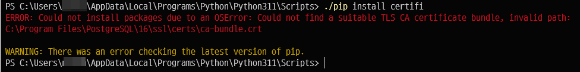
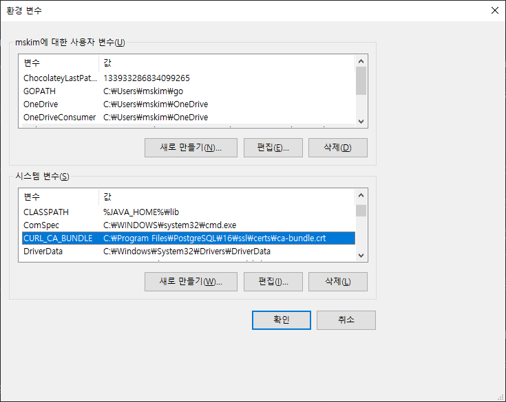
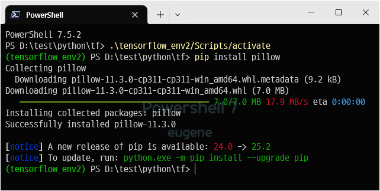

## pip install 하면 인증서 어쩌고 에러가 난다.

```ps
./pip install certifi
ERROR: Could not install packages due to an OSError: Could not find a suitable TLS CA certificate bundle, invalid path: C:\Program Files\PostgreSQL\16\ssl\certs\ca-bundle.crt

WARNING: There was an error checking the latest version of pip.
```

`pip install`만 하면 이런 에러가 난다. 



postgresql에 있는 인증 관련 기능을 사용하는데 거기에 문제가 있다는 거 같다. 

gemini가 환경설정에서 `REQUESTS_CA_BUNDLE` 환경변수를 제거하거나 뭔가 제대로 값을 주고 리부팅하라고 했지만 내 환경 변수에는 저런 설정이 없다. 

그래서 에러메시지에 언급된 `C:\Program Files\PostgreSQL\16\ssl\certs\ca-bundle.crt` 을 사용한 설정이 있나 보니, 

시스템 변수 / CURL_CA_BUNDLE 설정에 딱 저 값이 들어가 있다. 

저 파일이 실제 있는지 확인해 보니, postgresql을 16에서 17로 업그레이드하면서 저 경로는 실존하지 않는 경로가 되었고, 17 버전에는 저런 파일이 없다. 내가 뭔가 16버전에서 설정했던 거 때문일 수도 있고.


암튼, 이 설정을 지울경우 어떻게 되는지에 대한 실험결과이다.



CURL_CA_BUNDLE 설정을 지우고 리부팅없이 바로 터미널만 새로 띄우고 해 보니 잘 된다. 하...




## 오늘의 교훈
- 윈도우 스토어의 파이썬은 절대 설치하지 말자. 이상한 곳에 설치되어 통제가 안됨.

- 시스템에서 사용할 파이썬 버전은 환경변수에서 path로 관리하자. 

- 다빈치리졸브가 프로젝트 목록 나오는 창에서 죽으면 파이썬 버전을 낮추자. 현재 3.11에서는 잘 동작하고 있다. 3.13에서는 무조건 죽는다.