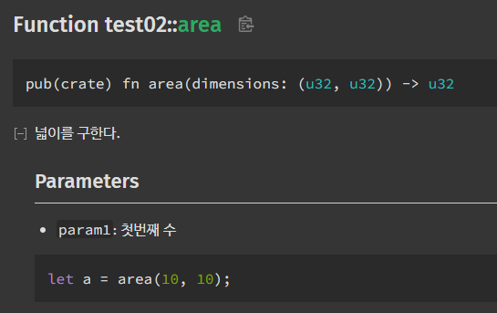
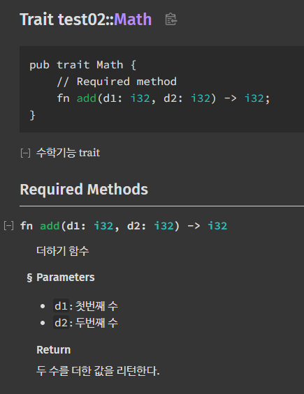

# rust 코드에 document 달기

```rust
/**
 * 넓이를 구한다.
 * # Parameters
 * * `param1`: 첫번째 수
 * ```rust
 * let a = area(10, 10);
 * ```
 */
fn area(dimensions: (u32, u32)) -> u32
{
    dimensions.0 * dimensions.1
}
```

rust 는 자체적으로 document를 지원한다.
markdown 형식을 지원한다.
위와 같이 하면,



```rust
/** 
 * 수학기능 trait
 */
pub trait Math 
{
    
    /// 더하기 함수
    /// 
    /// # Parameters
    /// * `d1`: 첫번째 수
    /// * `d2`: 두번째 수
    /// 
    /// # Return
    /// 두 수를 더한 값을 리턴한다.
    fn add(d1: i32, d2: i32) -> i32;
}
```



와 같이 나온다. 

```shell
PS E:\test\rust\test02> cargo doc --open
 Documenting test02 v1.0.0 (E:\test\rust\test02)
    Finished `dev` profile [unoptimized + debuginfo] target(s) in 0.91s
     Opening E:\test\rust\test02\target\doc\test02\index.html
```

위와 같이 `cargo doc --open`으로 문서를 만들 수 있다.