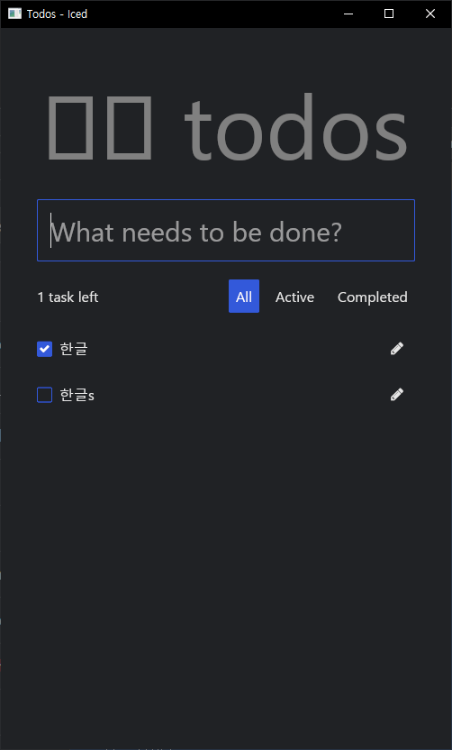
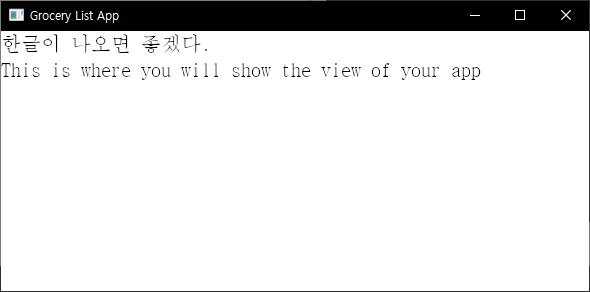
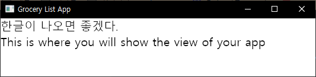
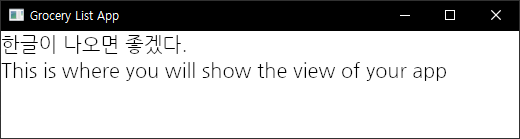
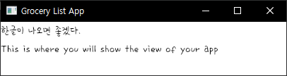
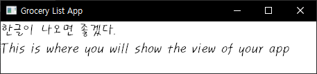
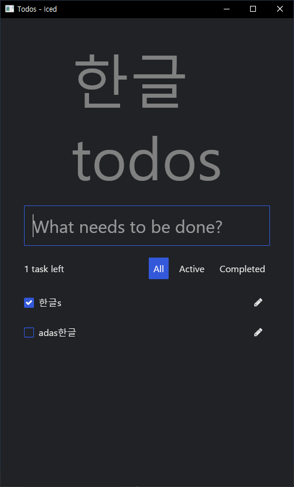

# rust 1.79 + iced 0.12.1 한글 나오게 하기



코드에

```rust
let title = text("한글 todos")
```

라고 하면 맨 위에 처럼 한글이 제대로 나오지 않는다.

그 아래 `What needs to be done? ` 라고 된 부분에 한글이 아무리 해도 입력조차 안되는데, 그러니까 한영키를 눌러도 그냥 영문으로만 입력이 되는데 다른 데서 한글을 쓰고 복사해서 붙여 넣으면 데이터가 추가되어 저렇게 한글로 제대로 보여진다. 모냐 이거. 하.


## 일단 한글이 나오긴 한다. 2024. 6. 29. 12:45



`impl Sandbox for GroceryList` 안에서

```rust
fn view(&self) -> Element<Self::Message> {
		text("한글이 나오면 좋겠다.\nThis is where you will show the view of your app")
        .size(20)
        .font(Font::MONOSPACE)        
		.into()
```

이제 custom font malgun.ttf를 쓰는 방법을 알아보자. 

## 맑은고딕 잘된다. 맑은고딕은 windows 기본 글꼴.


```rust
fn view(&self) -> Element<Self::Message> {
		text("한글이 나오면 좋겠다.\nThis is where you will show the view of your app")
        .size(20)
        //.font(Font::MONOSPACE)        
        //.font(Font::with_name("../fonts/malgun.ttf")) // 이건 안 됨.
        .font(Font::with_name("맑은 고딕"))
        //.font(Font::with_name("나눔고딕"))
        //.font(Font::with_name("휴먼편지체"))
        //.font(Font::with_name("Sandoll 미생"))        
		.into()
	}
```


## 나눔고딕. 글꼴은 미리 설치되어 있어야 한다.


```rust
fn view(&self) -> Element<Self::Message> {
		text("한글이 나오면 좋겠다.\nThis is where you will show the view of your app")
        .size(20)
        //.font(Font::MONOSPACE)        
        //.font(Font::with_name("../fonts/malgun.ttf")) // 이건 안 됨.
        //.font(Font::with_name("맑은 고딕"))
        .font(Font::with_name("나눔고딕"))
        //.font(Font::with_name("휴먼편지체"))
        //.font(Font::with_name("Sandoll 미생"))        
		.into()
	}
```

나눔고딕도 잘 된다.
맑은 고딕이랑 비슷한데 맑은 고딕이 좀 더 세로로 길다.

## 산돌미생체


## 휴먼편지체


```rust
#main.rs 전문

use iced::{Element, Sandbox, Settings};
use iced::{Font};
use iced::widget::text;

struct GroceryList {}
#[derive(Debug, Clone)]
enum Message {}

impl Sandbox for GroceryList 
{
	type Message = Message;

    	
	/* Initialize your app */
	fn new() -> GroceryList {
		Self {}
	}
	
	/**
	* The title of the window. It will show up on the top of your application window.
	*/
	fn title(&self) -> String {
		String::from("Grocery List App")
	}
	
	fn update(&mut self, message: Self::Message) {
		// Update the state of your app
	}
	
	fn view(&self) -> Element<Self::Message> {
		text("한글이 나오면 좋겠다.\nThis is where you will show the view of your app")
        .size(20)
        //.font(Font::MONOSPACE)        
        //.font(Font::with_name("../fonts/malgun.ttf")) // 이건 안 됨.
        //.font(Font::with_name("맑은 고딕"))
        //.font(Font::with_name("나눔고딕"))
        .font(Font::with_name("휴먼편지체"))
        //.font(Font::with_name("Sandoll 미생"))        
		.into()
	}
}

fn main() -> iced::Result 
{
	GroceryList::run(Settings::default())    
https://www.youtube.com/watch?v=epsLvcdXMr8&list=PLZWdwSd12Q74o3ne0nUztVeUr9JDJIbSL&index=6&pp=iAQB}
```

아까 안되었던 todos example도 이 방법으로 하니까 잘 됨.



```rust
fn view(&self) -> Element<Message> {
        match self {
            Todos::Loading => loading_message(),
            Todos::Loaded(State {
                input_value,
                filter,
                tasks,
                ..
            }) => {
                let title = text("한글 todos")
                    .width(Length::Fill)
                    .size(100)
                    .font(Font::with_name("맑은 고딕"))
                    .color([0.5, 0.5, 0.5])
                    .horizontal_alignment(alignment::Horizontal::Center);
```
				
todos example에서도

```rust
let input = text_input("What needs to be done?", input_value)
                    .id(INPUT_ID.clone())
                    .on_input(Message::InputChanged)
                    .on_submit(Message::CreateTask)
                    .padding(15)
                    .font(Font::with_name("맑은 고딕"))
                    .size(30);
```

이렇게 해도 저 "What needs to be done? 이라고 쓰인 입력창에 한글을 입력할 수가 없다. 한영 키를 눌러도 아무런 변화가 없다. 이건 자체적인 한글 입력 기능이 없는 듯하다.


이제 ttf 폰트를 읽어와서 쓰는 방법도 찾아봐야겠네.