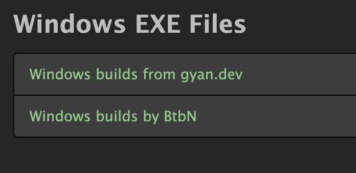

# rust에서 ffmpeg 개발하기

ffmpeg 개발할 때 몇몇 환경설정을 해야 한다. 

1. ffmpeg 설치.
2. ffmpeg 개발환경 라이브러리 설치
3. LLVM 설치

## ffmpeg 설치

rust의 ffmpeg-next crate는 ffmpeg를 이용한다.
ffmpeg는 기본적으로 설치 프로그램을 제공하지 않는다. 

https://ffmpeg.org/download.html 에서

여기에서 둘 중 아무데나 들어가자. ffmpeg대신 빌드한 릴리즈를 공유하는 곳이다. 
여기서 빌드된 바이너리를 받으면 된다.

압축을 풀고, 윈도우 환경설정의 path에 ffmpeg.exe 파일이 있는 폴더를 걸어준다.

## ffmpeg 개발환경 라이브러리 설치

ffmpeg-next crater는 ffmpeg 개발 라이브러리를 이용한다. 그래서 개발 라이브러리도 설치해야 한다. 

vcpkg를 이용했다.

`vcpkg install ffmpeg`

### 환경설정
시스템 환경 변수에
- path에 vcpkg의 packages\ffmpeg_x64-windows\bin 추가

## LLVM 설치

cargo build하면 clang 설정이 안되었다고 에러가 난다. 이 문제는 LLVM을 설치해서 해결한다. 
`vcpkg install llvm`

ffmpeg는 LLVM을 이용해 빌드되기 때문이라 한다.

build 하는데 시간이 굉장히 오래 걸린다. 그래서인지 LLVM은 pre-compiled 를 제공한다.지금 거의 3시간동안 빌드하고 있는 거 같다. 

### 환경설정
시스템 환경 변수에 
- LIBCLANG_PATH: vcpkg의 packages\llvm_x64-windows\tools\llvm 
- path에 vcpkg의 packages\llvm_x64-windows\tools\llvm  추가