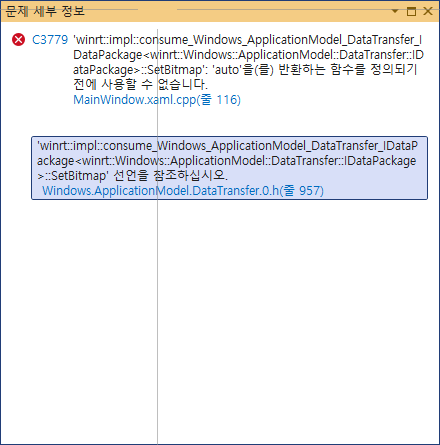
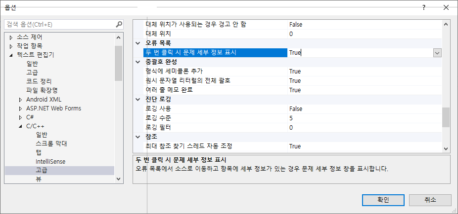

# 컴파일 오류 목록 중 하나를 더블클릭하면 문제 세부 정보 창이 나올 때 없애는 방법

## 없애는 방법

도구 > 텍스트 편집기 > C/C++ / 고급 > 오류 목록 > 두 번 클릭 시 문제 세부 정보 표시 를 "False" 로 바꾸면 없어짐.

## 관련 URL
https://learn.microsoft.com/ko-kr/visualstudio/ide/reference/problem-details-window?view=vs-2022
