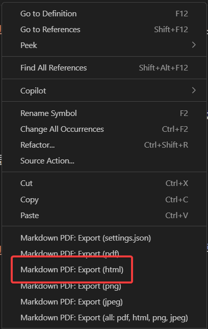
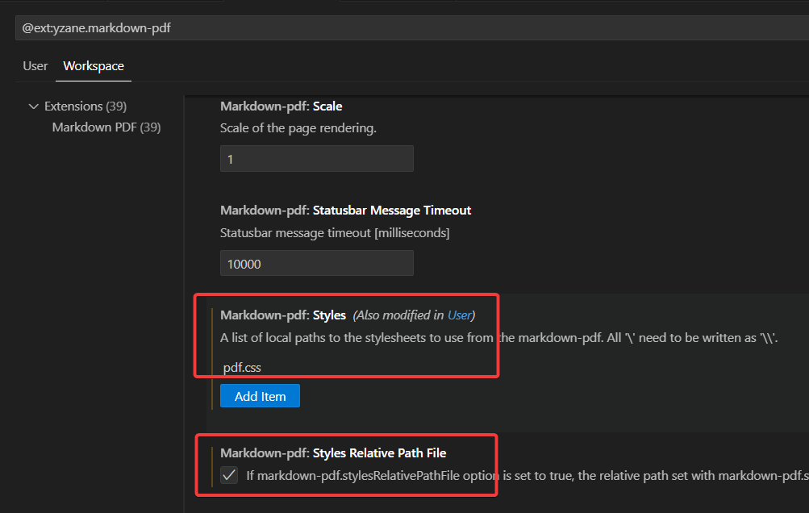
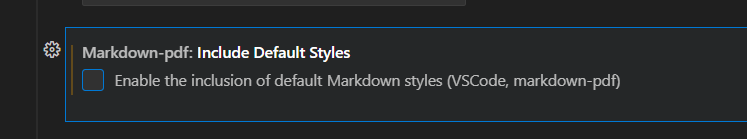

# markdown 파일을 html로 변환할 때 css 적용

index.md 파일을 html 파일로 변경하려 한다.



markdown pdf를 설치한 다음 html로 export할 때 css를 적용하려면, 아래와 같이 css 파일명을 적어준다.





이것도 해제해야 쓸데없는 간섭을 받지 않는다.


그리고  pdf.css 파일같은 css 파일을 생성한다.


```
body
{
    width: 1280px;
    margin: 0 auto;
    border: 0px solid;
}

p
{
    font-size: 1.3em;
}

h1 {
  /* 글꼴 크기: 매우 크게 설정하여 페이지의 주요 제목임을 강조 */
  font-size: 3.5em; /* 1em은 부모 요소의 font-size와 동일 */
  /* 글꼴 두께: 굵게 */
  font-weight: 800;
  /* 글꼴 색상: 진한 색상으로 설정 */
  color: #2c3e50;
  /* 아래쪽 여백: 다른 요소와의 간격 확보 */
  margin-bottom: 30px;
  
}

h2 {
  /* 글꼴 크기: h1보다 작지만 여전히 큼 */
  font-size: 2.5em;
  /* 글꼴 두께: 보통보다 약간 굵게 */
  font-weight: 700;
  /* 글꼴 색상: h1과 비슷하지만 조금 더 밝게 */
  color: #34495e;
  /* 아래쪽 여백: 적절한 간격 */
  margin-bottom: 30px;
}  

h3 {
  /* 글꼴 크기: 적당한 크기 */
  font-size: 2.0em;
  /* 글꼴 두께: 보통 */
  font-weight: 600;
  /* 글꼴 색상: 일반 텍스트보다 진하게 */
  color: #2c3e50;
  /* 아래쪽 여백: 다른 요소와의 간격 */
  margin-bottom: 20px;  
}

h4 {
  /* 글꼴 크기: 일반 텍스트보다 약간 크게 */
  font-size: 1.5em;
  /* 글꼴 두께: 보통 */
  font-weight: 500;
  /* 글꼴 색상: 어둡지만 너무 강하지 않게 */
  color: black;
  /* 아래쪽 여백: 작은 간격 */
  margin-bottom: 15px;
  
  
}

h5 {
  /* 글꼴 크기: 일반 텍스트와 비슷하거나 약간 크게 */
  font-size: 1.1em;
  /* 글꼴 두께: 보통 */
  font-weight: 400;
  /* 글꼴 색상: 일반 텍스트 색상 */
  color: #7f8c8d;
  /* 아래쪽 여백 */
  margin-bottom: 10px;
  /* 기울임꼴 */
  font-style: italic;
}

code{
    background-color: lightgray;
    border-radius: 7px;
    color: #020202;
    padding: 4px 6px;
    font-weight: 600;
}
```


이제 변환된 html 파일을 열어 다음 2가지를 해준다.
1. title을 고친다.
2. pdf 파일 경로를 환경에 맞게 고친다.