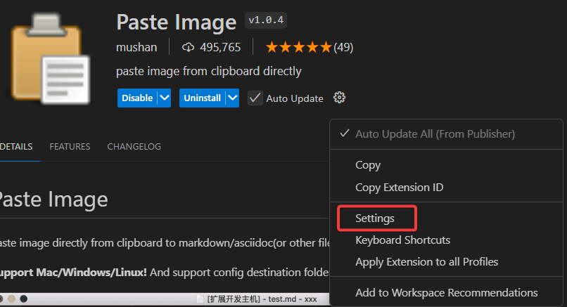
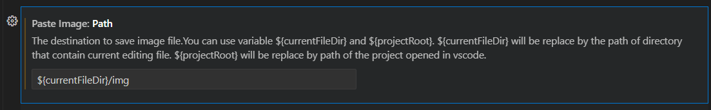
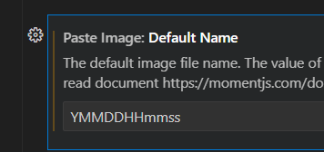
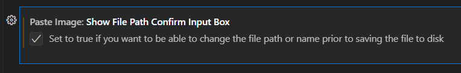

# md파일 내 이미지 특정 폴더에 붙여넣기

## extension 설치

vscode용 paste image extension을 설치한다. 

## 설정

### Path

Path 설정값을 `${currentFileDir}/img` 으로 수정한다.

이런 predefined variables는 [https://github.com/telesoho/vscode-markdown-paste-image](https://github.com/telesoho/vscode-markdown-paste-image) 에 정의되어 있다.

### Default Name

원래 값은 Y-MM-DD-HH-mm-ss 였음.

### 붙여넣을 파일명 정하는 창 보여주기 체크
