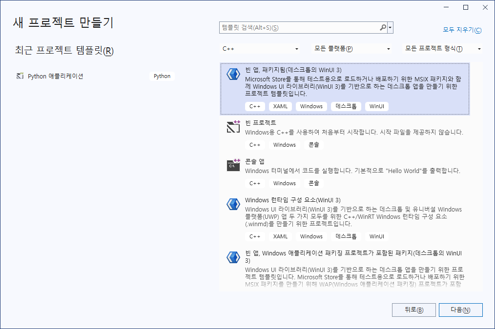
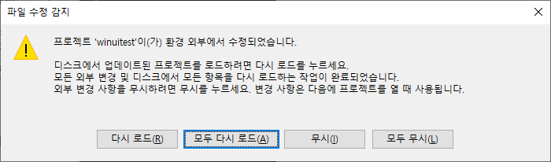
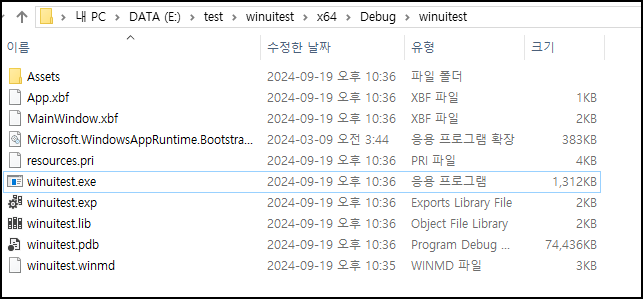
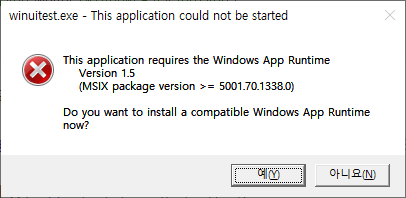
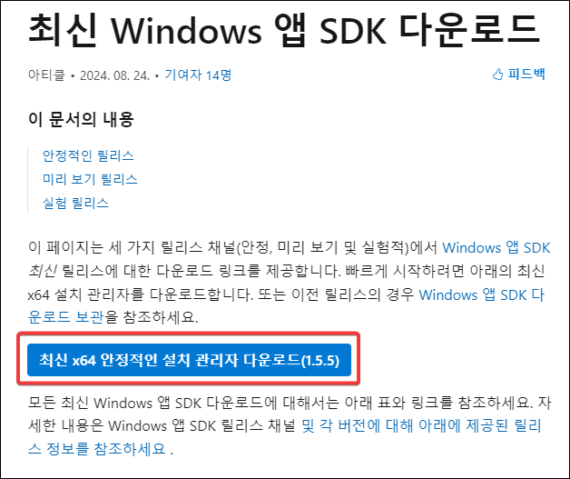
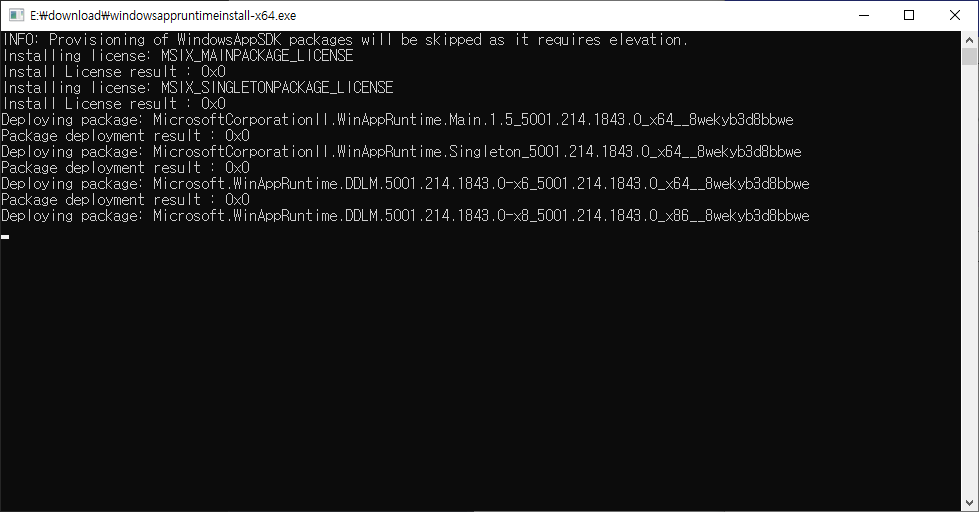
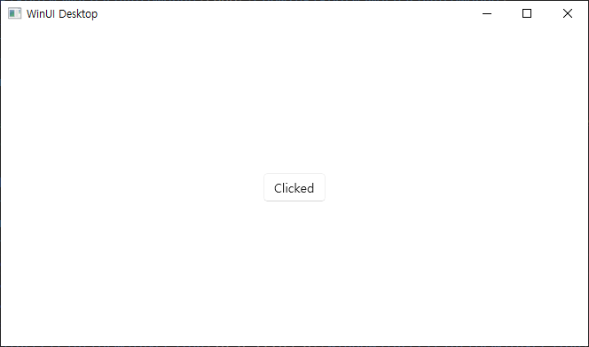

# winui 3 패키징하지 않고 탐색기에서 exe 파일 실행하기

이거 보고 함.  
https://learn.microsoft.com/en-us/windows/apps/winui/winui3/create-your-first-winui3-app


1. 프로젝트를 만든다. 



이걸로 프로젝트 만들었음.

2. vcxproj 파일을 수정한다.
  `<PropertyGroup Label="Globals">` 안에 
  `<WindowsPackageType>None</WindowsPackageType>`
  을 추가한다.
  
3. vcxproj 파일을 수정한다.
`<PropertyGroup Label="Globals">` 안에 
`<AppxPackage>true</AppxPackage>` 를
`<AppxPackage>false</AppxPackage>`  로 수정한다.


위 2, 3 번을 하고 나면 아래와 같다.
  
  ```xml
<PropertyGroup Label="Globals">
    <CppWinRTOptimized>true</CppWinRTOptimized>
    <CppWinRTRootNamespaceAutoMerge>true</CppWinRTRootNamespaceAutoMerge>
    <MinimalCoreWin>true</MinimalCoreWin>
    <ProjectGuid>{1c4a0c28-b802-46ee-83ee-a35facb2c5d7}</ProjectGuid>
    <ProjectName>winuitest</ProjectName>
    <RootNamespace>winuitest</RootNamespace>
    <!--
      $(TargetName) should be same as $(RootNamespace) so that the produced binaries (.exe/.pri/etc.)
      have a name that matches the .winmd
    -->
    <TargetName>$(RootNamespace)</TargetName>
    <DefaultLanguage>ko-KR</DefaultLanguage>
    <MinimumVisualStudioVersion>16.0</MinimumVisualStudioVersion>
    <AppContainerApplication>false</AppContainerApplication>
    <AppxPackage>false</AppxPackage>
    <ApplicationType>Windows Store</ApplicationType>
    <ApplicationTypeRevision>10.0</ApplicationTypeRevision>
    <WindowsTargetPlatformVersion>10.0</WindowsTargetPlatformVersion>
    <WindowsTargetPlatformMinVersion>10.0.17763.0</WindowsTargetPlatformMinVersion>
    <UseWinUI>true</UseWinUI>
    <EnableMsixTooling>true</EnableMsixTooling>
    <WindowsPackageType>None</WindowsPackageType>
  </PropertyGroup>
```

4. visual studio로 돌아오면 



이런 메시지가 나오는데 당연히 [모두 다시 로드]를 클릭한다.


5. build 하면



E:\test\winuitest\x64\Debug\winuitest 안에 exe 파일이 생성된다.

실행하면



이런 메시지가 나온다. Windows App Runtime을 설치하라는 것. 

[예]를 누르면

https://learn.microsoft.com/ko-kr/windows/apps/windows-app-sdk/downloads

창이 열린다. 

여기서 



저 다운로드 버튼을 눌러 실행하면 msix 패키징없이 탐색기에서 exe 파일을 더블클릭해 실행할 수 있게 된다.





탐색기에서 더블클릭해 실행된 winui 3 앱.

개발자 pc 가 아닌 다른 곳에서는 실행이 안될 수도 있는데 그때는 vcredist.exe 를 다운로드받아 실행하면 된다.