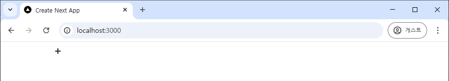
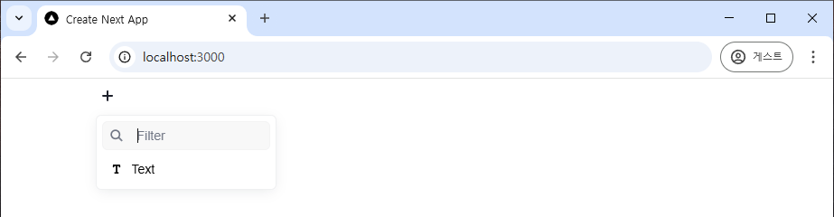
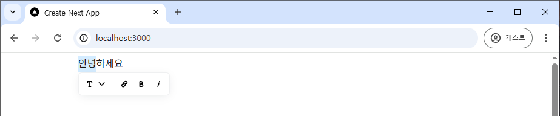
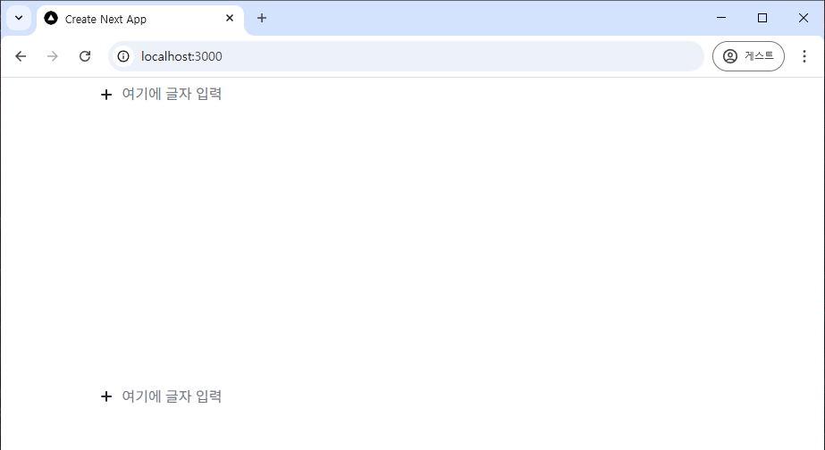
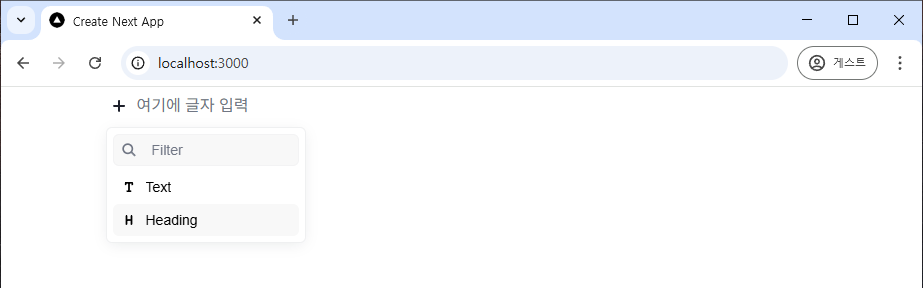
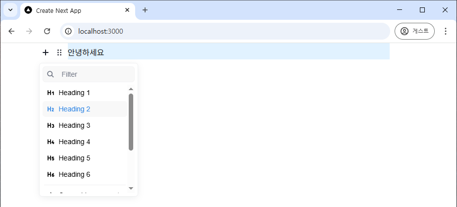
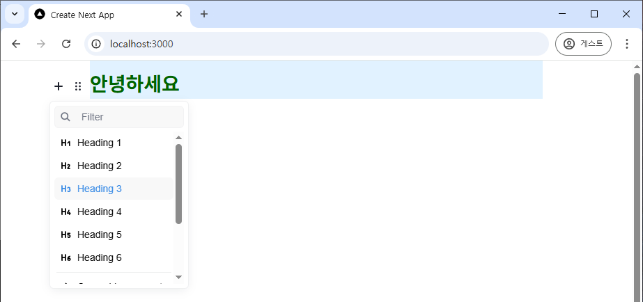
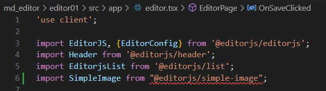
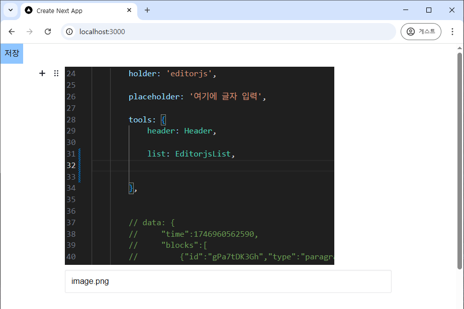

# Editor.js

- 노션 스타일의 블록형 에디터
- 오픈소스
- 홈페이지: [https://editorjs.io](https://editorjs.io/)
- 작성일: 2025. 5. 11.
- 최종수정일: 2025. 5. 11.


## 설치
editor.js는 다양한 플러그인을 제공한다. 우선 본체만 설치.

```ps
npm install @editorjs/editorjs
```

## 가장 간단한 샘플

### page.tsx
죄다 지우고 아래와 같이 바꾼다.

``` ts
// app/page.tsx

import EditorPage from "./editor";


export default function Home() {
  return (
    <div>
      <EditorPage />
    </div>
  );
}
```


### editor.tsx

Editor.js를 정의한 클라이언트 컴포넌트

```ts
// app/editor.tsx

"use client";

import EditorJS from '@editorjs/editorjs';
import './globals.css';


export default function EditorPage()
{
    const editor = new EditorJS('editorjs');

    return(
        <div>
            <div id="editorjs" />
        </div>
    );
}
```

vs 터미널에서 `npm run dev`로 실행하면 터미널에 에러가 잔뜩 나오는데, 

실행한 후에 화면의 빈 곳을 마우스로 움직이다 보면



이렇게 `+` 기호가 나오고 노션처럼 글을 쓸 수 있다. 



아직까지는 text만 추가할 수 있다.

혹시 `+` 기호가 안나오면 

```ts
// app/editor.tsx

const editor = new EditorJS('editorjs');
```

의 `editorjs` 부분의 값을 바꾸고 다시 원래대로 돌려놓으면서 테스트해 보자. 

`editorjs`가 holder인데, 이 값이랑 

```ts
// app/editor.tsx

<div id="editorjs" />
```

이 부분의 id 값이 같아야 한다. 



블록을 잡으면 진하게 등을 설정할 수 있게 된다.


## configuration

EditorJS() 에 문자열을 넘기면 div의 id에 넣어주는 holder가 되지만 이렇게는 쓰지 않고 다양한 설정들을 담아 넣어줘야 한다.

```ts
// app/editor.tsx

import EditorJS, {EditorConfig} from '@editorjs/editorjs';
```

`EditConfig`를 추가하고 이 타입 객체를 EditorJS() 안에 파라미터로 넣어준다.

```ts
// app/editor.tsx

const editor = new EditorJS(
    {
        holder: 'editorjs'
    }
);
```

이런 식으로 값을 넣어줄 수도 있지만, 아래처럼 EditorConfig 객체를 만들어 넣어주겠다.

```ts
// app/editor.tsx

const editorConfig: EditorConfig = 
{
    holder: 'editorjs'
}   
const editor = new EditorJS(editorConfig);
```    

이제 holder와 같은 옵션을 눌려주며 에디터를 설정해 간다.

```ts
// app/editor.tsx

const editorConfig: EditorConfig = 
{
    holder: 'editorjs',
    placeholder: '여기에 글자 입력',
}   
const editor = new EditorJS(editorConfig);
```   




## heading 플러그인
먼저 header 플러그인을 설치하자.

```ps
npm install @editorjs/header
```

```ts
// app/editor.tsx

import Header from '@editorjs/header';
```

아래와 같이 설정하면 H1, H2 등을 설정할 수 있게 된다.

```ts
// app/editor.tsx

const editorConfig: EditorConfig = 
{
    holder: 'editorjs',

    placeholder: '여기에 글자 입력',

    tools: { 
        header: Header
        }
    
};
```



이렇게 Heading을 설정할 수 있다.



.. 3줄인 버튼을 누르면 Heading 1 ~ Heading 6 까지 선택할 수 있는데, 이걸 바꿔도 글자 크기가 바뀌지 않는다. next.js에서 tailwind css를 사용하기 때문이다. 

`app/globlas.css` 파일안에 h1 ~ h6까지 정의해 줘야 그게 여기에 반영된다.

```css
/* app/globlas.css */

h1 {
  color: #333;
  font-size: 2.5em;
  font-weight: bold;
  margin-bottom: 0.5em;
}

h2 {
  color: steelblue;
  font-size: 2em;
  font-weight: bold;
  border-bottom: 2px solid steelblue;
  margin-top: 1em;
}

h3 {
  color: darkgreen;
  font-size: 1.75em;
  font-weight: bold;
}

h4 {
  color: purple;
  font-size: 1.5em;
  font-weight: bold;
}

h5 {
  color: orange;
  font-size: 1.25em;
  font-weight: bold;
}

h6 {
  color: gray;
  font-size: 1em;
  font-weight: bold;
}
```



이렇게 글자 크기가 바뀐다.


## 데이터 저장

```ts
// app/editor.tsx

return(
    <div>
        <button onClick={OnSaveClicked} className='bg-blue-300 p-2'>저장</button>
        <div id="editorjs" />
    </div>
);
```    

이렇게 저장 버튼을 넣으면 저장할 수 있게 되고, `OnSaveClicked` 핸들러는 

```ts
// app/editor.tsx

const OnSaveClicked = async () =>
{
    const article = await editor.save();
    console.log("article = " , article);
}
```    
와 같이 해 준다. 전체 코드는 다음과 같다.

```ts
// app/editor.tsx

"use client";

import EditorJS, {EditorConfig} from '@editorjs/editorjs';
import Header from '@editorjs/header';

import './globals.css';


export default function EditorPage()
{
    const OnSaveClicked = async () =>
    {
        const article = await editor.save();
        console.log("article = " , article);
    }

    const editorConfig: EditorConfig = 
    {
        holder: 'editorjs',

        placeholder: '여기에 글자 입력',

        tools: { 
            header: Header
        }      
    };


    const editor = new EditorJS(editorConfig);

    return(
        <div>
            <button onClick={OnSaveClicked} className='bg-blue-300 p-2'>저장</button>
            <div id="editorjs" />
        </div>
    );
}
```


여기서 나온 article의 구조는 다음과 같다.

```ts
// app/editor.tsx

const OnSaveClicked = async () =>
{
    const article = await editor.save();
    console.log("article = " , article);

    const json = JSON.stringify(article)
    console.log("json = " , json);
}
```    

이 코드로 본 결과는 아래와 같고, 이 값을 DB에 저장하면 된다.

```json
{
    "time":1746960562590,
    "blocks":[
        {"id":"gPa7tDK3Gh","type":"paragraph","data":{"text":"안녕하세요."}}
    ],
    "version":"2.31.0-rc.7"
}
```


## 데이터 읽어오기

```ts
// app/editor.tsx

const editorConfig: EditorConfig = 
{
    ...생략...

    data: {
        "time":1746960562590,
        "blocks":[
            {"id":"gPa7tDK3Gh","type":"paragraph","data":{"text":"안녕하세요."}}
        ],
        "version":"2.31.0-rc.7"
    }
};
```    

이렇게 data 항목에 값을 위 article 에서 본 형식으로 값을 세팅하면 컴퍼넌트가 나오면서 이 값이 보여진다.


## 리스트 플러그인

설치
```ps
npm install @editorjs/list
```

아래와 같이 모듈을 사용한다.
```ts
// app/editor.tsx

import EditorjsList from '@editorjs/list';
```

이제 list를 추가한다.

```ts
tools: { 
    header: Header, 
    list: 
    {
        EditorjsList
    }
},
```        


## 이미지 플러그인

paste를 통해서만 이미지를 추가할 수 있는 간단 버전.

```json
editor.tsx:19 json =  {"time":1746963981205,"blocks":[{"id":"CMI0iKaAeY","type":"image","data":{"url":"data:image/png;base64,iVBORw0KGgoAAAANSUhEUgAAAnUAAAESCAIAAAAUjLR8AAAgAElEQVR4Ae2dTatdx5X3+5vsUUSDrzDIIF0rIAecS7AGiWK4RgpptUWjcNHgooEQSqBNLm4yMB54EoJNoEl3Bh2c7k7jJpNAQIMMgk1GDxq4P0U+QR7Wqre16mWfs89Ze5999v4b4btfqlat+lWd+u9VtV/+rlvof0+fPn399dcnq9y3vvWta9euTVYcCgIBEAABEJg5gb+buX87uwd93RkdMoIACIAACOxPAPq6P0OygPjVhiOsgAAIgMBSCEBfbVoS+mrDEVZAAARAYCkEoK82LQl9teEIKyAAAiCwFAJG+nr74vL5Vfx3frvEc+PsIia4OC3PWx/B+qs1UdgDARAAARAYQMBIX2WJrLVKYk/uP3p+9ejuDZlq7G3o69iEYR8EQAAEQKCHwAj62nGo
```

별도의 이미지 전송 처리같은 거 없이 위에 보이는 것처럼 이미지를 base64 인코딩해서 전송할 수 있어 빠르게 처리할 수 있다. 단점은 파일선택이 불가능하고 paste를 통한 이미지 추가만 가능하다는 거.

설치

```ps
npm install @editorjs/simple-image
```

플러그인 임포트
```ts
// app/editor.tsx

import SimpleImage from "@editorjs/simple-image";
```

```ts
// app/editor.tsx

tools: { 
    header: Header,

    list: EditorjsList, 

    image: SimpleImage
},
```        

tools에 image를 추가한다. 



모듈을 제대로 설치해도 이렇게 빨간색으로 나오는데 기능은 동작한다.




## 문제 해결

### F5를 누르면 안나와서 `<div id="editorjs" />`의 id 값을 바꾸면서 테스트해야 하던 문제 & 한 번에 3줄씩 나오던 문제

```ts
// app/editor.tsx

import React, {useEffect} from 'react';
```

editor 설정 부분을

```ts
useEffect(() =>
{
    const editor = new EditorJS(editorConfig);
}, []);
```

과 같이 고쳐 주고 useRef() 훅도 사용해야 한다.

그리고 SSR을 막는 처리도 해줘야 한다.

이렇게 하려면 app/editor_c.tsx 파일을 만들고 그 안에 다음과 같이 코딩한다.

```ts
// app/editor_c.tsx

// SSR 을 막고 client에서만 돌아가도록 한다.

'use client';
import dynamic from 'next/dynamic';
import React from 'react';

const DynamicEditor = dynamic(
    () => import('./editor'), // Editor 컴포넌트 경로
    { ssr: false } // 서버 측 렌더링 비활성화
);

const MyPage: React.FC = () => {
  return (    
      <DynamicEditor />
  );
};

export default MyPage;
```

여기서 ./editor.tsx 를 import 해서 사용하니, 이제 이 page.tsx에서 이 파일을 읽어 사용하도록 만들어줘야 한다.

```ts
// app/page.tsx

import MyPage from "./editor_c";
// import EditorPage from "./editor";

export default function Home() {
  return (
    <div>
      <MyPage />
      {/* <EditorPage /> */}
    </div>
  );
}
```


## build 에러 해결

빌드하면 src/editor.tsx 파일에서 에러가 난다.

```ps
PS E:\github-stuousk\nextjstest\md_editor\editor01> npm run build                                 
> editor01@0.1.0 build
> next build

   ▲ Next.js 15.3.2

   Creating an optimized production build ...
 ✓ Compiled successfully in 0ms
   Linting and checking validity of types  ..Failed to compile.

   Linting and checking validity of types  ..../src/app/editor.tsx:7:25
Type error: Could not find a declaration file for module '@editorjs/simple-image'. 'E:/github-stuousk/nextjstest/md_editor/editor01/node_modules/@editorjs/simple-image/dist/simple-image.mjs' implicitly has an 'any' type.
  Try `npm i --save-dev @types/editorjs__simple-image` if it exists or add a new declaration (.d.ts) file containing `declare module '@editorjs/simple-image';`

   5 | import Header from '@editorjs/header';
   6 | import EditorjsList from '@editorjs/list';
>  7 | import SimpleImage from '@editorjs/simple-image';
     |                         ^
   8 |
   9 | import './globals.css';
  10 |
Next.js build worker exited with code: 1 and signal: null
```
보면 simple-image 플러그인을 읽는데 에러가 나는거다. 기능은 동작하는데. 이 플러그인은 ts 버전도 따로 없다.

 `Try npm i --save-dev @types/editorjs__simple-image` 이거 해도 없다고 나온다. 문제가 해결되지 않는다. 

 문제 해결은, 

 /src/types/editorjs_simple-image.d.ts 파일을 만들고, 다음과 같이 한 줄 적어주면 빌드 문제가 해결된다.

```ts
// /src/types/editorjs_simple-image.d.ts

declare module "@editorjs/simple-image";
```