# Godot4 배경을 투명하게 하고 뒷면의 앱으로 마우스 통과시키기

## 개요
- 버전: Godot 4.3
- 하고 싶은 거
    - 게임의 배경을 투명하게 한다. 
    - 항상 맨 위에 올라온다.
    - 일정 영역 외에는 마우스가 그 뒷면에 있는(배경이 투명하니 밑에 보이는) 앱을 마우스로 처리할 수 있도록 한다.
- 예
    - https://www.youtube.com/watch?v=QGwaZ89vrzo
    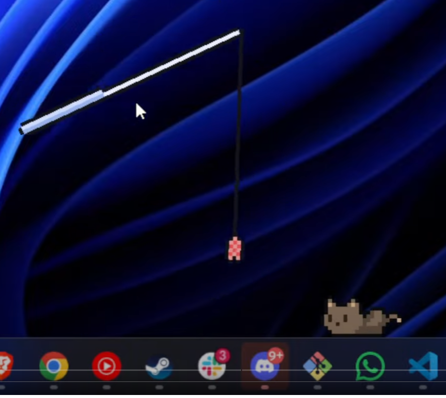  
    <br>이렇게 어떤 프로그램을 띄어도 맨 위에 올라오고 배경이 투명하고, 바탕화면의 아이콘을 누르면 그 처리가 되고, 고양이를 클릭하면 고양이가 선택됨.


## 튜토리얼

### 프로젝트 생성

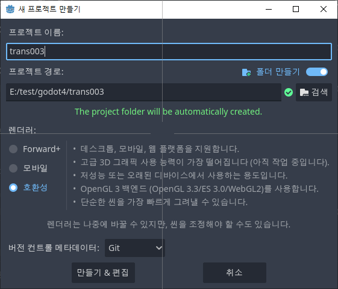

렌더러를 "호환성"으로 한 거는 그냥 자원을 조금 쓰게 하기 위한 것. 꼭 호환성으로 해야 하는 건 아님.

### 2D 노드 생성

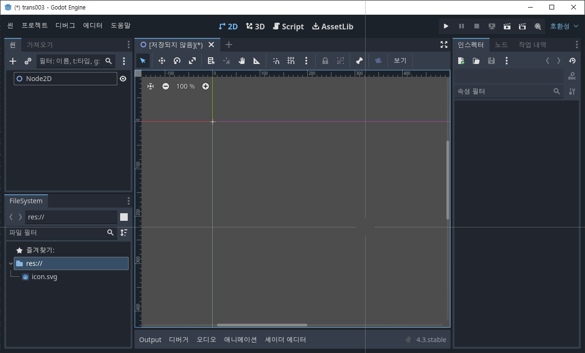

이 노드에 GD script를 붙인다. (node_2d.gd)

이 상태에서 scene을 저장하고 실행하면(그러니까 아무 것도 하지 않고 실행하는 경우) 다음 그림과 같이 나온다.

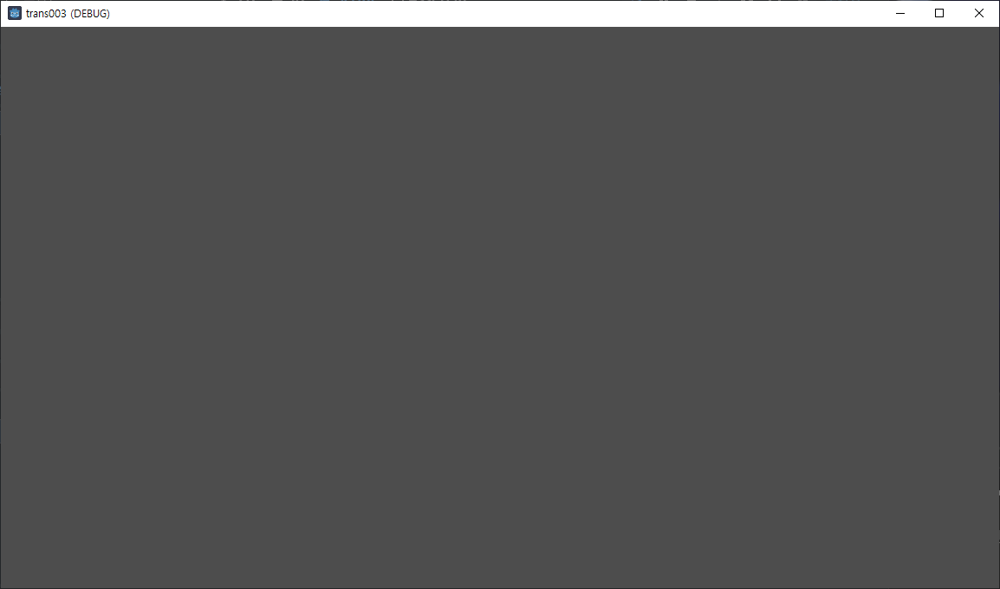


### 배경 투명하게

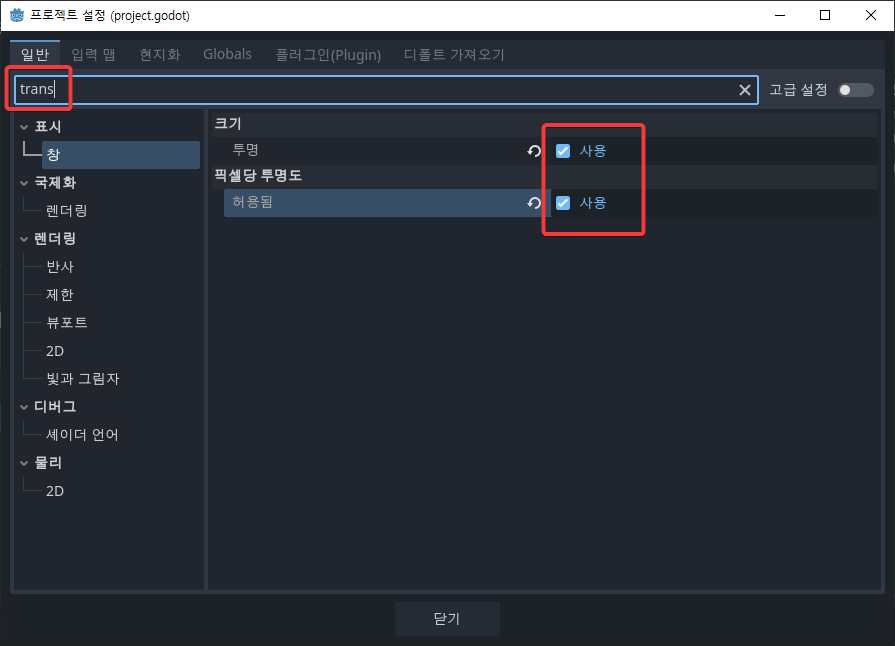

프로젝트 설정창을 띄운 다음 검색어로 `trans`를 입력하고, 

표시 > 창 에서 위와 같이 크기/투명, 픽셀당 투명도/허용됨 을 모두 체크한다.

이 상태로 실행하면, 

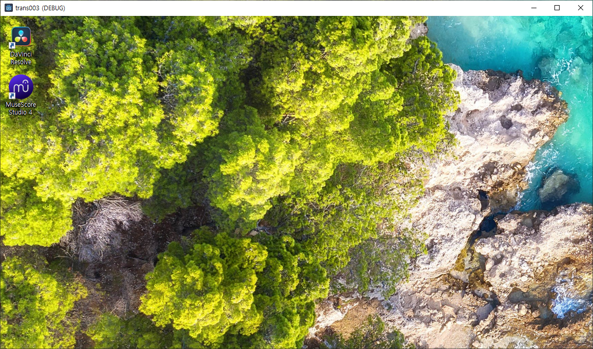

이렇게 타이틀바가 나타나고 배경이 투명하게 된다. 

하지만 이 상태에서는 뒷 배경을, 예를 들면 MuseScore Studio 4를 클릭할 수 없다. 

우리 게임의 뒷 배경을 클릭하게 하는 방법은 

`Window.mouse_passthrough_polygon` 를 사용하는 거다. 

저 속성에는 하나의 폴리곤을 넘겨줄 수 있다. 그럼 이 게임에서는 그 폴리곤의 영역만 마우스로 클릭할 수 있고, 그 외의 영역에서 발생한 마우스 이벤트는 그 뒤에 있는 앱으로 넘어간다. 그리고 그 폴리곤의 영역만 화면에 표시된다.

테스트를 위해 아이콘을 화면에 추가한다.

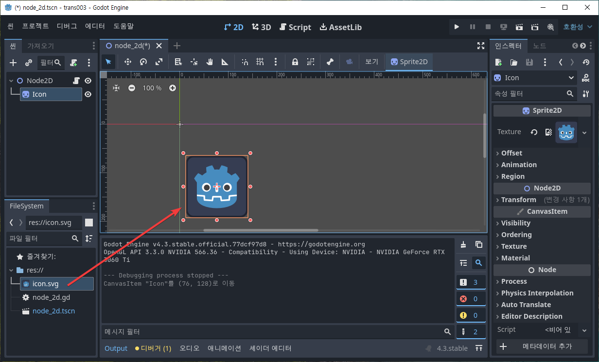

이렇게 하고 실행하면

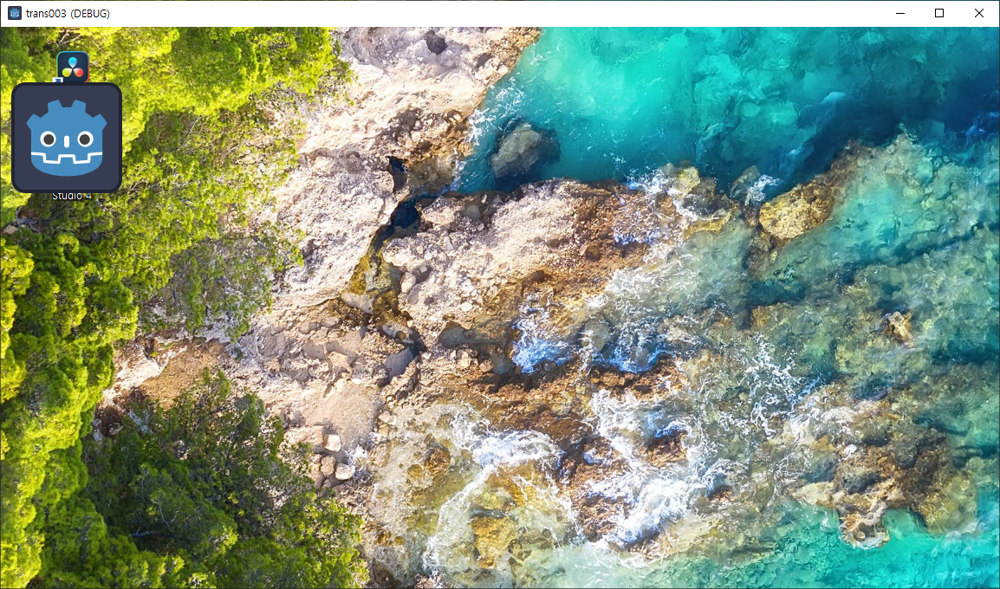

이렇게 내가 추가한 건 제대로 보이고 그 외는 모두 투명하게 보이는 걸 알 수 있다. 훌륭하군. 이제 폴리곤을 넣어보자. 

**node_2d.gd** 파일 

```gdscript
func _ready() -> void:
	# 다각형
	var polygon = [
		Vector2(100, 100),		
		Vector2(200, 100),
		Vector2(200, 200),
		Vector2(100, 200)
	]

	var window = get_viewport().get_window()	
	window.mouse_passthrough_polygon = polygon
```

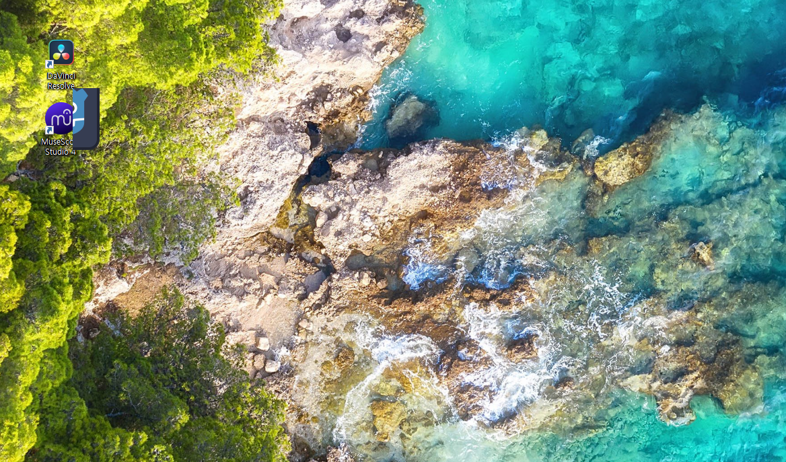

상황은 다음과 같다. 정확한 상황을 파악하기 위해 다음과 같이 한다. 

좀전에 프로젝트 설정했던 것들을 다 원래대로 돌려 준다.

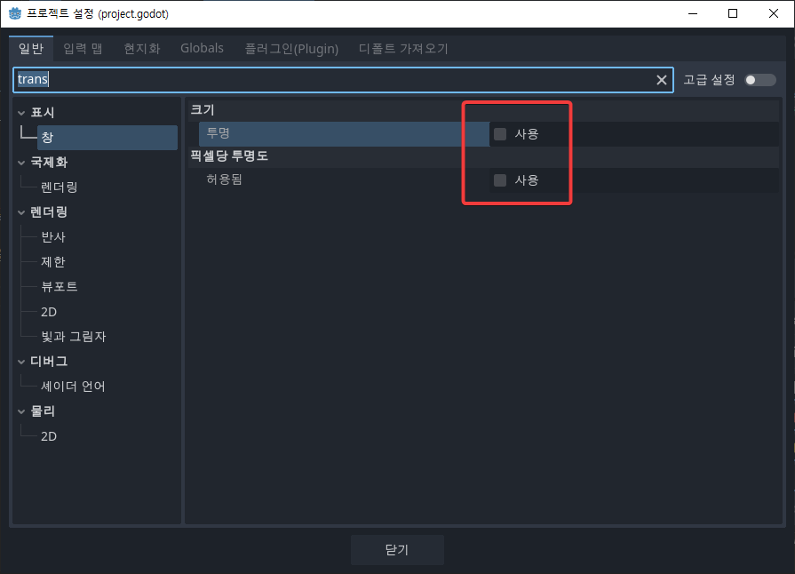

그리고 스크립트 파일을 다음과 같이 맨 밑에 한 줄 추가한다.

**node_2d.gd** 파일 

```gdscript
func _ready() -> void:
	# 다각형
	var polygon = [
		Vector2(100, 100),		
		Vector2(200, 100),
		Vector2(200, 200),
		Vector2(100, 200)
	]

	var window = get_viewport().get_window()	
	window.mouse_passthrough_polygon = polygon

    window.transparent_bg = true    
```

그럼 아래와 같이 내가 만들어준 (100, 100) - (200, 200)의 정사각형 폴리곤이 검은 색으로 보이고, 딱 그 부분만 아이콘이 제대로 보이는 걸 알 수 있다. 

(100, 100)인데 윗 부분이 더 길어 보이는데 싶은데, 그건 게임의 title bar의 높이 만큼 더 길어보이는 거다. 


정리하면, 위 이미지만큼이 원래 게임 앱의 크기인데, Window.mouse_passthrough_polygon에 넣어준 (100, 100) 크기의 폴리곤 만큼만 화면에 나타나고 게임 내에서 처리할 수 있는 클릭이 된다. 그 외의 영역은 뒷 부분이 보이고 뒷 부분의 앱에서 마우스로 클릭도 할 수 있다. 그래서 저 아이콘들을 눌러 실행할 수 있다.


만약 아래 글을 계속 볼 거면 현재 상태로 그냥 놔둔다.  

그렇지 않고 바로 개발을 시작할 거면 다시 프로젝트 세팅 2개 설정하고 스크립트에 추가했던 맨 밑 한 줄을 지우자. 이 상태로 프로그램을 만들면 된다. 


## 여러 개의 폴리곤을 사용해야 하는 경우

Window.mouse_passthrough_polygon 에는 한 개의 폴리곤만 넣을 수 있다. 

만약 2개의 폴리곤을 사용하고 싶으면 이걸 하나로 합쳐야 한다. 

예를 들어, 


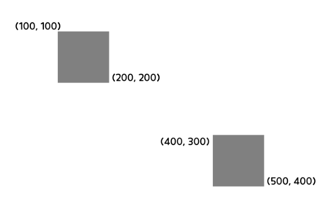

이렇게 2개의 폴리곤을 설정해 줘야 하는 경우, 생각없이 만들면, 

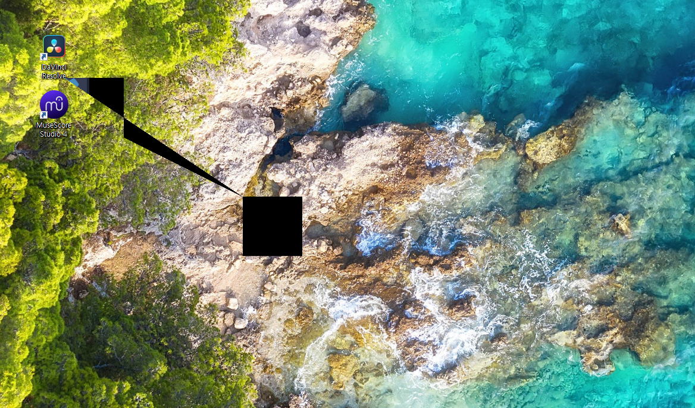

이런 식으로 된다. 그래서 이걸 제대로 만드는 방법을 설명하려 한다. 이 문제를 해결하려면

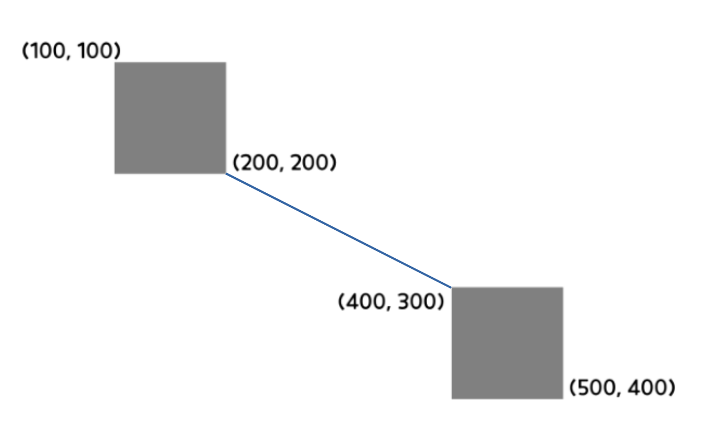

이렇게 생긴 폴리곤으로 만들어야 위와 같이 이상한 모양이 나타나는 걸 막을 수 있다.

방법은, 

```gdscript
var polygon1 = [
		Vector2(200, 200),
        Vector2(100, 200),
        Vector2(100, 100),		
		Vector2(200, 100),
        Vector2(200, 200)
	]
```

와 같이 4각형이면 점을 5개해서, 연결되는 점인 (200, 200)이 시작점이자 끝점이 되도록 해야 한다. 

```gdscript
var polygon2 = [
		Vector2(400, 300),
        Vector2(500, 300),
        Vector2(500, 400),		
		Vector2(400, 400),
        Vector2(400, 300)
	]
```

과 같이 두 번째 폴리곤도 연결되어야 하는 점인 (400, 300)이 시작점이자 끝점이 되도록 만든다. 

연결되는 점 선정 기준: 두 폴리곤 사이를 가장 가깝게 연결하는 두 점

그리고 연결하는 선을 정의한다.

```gdscript
var polygon_br = [
		Vector2(200, 200),        
        Vector2(400, 300)
	]
```

이제 새로운 폴리곤을 만들고 첫 번째 폴리곤, 브릿지, 두 번째 폴리곤 순서로 추가한다.

```
var polygon = []
polygon.append_array(polygon1)
polygon.append_array(polygon_br)
polygon.append_array(polygon2)

window.mouse_passthrough_polygon = polygon
```

이렇게 해주면 된다.

전체 코드

```gdscript
func _ready() -> void:
	# 다각
	var polygon1 = [
		Vector2(200, 200),
		Vector2(100, 200),
		Vector2(100, 100),		
		Vector2(200, 100),
		Vector2(200, 200)
	]
	
	var polygon2 = [
		Vector2(400, 300),
		Vector2(500, 300),
		Vector2(500, 400),		
		Vector2(400, 400),
		Vector2(400, 300)
	]
	
	var polygon_br = [
		Vector2(200, 200),        
		Vector2(400, 300)
	]
	
	var polygon = []
	polygon.append_array(polygon1)
	polygon.append_array(polygon_br)
	polygon.append_array(polygon2)
	
	var window = get_viewport().get_window()	
	window.mouse_passthrough_polygon = polygon
	
	window.transparent_bg = true
```
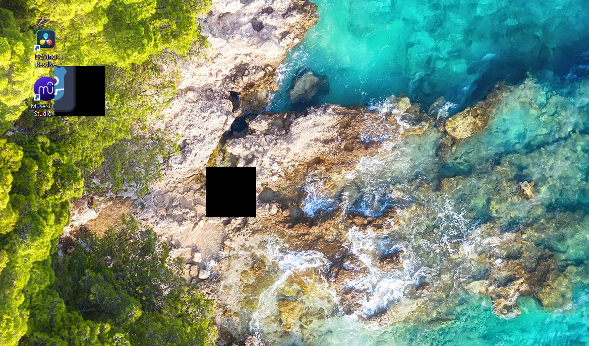

중간 브릿지는 안 보인다.


## 게임 앱을 제일 위에

아무래도 투명하게 보여서 밑에 있는 앱을 마우스로 클릭할 수 있다보니 그렇게 하면 이 앱이 다른 앱의 밑으로 내려가 버린다. 그러니 게임 앱을 always on top으로 설정해 줘야 한다.

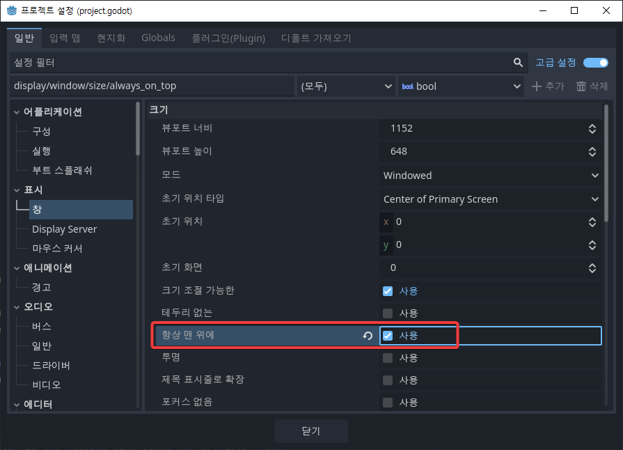