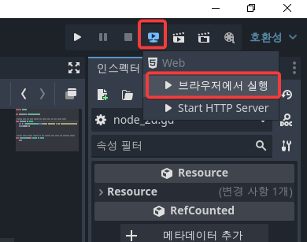
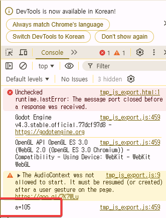

# 웹개발 시 url param 가져오기

```gdscript
func _ready() -> void:
	var a = JavaScriptBridge.eval("const urlParams = new URL(location.href).searchParams; const a = urlParams.get('a'); a")
	print("a=", a)
```

이렇게 하면 gdscript의 변수 a에 

`http://localhost:8060/tmp_js_export.html?a=105`

와 같이 url을 적어줬을 때 url에 적은 파라마티 a의 값이 들어간다.



이렇게 실행하면 되고, 웹 브라우저가 자동으로 실행되는데 

`http://localhost:8060/tmp_js_export.html?a=105`

과 같이 하면 a 값으로 105가 찍힌다.

