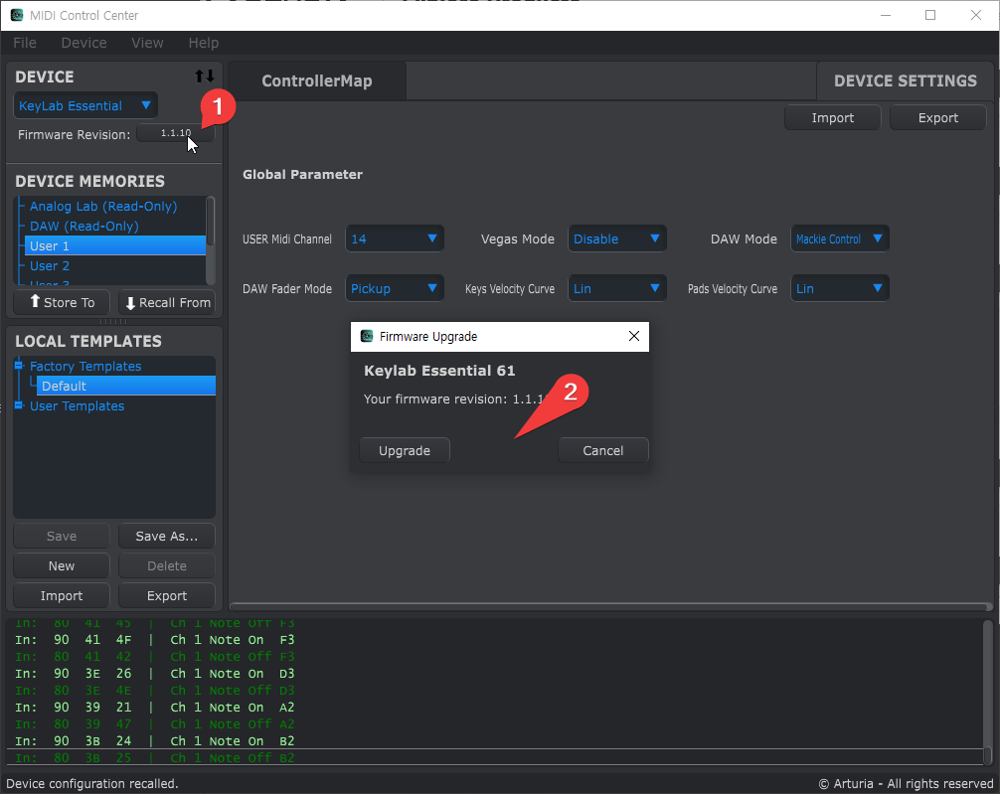

# 프로그램 설치

* 무료 analog lab 프로그램 설치: 
  * https://www.arturia.com/products/software-instruments/analoglab/free
  * 하지만 이 프로그램은 아래 설치할 ASC에서 설치하도록 하자.

* ASC(Arturia Software Center) 설치:
  * https://www.arturia.com/fr/support/downloads-manuals
  * 그리고 이 안에서 MIDI Control Center를 설치하면 드라이버가 설치되고 펌웨어 버전과 업데이트도 자동으로 할 수 있다.

# 관련 Youtube Video
https://www.youtube.com/watch?v=490krwG0qDk

# firmware upgrade
ASC(Arturia Software Center)를 설치한 다음, MIDI Control Center를 설치하면 현재 펌웨어 버전을 보여준다. 

이 프로그램에서 최신 버전을 자동으로 다운로드받아 설치할 수 있다.

펌웨어 버전을 누르면 창이 나오는데 가운데에 지금은 최신 버전으로 펌웨어 업그레이드 되어 안 보이는 버튼이 하나 나타나는데, "Download latest" 버튼이다. 그걸 누르면 자동으로 펌웨어를 다운로드받고 설치한다.

# 가만 놔두면 불빛이 번쩍번쩍거린다.

MIDI Control Center에서 Device Settings로 들어가 Vegas Mode를 "disable" 로 바꾼다.

관련 글: https://legacy-forum.arturia.com/index.php?topic=95080.0

# 매뉴얼

[keylab-essential_Manual_1_0_0_EN.pdf](:/ce18ef6086b0466987892bbf0fad88b3)

다운로드 URL: https://downloads.arturia.com/products/keylab-essential-49/manual/keylab-essential_Manual_1_0_0_EN.pdf

