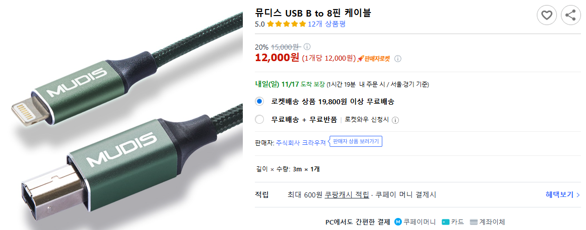
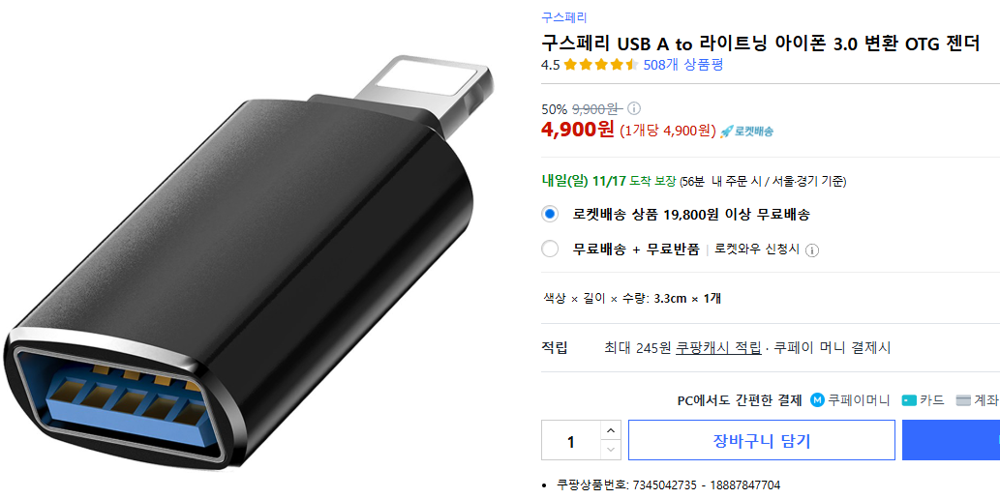
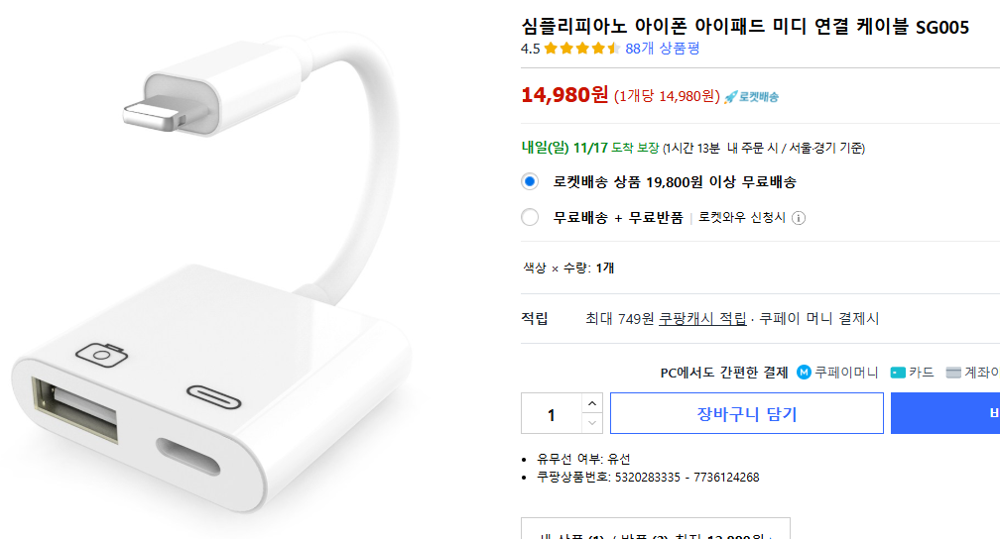
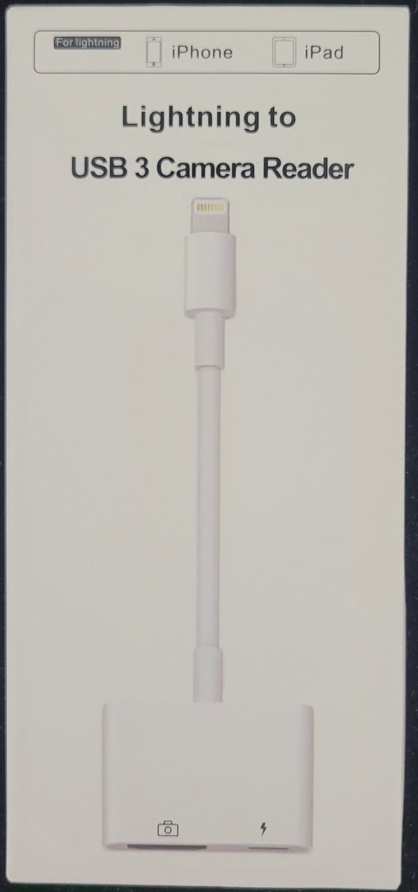
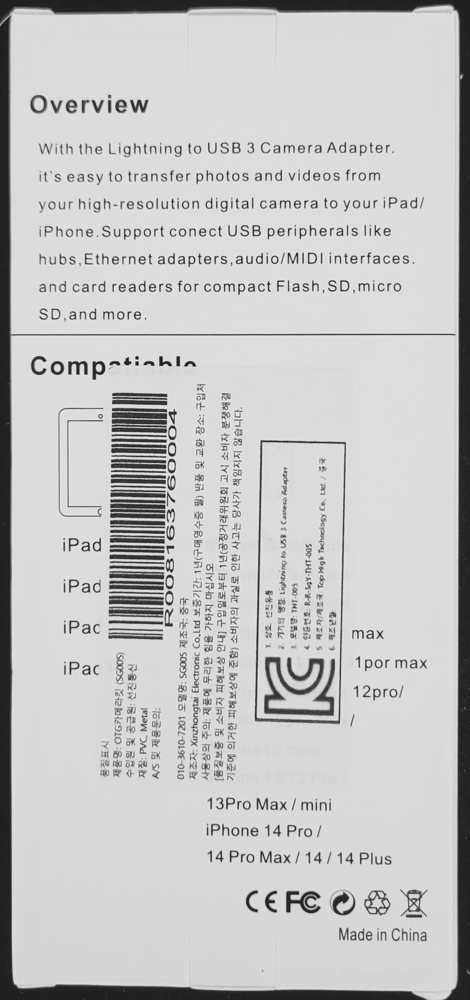
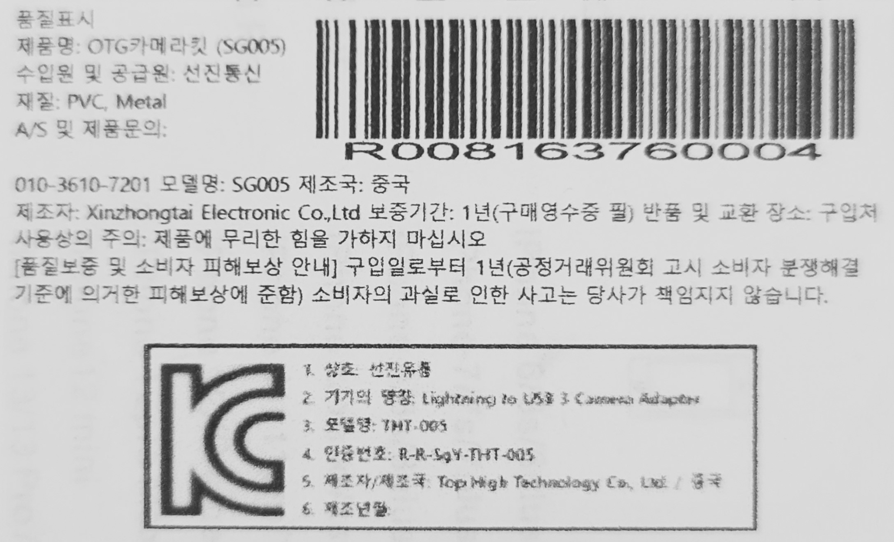
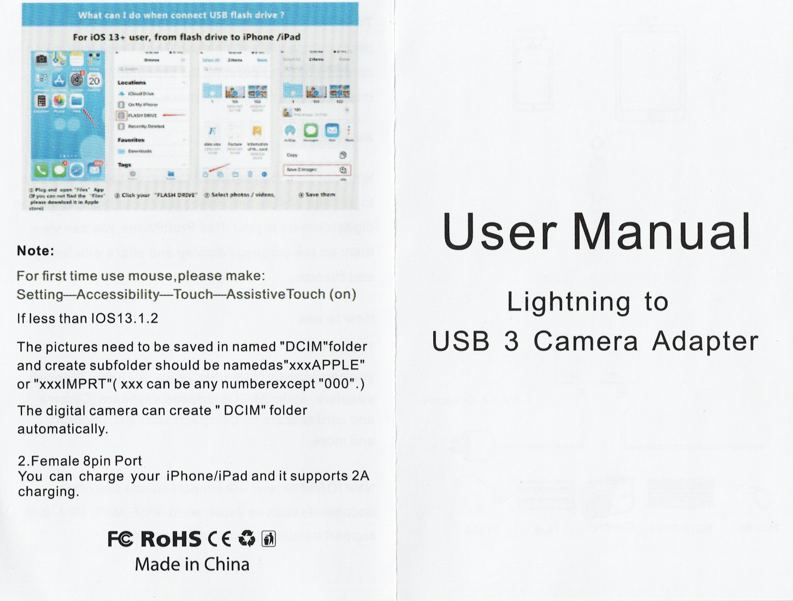
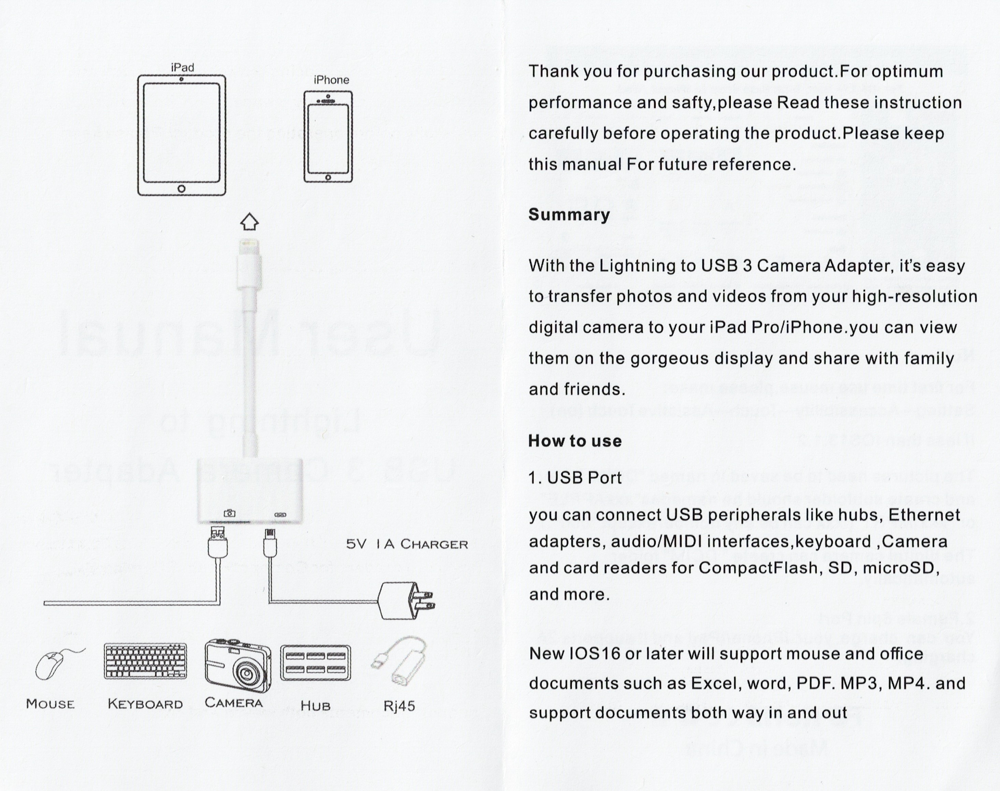

# 아이패드와 연결
keylab 61과 아이패드를 연결하는 방법을 찾아보니 3가지 방법이 나옴.

## 1. OTG 케이블
https://www.coupang.com/vp/products/7685325978?itemId=20536740130

이걸 쓰면 직접 연결할 수 있을 거 같다. 

3미터면 너무 긴데.. 하면서 다른 걸 찾아봄. (짧은 걸 못 잦음)

## 2 OTG 변환잭
https://www.coupang.com/vp/products/7345042735?itemId=18887847704

음.. 웬지 믿음이 안 감.

## 3. 미디 연결 케이블
https://www.coupang.com/vp/products/5320283335?itemId=7736124268

이 제품으로 구입했음. 

이렇게 되면 keylab 61의 usb 포트에서 PC가 아닌 이 장비로 연결해야 하기 때문에 전원 공급을 신경써야 함. 이 장비에 충전 포트가 있는데 전원이 아이패드로만 갈지 아니면 keylab 61로도 전달될지 궁금. 만약 keylab 61로 전원 공급이 안되면 별도의 아답터([전원 공급](:/32e2b1cbcca1415fbd1ded323f844b3d)) 를 써야 함.

### 2024. 11. 18.(월)

택배 도착함. 

저 사진과 다른 게 옴. 약간만 다르고 기본적인 건 다 똑같다. 

충전하는 포트는 8핀이다. 

keylab 61 usb 포트에 꽂은 케이블을 왼쪽 usb 포트에 연결하니 바로 keylab 61에 전원이 공급된다. 아이패드의 전원을 쓰는 거다. 헐.

오른쪽 충전포트에도 8핀 꽂았더니 아이패드 바로 충전된다. 와우.

그런데 내 충전기가 약한 건지 충전 중인데도 피아노를 계속 치고 있으면 아이패드 배터리 잔량이 내려가고 피아노 안 치고 그냥 그대로 놔두고 있으면 배터리 잔량이 올라간다.

잘된다. 
latency도 거의 느껴지지 않는다. 

keylab 61 버튼 몇개가 KORG module과 연결된다.

처음엔 velocity 강약을 맞추기가 어려웠는데, KORG module의 velocity curve를 light로 고치니 손에 딱 맞는다. 
기본인 velocity curve: normal인 상태일 때는 썌게 쳐야 소리가 크게 나고 약하게 치면 소리가 아예 안 났는데 light 로 고치니 어느 정도 약하게 치면 어느 정도 누른 상태로 약하게 인식하고 쎄게 치면 쎄게 인식해서 딱 좋다.

아답터 안 사도 되서 좋다.

#### manual
  

