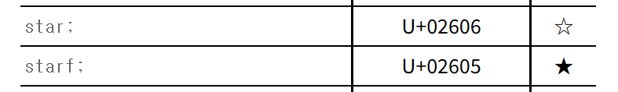

# html

## html named character 목록

[https://html.spec.whatwg.org/multipage/named-characters.html](https://html.spec.whatwg.org/multipage/named-characters.html)




이렇게 표시되어 있는데 속이 빈 별을 md 파일에서 표시하고 싶으면

```md
&star;
```

라고 해주면 된다.

결과는 &star; 이다.

```md
&starf;
```
의 결과는 &starf; 이다.

대소문자를 가린다.


## 쓸만한 거

- &block; : `&block;`
- &marker;: `&marker;`
- &FilledSmallSquare; : `&FilledSmallSquare;`
- &FilledVerySmallSquare;: `&FilledVerySmallSquare;`