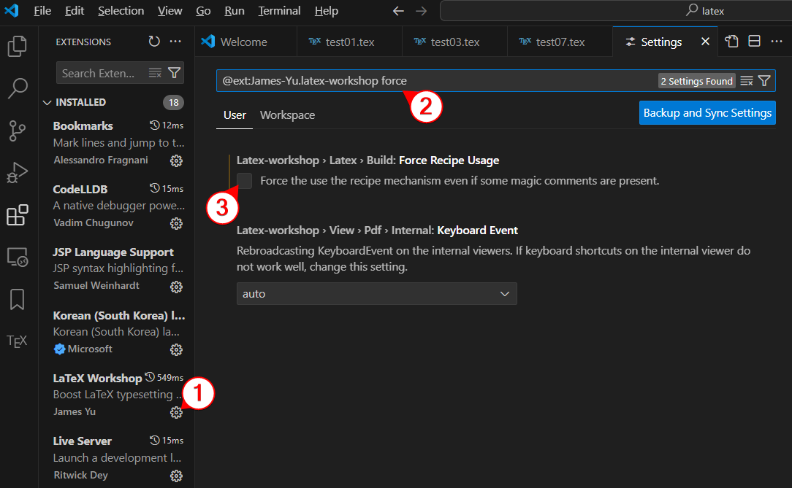

# Visual Studio Code에서 lualatex 사용하기

LaTeX는 기본적으로 시스템에 설치된 true type 글꼴을 지원하지 않기 때문에 lualatex를 사용해야 한다. lualatex는 기본적으로 한글을 지원한다(utf-8)

vscode에서 LaTeX workshop 익스텐션을 설치한 상태에서 lualatex를 사용하려면 다음과 같이 해야 한다.



1. 설치한 LaTeX Workshop 익스텐션을 찾아 톱니바퀴를 누른다.
2. settings가 나오면 검색창 뒤에 'force'를 붙여 `LaTeX-Workshop > Latex > Build: Force Recipe Usage` 항목을 찾는다.
3. 디폴트로 체크되어 있는건데, 이 체크를 풀어준다(체크 표시가 없어져야 함). 매직 커멘트를 적어놔도 무시하고 recipe를 무조건 쓰겠다는 옵션인데 우리는 매직 커멘트를 쓸 것이기 때문.
4. vscode를 닫고 다시 실행한다.
5. .tex 파일의 맨 위에 아래 매직 커멘트를 붙인다.
    ```tex
    % !TEX TS-program = lualatex
    ```

    가장 간단한 전체 코드는 다음과 같다.
    ```tex
    % !TEX TS-program = lualatex

    \documentclass{article}
    \usepackage{fontspec}
    \setmainfont{Nanum Gothic}

    \begin{document}
    한글도 잘 된다. 이제 나눔고딕 글꼴을 기본 글꼴로 사용할 수 있다.
    \end{document}
    ```

6. 빌드(Ctrl + Alt + B)해서 확인한다.

