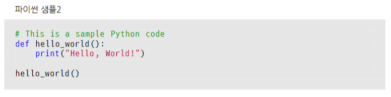
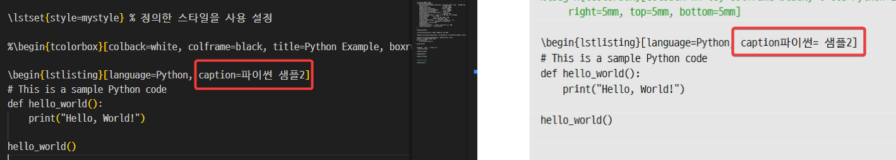

# 소스코드 보이기

lualatex 이용해 소스코드 보여주는 방법



[LaTeX 코드]
```tex
% !TEX TS−program = lualatex
\documentclass{article}
\usepackage{listings} % 코드 목록을 위한 패키지
\usepackage{tcolorbox} % 색상을 사용하기 위한 패키지
\usepackage{caption} % 캡션 설정
\usepackage{fontspec} % TTF 사용위한 패키지

\setmainfont{Nanum Gothic}

% D2Coding 폰트 설정
\newfontfamily{\DTwoCoding}{D2Coding}

% 색상 정의
\definecolor{codegreen}{rgb}{0,0.6,0}
\definecolor{codegray}{rgb}{0.5,0.5,0.5}
\definecolor{codepurple}{rgb}{0.58,0,0.82}
\definecolor{backcolour}{rgb}{0.9,0.9,0.9}

% 캡션 설정
\captionsetup{
    justification=raggedright, % 코드 캡션을 왼쪽 정렬로 설정
    singlelinecheck=false,
    labelformat=empty, % 앞에 Listing 1: 을 사용하지 않음
    font=small % 글씨 크기를 작게. small 등 사용 가능
}

% listings 스타일 설정
\lstdefinestyle{mystyle}{
    basicstyle=\DTwoCoding \normalsize, % D2Coding 폰트를 사용. 글씨크기 보통
    %numbers=left, % 줄 번호 위치
    numberstyle=\small, % 줄 번호 스타일
    keywordstyle=\color{blue}, % 키워드 스타일
    commentstyle=\color{codegreen}, % 주석 스타일
    stringstyle=\color{purple}, % 문자열 스타일
    backgroundcolor=\color{backcolour}, % 배경색
    breaklines=true, % 자동 줄 바꿈
    showstringspaces=false, % 문자열 내 빈 칸 기호 표시 비활성화
    xleftmargin=0pt, % 왼쪽 여백
    frame=single, % 코드 블록에 테두리 추가
    framerule=0pt, % 테두리 두께 설정 (1pt)
    rulecolor=\color{gray}, % 테두리 색상 설정 파란색()
    framesep=10pt, % 테두리와 블록 사이의 간격
    lineskip=2pt, % 줄 간격 설정
    keepspaces=true,
    columns=fullflexible, % 유니코드 문자 정렬 문제 해결
    inputencoding=utf8, % UTF−8 인코딩
}

\begin{document}
\lstset{style=mystyle} % 정의한 스타일을 사용 설정
%\begin{tcolorbox}[colback=white, colframe=black, title=Python Example, boxrule=0.5mm, left=5mm,right=5mm, top=5mm, bottom=5mm]

\begin{lstlisting}[language=Python, caption = 파이썬 샘플2]
# This is a sample Python code
def hello_world():
    print("Hello, World!")
hello_world()

\end{lstlisting}
%\end{tcolorbox}
\end{document}
```

<br>
위 코드는 다른 문제도 있다. 



lstlistring 안에 한글과 영문이 한꺼번에 붙어 있으면 순서가 엉망이 된다. 하.  
caption=파이썬 샘플 2 인데 이게 caption파이썬= 샘플2가 된다.