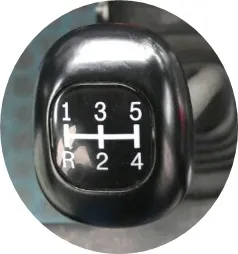

# 전북면허시험장

코스의 노란선은 잘 보인다.  
클러치를 완전히 다 올려야 차가 움직인다. 그래서 반클러치가 없다.  
오늘 떨어진 이유도 이 때문.  
처음 시작하자마자 20초 동안 차를 움직이지 못해 벌점 5점 먹었다.  기어를 몇 번이나 다시 넣고 엄청 놀람.  
경사로에서 힘들 거 같다.

## 버스 조작
- 반 클러치 안 됨. 앞으로 가려면 발에서 클러치를 완전히 떼야 함.
- 기어  

- R 놓을 때 레버 위로 올리는 거 없음. 그냥 R로 가면 됨.
- 비상등: 오른쪽 레버 위로 올리면 켜지고, 내리면 꺼진다.

## 좋은 점
처음 시작할 때 코스를 한 번에 해버려서 시간을 더 절약할 수 있고, S코스를 오른쪽에 바로 붙여서 들어갈 수 있어 통과할 확률이 훨씬 높아졌다.

## 나쁜 점
그지같은 버스. 반클러치를 할 수가 없다.

## 떨어진 이유
### 1차(전체 2차)
#### 이유
- 여기 버스는 반클러치를 할 수가 없다. 클러치에서 발을 떼야 차가 앞으로 간다. 반클러치 성공 못함. 이러다 20초 내에 출발 못해서 5점 깎이면서 엄청 당황함.
- 굴절에서 떨어짐. 바퀴를 11자로 놓아야 할 때 핸들을 완전히 오른쪽으로 돌려버려 차가 완전히 이상하게 가버렸다.

#### 반성, 할 일, 기대
- 여태까지는 경험이었지만 이제부터는 실전이다. 준비 제대로 해서 가자.
- 마인드 트레이닝 확실히 해가자. 굴절에서 후진 시 핸들을 완전히 오른쪽으로 돌려버릴 줄이야.
- 기어 외워 가자.
- 다음은 꼭 코스 통과까지 가자.

### 2차(전체 3차)

#### 이유
- 코스는 다 통과했으나 속도가 느려서 굴절에서 5점, T자에서 5점(이상), 횡단보도에서 2m 앞 쯤에서 멈춰섰다고 한다. 
- T자 끝나고 횡단보도가 이렇게 빨리 나올 줄 몰랐는데 횡단보도가 나와서 당황한 것도 있다. 

#### 반성
- 시간이 오래 걸린 건 클러치 때문인데 반 클러치가 안 되기 때문이다. 
- 볼록거울 잘 보고 횡단보도 거의 직전에 멈춰서자. 이렇게 빨리 멈추면 사거리에서 무조건 떨어진다.
