# nextauth 튜토리얼

- next.js 버전: 15.3.52
- nextauth 버전 4.24.11
- postgresql 버전: 17.4
- pg 라이브러리 버전: 8.15.6
- 작성: 2025. 5. 8.
- stuo github에 코드 올림.

## podman 설정

### postgresql 이미지 다운로드
```ps
PS E:\> podman search postgres
NAME                                DESCRIPTION
docker.io/library/postgres          The PostgreSQL object-relational database sy...


PS E:\> podman pull docker.io/library/postgres
Trying to pull docker.io/library/postgres:latest...
Getting image source signatures
```

### postgresql 실행
```ps
-- 네트워크 설정
podman network create --subnet=172.31.0.0/16 mynet

-- 실행
podman run -d --net mynet --ip 172.31.0.7 --name postgres -p 43432:5432 -p 43022:22 -e POSTGRES_PASSWORD=My:s3Cr3t/ -e TZ=Asia/Seoul docker.io/library/postgres:latest
```


## DB 설정
```sql
-- user 생성은 생략

root@31dfb447326c:/# su - postgres


postgres@31dfb447326c:~$ psql 
psql (17.4 (Debian 17.4-1.pgdg120+2))
Type "help" for help.


postgres=# create user scott password 'tiger';
CREATE ROLE


postgres=# create database nextauth owner=scott LC_COLLATE='C.utf8' LC_CTYPE='C.utf8' template=template0;
CREATE DATABASE


postgres=# exit


postgres@31dfb447326c:~$ psql -U scott -d nextauth
psql (17.4 (Debian 17.4-1.pgdg120+2))
Type "help" for help.


nextauth=> create table member
(
    id varchar(10) primary key
    , nickname varchar(10) not null
    , pwd varchar(62) not null
    , email varchar(100)
);
CREATE TABLE


-- crypt extension 생성. 로그인 위해
nextauth=> create extension pgcrypto;
CREATE EXTENSION


-- member 하나 추가
nextauth=> insert into member(id, nickname, pwd, email) values 
('user01', 'nickname01', crypt('1234', gen_salt('bf')), 'test@gmail.com');
INSERT 0 1


-- data 테이블 추가하고 데이터 2개 추가. session 테스트 위해.
nextauth=> create table data (id int primary key, title varchar(100) not null);
CREATE TABLE
nextauth=> insert into data (id, title) values (1, 'about next.js');
INSERT 0 1
nextauth=> insert into data (id, title) values (2, 'about react');
INSERT 0 1
```


## next.js 프로젝트 생성

### 프로젝트 생성
```ps
npx create-next-app
√ What is your project named? ... nextauth
√ Would you like to use TypeScript? ... No / Yes
√ Would you like to use ESLint? ... No / Yes
√ Would you like to use Tailwind CSS? ... No / Yes
√ Would you like your code inside a `src/` directory? ... No / Yes
√ Would you like to use App Router? (recommended) ... No / Yes
√ Would you like to use Turbopack for `next dev`? ... No / Yes
√ Would you like to customize the import alias (`@/*` by default)? ... No / Yes
Creating a new Next.js app in D:\test\nextauth001\src\nextauth.

Using npm.

Initializing project with template: app-tw


Installing dependencies:
- react
- react-dom
- next

Installing devDependencies:
- typescript
- @types/node
- @types/react
- @types/react-dom
- @tailwindcss/postcss
- tailwindcss
- eslint
- eslint-config-next
- @eslint/eslintrc


added 436 packages, and audited 437 packages in 54s

165 packages are looking for funding
  run `npm fund` for details

found 0 vulnerabilities
Success! Created nextauth at D:\test\nextauth001\src\nextauth
```

### nextauth.js 설치
```ps
PS D:\test\nextauth001\src\nextauth> npm install next-auth

added 14 packages, and audited 451 packages in 9s

169 packages are looking for funding
  run `npm fund` for details

found 0 vulnerabilities

PS D:\test\nextauth001\src\nextauth> npm list next-auth
nextauth@0.1.0 D:\github_stuousk\nextauth001\src\nextauth
└── next-auth@4.24.11
```

### pg 패키지 설치
```ps
PS D:\test\nextauth001\src\nextauth> npm install pg

added 14 packages, and audited 465 packages in 3s

169 packages are looking for funding
  run `npm fund` for details

found 0 vulnerabilities
PS D:\test\nextauth001\src\nextauth> npm list pg
nextauth@0.1.0 D:\test\nextauth001\src\nextauth
└─┬ pg@8.15.6
  └─┬ pg-pool@3.9.6
    └── pg@8.15.6 deduped

PS D:\test\nextauth001\src\nextauth> npm install --save @types/pg

added 9 packages, and audited 474 packages in 2s

169 packages are looking for funding
  run `npm fund` for details

found 0 vulnerabilities
```

## 테스트 실행
프로젝트 폴더에서 
```
npm run dev
```

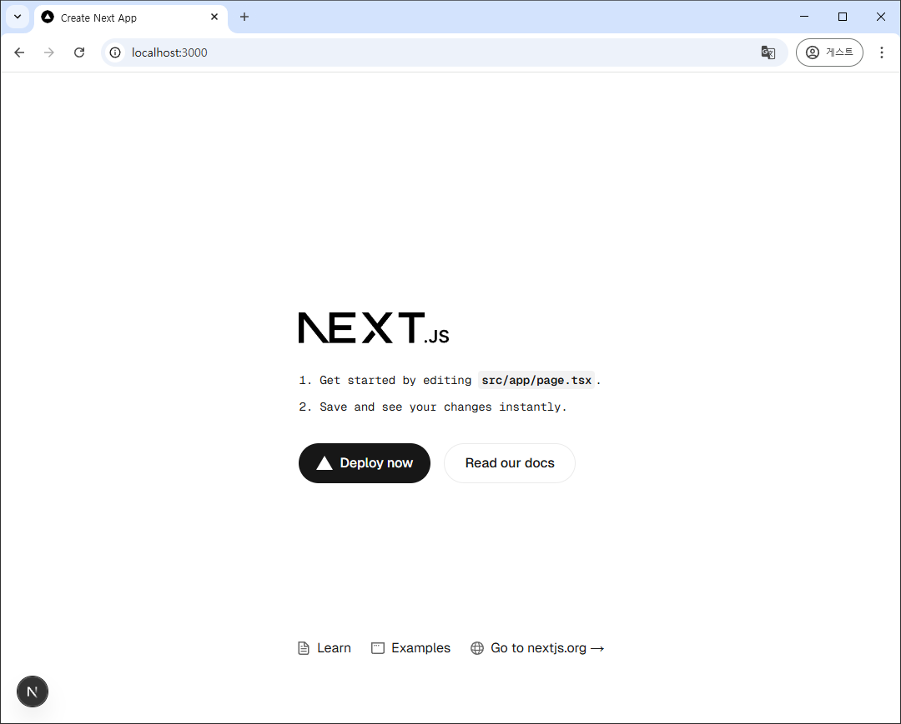


### app/page.tsx 수정
싸그리 지우고 아래만 남긴다. 

```ts
export default function Home() {
  return (
    <div>
      nextauth
    </div>
  );
}
```

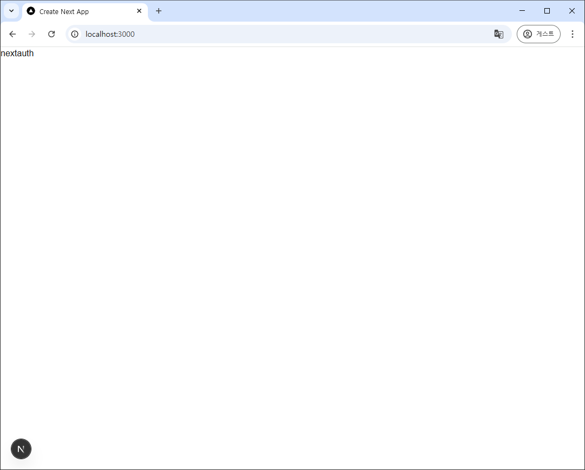


## next.js에서 pg 접속

### app/lib/db.ts
db관련 처리를 모두 담당할 클래스 생성

#### pg 사용
```ts
// app/lib/db.ts

import pg, { Client } from 'pg'
```

#### 인터페이스 생성
DB 테이블(member) 구조와 똑같이 만든다.  
다만 pwd는 가져와 쓸 일이 없으니 뺐다.

```ts
//app/lib/db.ts

// 인터페이스 생성
export interface SMember
{
    id: string;
    nickname: string;        
    email: string  | null;
}
```

#### 클래스 본체
```ts
class DBMan
{    
    private client: pg.Client;

    constructor()
    {
        this.client = new Client(
            {
                user: 'scott', 
                password: 'tiger',
                host: 'localhost',
                port: 43432,
                database: 'nextauth'
            }
        );

        this.client.connect()
            .then( ()=> {
                console.log("connect 성공");
            })
            .catch( () => {
                console.log("connect 실패");
            });
    }


     // 멤버정보 가져오기
    public async getMembers()
    {
        const sql = `
            select * from member
            `;
        
        const result = await this.client.query(sql);
  
        const data = result.rows;
        console.log("[db.ts getMembers] result.rows = ", data);

        return data;
    }


    // 연결을 끊는다.
    public async disconnect()
    {
        this.client.end();        
    }
}

export default DBMan;
```

#### DB 접속, 데이터 가져오기 테스트

app/lib/page.tsx 파일 생성  

가장 간단하게 DB 테스트하는 방법

```ts
// app/lib/page.tsx 파일
// db 연결 테스트 위한 서버 컴퍼넌트

import DBMan, { SMember } from '@/app/lib/db';

export default async function DBTest() {
    const db = new DBMan();
    const members: Array<SMember> = await db.getMembers();
    db.disconnect();
  
    members.forEach(element => {
      console.log(element.nickname);    
    });
  
    return (
      <div>
        member 테이블 데이터 갯수: {members.length}
      </div>
    );
}
```

실행결과: localhost:3000/**lib** 로 접속

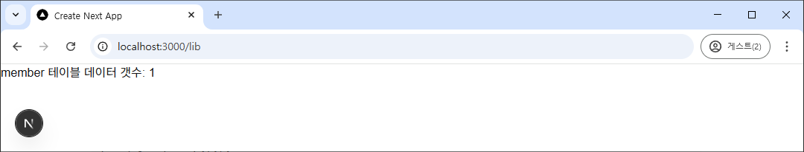

vscode 터미널에 출력된 콘솔 내용

```ps
 GET /lib 200 in 141ms
 GET /favicon.ico?favicon.45db1c09.ico 200 in 304ms
 ✓ Compiled in 55ms
 ✓ Compiled /lib in 52ms
connect 성공
[db.ts getMembers] result.rows =  [
  {
    id: 'user01',
    nickname: 'nickname01',
    pwd: '$2a$06--------------------------------가림----------------',
    email: 'test@gmail.com'
  }
]
nickname01
 GET /lib 200 in 177ms
 GET /favicon.ico?favicon.45db1c09.ico 200 in 287ms
``` 

DB 접속 쉽게 잘 되는 것 확인


## nextauth를 이용한 로그인

credentials (아이디, 비밀번호)로 로그인

### app/api/auth/[...nextauth]/route.ts

nextauth에서 가장 중심이 되는 파일.

실제 폴더명이 `[...nextauth]` 이다. 

```ts
// app/api/auth/[...nextauth]/route.ts

import NextAuth from 'next-auth/next'
import CredentialsProvider from 'next-auth/providers/credentials'

const handler = NextAuth({
    providers: [
      CredentialsProvider({
        name: 'Credentials',
        credentials: {
          username: { label: '아이디', type: 'text', placeholder: '아이디 입력' },
          password: { label: '비밀번호', type: 'password', placeholder: '비밀번호 입력' },
        },
  
        async authorize(credentials, req) {
          return null;  // null을 넘기면 실패했다는 뜻이다. 
        },
      }),
    ]
  })
  
export { handler as GET, handler as POST }
```  

위 코드가 nextauth에서 credentials 방식을 사용할 때 가장 간단한 형태이다.

이 코드는 get 방식을 사용하지 않고 POST 방식을 사용하기 때문에 바로 테스트해볼 수는 없다.

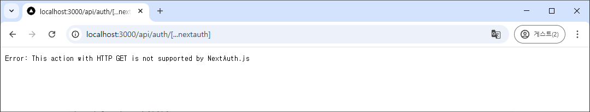

로그인 버튼을 만들고 누르면 로그인이 실행되도록 하자.

### 로그인 버튼

app/page.tsx 파일에 로그인 버튼 추가

```ts
// app/page.tsx

import { signIn } from "next-auth/react";

export default function Home() {
  return (
    <div>
      nextauth

      {/* 로그인 버튼 추가 */}
      <button onClick={() => signIn()}>로그인</button>
    </div>
  );
}
```

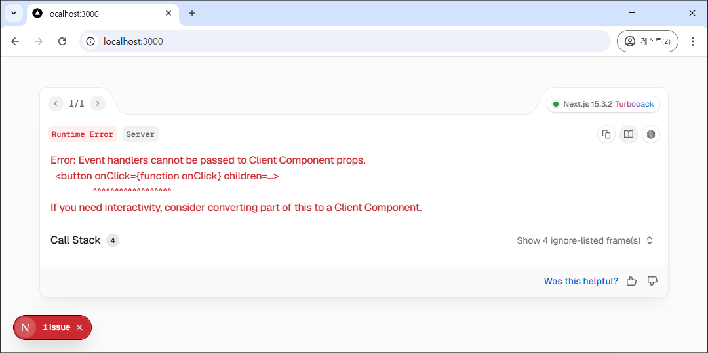

버튼을 누르면 그에 대한 이벤트 핸들링을 해야 하기 때문에 Client component에서만 이 동작이 가능하다. 그러니 app/page.tsx는 원래대로 돌려 놓고 로그인 버튼을 가지는 client component를 만들자.

(물론 page.tsx 파일 맨 위에 "use client"를 적으면 가장 간단하게 해결되지만 클라이언트는 컴퍼넌트로 만들어 추가해 쓰자.)

```ts
// app/page.tsx

export default function Home() {
  return (
    <div>
      nextauth
    </div>
  );
}
```

app/**login**/**sign_in_button_c.tsx** 컴퍼넌트를 만들자.

파일명 맨 뒤에 _c 를 붙인 건 이게 client 컴퍼넌트라 구분하기 위해서다.

nextauth에서는 login을 signin 이라 부른다. logout은 signout. 그래서 따라하기로 했다.

```ts
// app/login/sign_in_button_c.tsx

"use client";
import React from "react";
import { signIn } from "next-auth/react";

export default function SignInButton_C() {
  return (    
        <div>
            <button onClick={() => signIn()}>로그인</button>
        </div>
  );
}
```

이제 이 컴퍼넌트를 사용하도록 app/page.tsx를 수정하자.

```ts
// app/page.tsx

import SignInButton_C from "./login/sign_in_button_c";

export default function Home() {
  return (
    <div>
      nextauth

      <SignInButton_C />
    </div>
  );
}
```

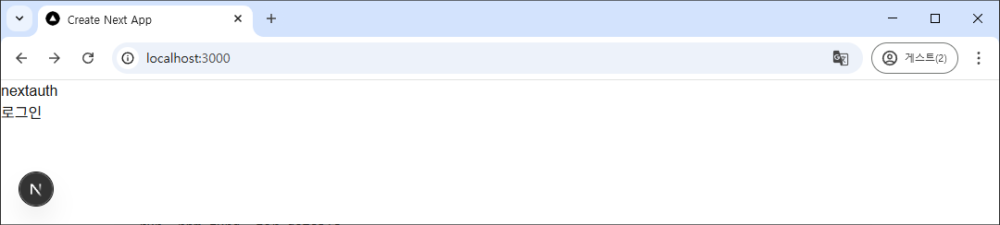

로그인 버튼에 CSS를 주지 않았더니(현재 tailwind 적용 상태) 그냥 텍스트처럼 보이는데 코드를 단순화하기 위해 css 먹이지 않겠음.

로그인 버튼을 누르면 아래와 같이 nextauth가 제공하는 기본 로그인 창이 나온다. 

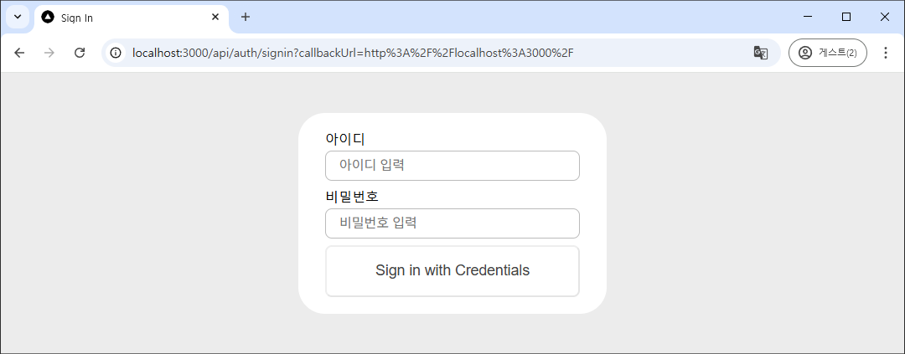

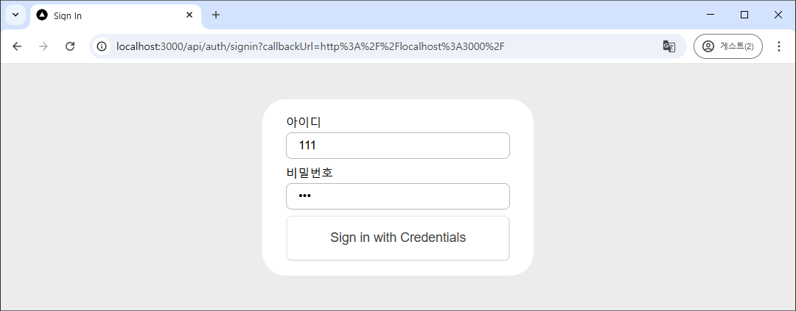

아이디 비번 모두 111을 넣고 [Sign in with Credentials] 버튼을 누르면,

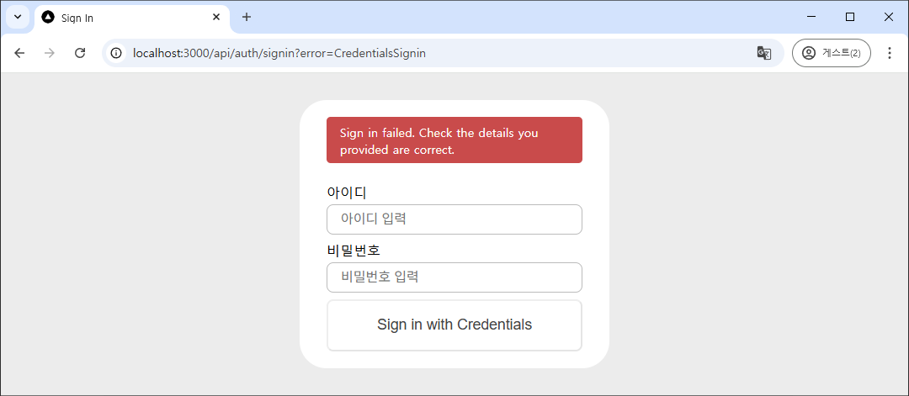

로그인에 실패했다는 메시지를 볼 수 있다. 

이거 전부 nextauth가 기본적으로 해주는 거다. 


### DB를 이용한 진짜 로그인

app/api/auth/[...nextauth]/route.ts 파일을 다시 열어보자. 

authorize() 함수에서 어떤 값을 리턴하면 로그인 성공이고 null을 리턴하면 로그인 실패다. 리턴하는 값은 나중에 세션을 구성할 때 쓰이니 아무 값이나 리턴하면 안 된다.

```ts
// app/api/auth/[...nextauth]/route.ts 

async authorize(credentials, req) {
          return null;  // null을 넘기면 실패했다는 뜻이다. 
        },
```

이 부분을 수정할 거다. 

이걸 하려면 먼저 DBMan 클래스에서 login을 처리하는 함수가 있어야 한다.

```ts
// app/lib/db.ts

    // 로그인. 결과가 null이면 로그인 실패. 그렇지 않으면 로그인 성공
    public async login(id: string, password: string)
    {
        let sql = `
                select 
                    id
                    , nickname
                    , email
                from 
                    member
                where
                    id = '${id}'
                    and pwd = crypt('${password}', pwd)
                    `;

        const result = await this.client.query(sql);
        const rowcount = result?.rowCount || -1;
        
        if (1 == rowcount)
        {
            const data = result.rows[0];
            return data;        
        }

        return null;
    }
```

crypt를 이용해 insert 했으니, crypt를 이용해 where문을 만들어야 한다. 

```sql
 where pwd = crypt('${password}', pwd)
``` 

와 같은 식으로 where 절을 구성하면 된다.


이제 DB는 준비가 되었으니 authorize 함수를 수정하자.

app/api/auth/[...nextauth]/route.ts 파일의 윗부분에 

```ts
// app/api/auth/[...nextauth]/route.ts 

import DBMan, { SMember } from '@/app/lib/db';
```

을 추가해 DB를 사용하도록 준비하고, 

```ts
// app/api/auth/[...nextauth]/route.ts 

          async authorize(credentials, req) {
            const db = new DBMan();
            // console.log("credentials?.username", credentials?.username || "");
            // console.log("credentials?.password", credentials?.password || "");
            const member: SMember = await db.login(credentials?.username || "", credentials?.password || "")
            db.disconnect();
    
            console.log("[login] member: ", member);       
            
            if (member != null)
            {
              console.log("[login]로그인 성공. member: ", member);       
              return member;    // 로그인 성공
            }
            else          
            {
              console.log("[login] 로그인 실패: ", credentials?.username);
              return null;  // 로그인 실패
            }
        },
```

user01 / 1234 로 로그인해 보자. 틀리게도 해보자.

실패한 경우 로그
```ps
connect 성공
[login] member:  null
[login] 로그인 실패:  user01
 POST /api/auth/callback/credentials 302 in 110ms
 GET /api/auth/error?error=CredentialsSignin&provider=credentials 302 in 83ms
 GET /api/auth/signin?error=CredentialsSignin 200 in 79ms
 GET /favicon.ico 200 in 308ms
```

성공한 경우 로그
```ps
connect 성공
[login] member:  { id: 'user01', nickname: 'nickname01', email: 'test@gmail.com' }
[login]로그인 성공. member:  { id: 'user01', nickname: 'nickname01', email: 'test@gmail.com' }
 POST /api/auth/callback/credentials 302 in 108ms
 GET / 200 in 147ms
 GET /favicon.ico?favicon.45db1c09.ico 200 in 314ms
```


### custom 로그인 화면

로그인 실패 시 메시지를 보여주는 등 좀 더 다양한 로그인 관련 처리를 하려면 아무래도 custom 로그인 화면이 있어야 한다. nextauth가 만들어서 보여주는 로그인 화면을 그대로 쓰는 경우는 없을거다.

이를 위해 

app/api/auth/[...nextauth]/route.ts 파일에서 NextAuth() 파라미터로 pages 를 추가해 주면 된다.

providers: 밑에 pages: 를 추가해 주고 signIn() 함수가 호출될 때 이동할 페이지를 적어준다.

```ts
// app/api/auth/[...nextauth]/route.ts

    , pages: {
        signIn: '/auth/signin', // Displays signin buttons
        // signOut: '/auth/signout', // Displays form with sign out button
        // error: '/auth/error', // Error code passed in query string as ?error=
        // verifyRequest: '/auth/verify-request', // (used for check email message)
        // newUser: null, // Will disable the new account creation screen
      }
```      

밑에 여러 종류가 있지만 일단 signIn만 해보자.

여기까지만 하고 다시 [로그인] 버튼을 눌러보면

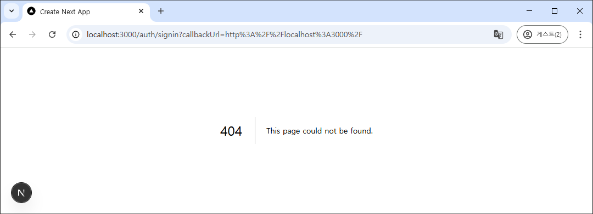

아까와 달리 NOT FOUND 에러가 난다. 

app/api/auth/signin 으로 찾아가야 하는데 그런 폴더가 없어서다.


이제 설정한 것처럼 app/api/auth/signin 폴더를 만들자. 정확한 위치에 폴더가 만들어지지 않으면 dev 서버가 죽기도 한다.

그리고 그 폴더 아래에 page.tsx 파일을 만든다.

```ts
// app/api/auth/signin/page.tsx

'use client'
import React, { useRef } from 'react'
import { signIn } from 'next-auth/react'


export default function LoginForm_C() {
    const useridRef = useRef(null)
    const passwordRef = useRef(null)

    const handleSubmit = async () => {
        //console.log(useridRef.current)
        //console.log(passwordRef.current)

        const result = await signIn('credentials', {
            username: useridRef.current,
            password: passwordRef.current,
            redirect: false,
            callbackUrl: '/',        
        });

        console.log("[Login] result", result);
        
        if (result?.ok == false) 
        {
          location.href = '/';          
        }
        else
        {
          alert("로그인에 실패했습니다.");
        }
    }

  return (    
        <div>
          <label>아이디</label><input ref={useridRef} onChange={(e: any) => {useridRef.current = e.target.value}} id='id' name='id' type='text' required autoFocus={true} />
          <label>비밀번호</label><input ref={passwordRef} onChange={(e: any) => {passwordRef.current = e.target.value}} id='password' name='password' type='password' required />
          
          <button onClick={handleSubmit}>로그인</button>
        </div>
  )
}
```

이제 로그인 버튼을 누르면 `app/api/auth/signin/page.tsx` 파일의 내용이 보여진다.

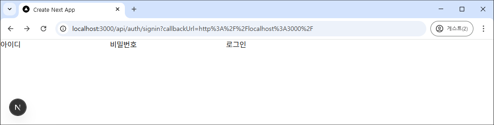

역시나 css 때문에 input box 의 테두리가 안 그려지고 있다. 

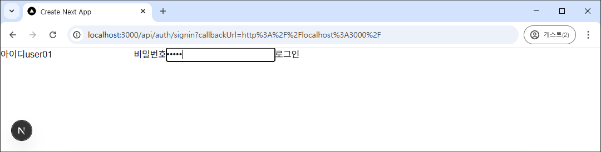

로그인에 성공하면 `/`로 이동하고, 실패하면 에러메시지가 나온다.

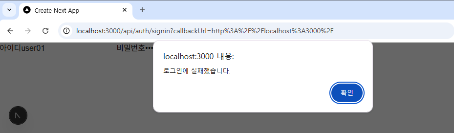

signIn() 함수를 호출하면서 다양한 파라미터를 넘기는데, 그 중 redirect를 true로 세팅하면, 로그인 실패 시 그 자리에 가만히 있고, 성공하면 callbackUrl 에서 정해준 위치로 이동하게 된다. 

뭔가 다른 옵션을 좀 더 찾아볼 필요가 있겠다. 

하지만 일단은 내가 원하는대로 조정하려면 redirect를 false로 놓고 그 아래에서 결과에 따라 (await 하니까) 그에 맞는 처리를 해주었다. 


## 세션 처리

nextauth는 기본적으로 로그인한 결과를 세션에 넣어주고 JWT(JSON Web Token) 값까지 만들어준다. 아무 것도 안해도 세션에 값이 이미 들어가 있는거다.

만약 세션에 저장되는 값을 (당연하게도) 바꾸고 싶다면 `app/api/auth/[...nextauth]/route.ts` 파일에서 이번에는 callbacks: 를 추가해야 한다.

nextauth는 2개의 callbacks를 제공한다.

- jwt() : [jws callback](./nextauth.md#jwt-콜백-함수) 참조
- session() : [session callback](./nextauth.md#session-콜백-함수) 참조

pages 밑에 callbacks: 를 추가해 보자. 


### jwt() 콜백

우선 jwt()를 추가한다.

```ts
// app/api/auth/signin/page.tsx

    , callbacks: 
    {
        jwt({ token, user }) 
        {
          console.log("\n\n");
          console.log("------------------- [jwt callback] -------------------");
          console.log("[jwt] token = ", token, "\n");
          console.log("[jwt] user = ", user);
                    
          return token;
        }
    }
```    

이렇게 해 놓고 로그인을 해보자. 
jwt()는 JWT가 생성되거나 업데이트될 때 실행되는데, authorize() 함수에서 값이 리턴되면 이 값을 기반으로 바로 JWT를 만들기 때문에 이 jwt() 콜백함수도 실행된다.

이렇게 놓고 로그인이 성공하면 jwt()로 넘어오는 값이 어떤 값들인지 vscode의 terminal에 출력된 로그로 확인하자.

```ps
------------------- [jwt callback] -------------------
[jwt] token =  {
  name: undefined,
  email: 'test@gmail.com',
  picture: undefined,
  sub: 'user01'
}

[jwt] user =  { id: 'user01', nickname: 'nickname01', email: 'test@gmail.com' } 
```

token을 가만 보면, member 객체가 가지고 있는 것 중 token이 기존에 가지고 있던 항목  중 하나인 email 항목에 자동으로 들어와 있는 걸 확인할 수 있다. 그리고 `sub` 항목(subject)에 id 값인 'user01'이 들어가 있는 것도 볼 수 있다. 

nickname은 token의 기존 항목에 없는 항목이라 아무 데에도 들어가 있지 않다.
```ts
// app/api/auth/signin/page.tsx

if (member != null)
{
  console.log("[login]로그인 성공. member: ", member);       
  return member;    // 로그인 성공
}
```            
위와 같이 authorize() 함수 내에서 로그인 성공 시 이렇게 리턴한 member 객체가 jwt() 함수의 user 객체로 그대로 들어와 있다.

여기서 쓸 값은 token이니까 token에 user의 값을 옮겨담고 기타 더 필요한 게 있으면 token에 적어주면 된다.

jwt() 함수를 아래처럼 조금 더 고쳤다.

```ts
// app/api/auth/signin/page.tsx

    , callbacks: 
    {
        jwt({ token, user }) 
        {
            console.log("\n\n");
            console.log("------------------- [jwt callback] -------------------");
            console.log("[jwt] token = ", token, "\n");
            console.log("[jwt] user = ", user);

            if (user) 
            {
                token.id = user.id;
                token.nickname = user.nickname;
                token.email = user.email;
            }
            
            return token;
        }
    }
```    

vscode에서 user에는 nickname이라는 값이 없다고 아래처럼 빨간 밑줄을 보여 줄거다. 당장은 큰 에러가 나지는 않으니 이 문제는 [나중에 해결](nextauth_001.md#sessionuser의-데이터-구조-변경) 하자.

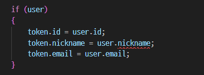

여기까지 로그인하는 순간 nextauth가 JWT 값을 생성하고, 그래서 그 때 jwt() 함수가 콜백되어 token에 값을 쓸 수 있게 되었다.


이 값은 nextauth가 잘 보관하고 있다.


### session() 콜백

이제 nextauth가 가지고 있던 토큰 값을 사용할 떄가 되었다. 사용자가 session에 저장된 값을 원하면 그 때 session() 콜백이 일어난다.

구체적으로는 client component가 useSession 훅을 이용하거나 server component가 getServerSession() 함수를 호출할 때다.

jwt() 함수에서 token에 값이 잘 들어갔는지, 정확히는 어떤 값이 들어갔는지 확인하기 위해서라도 session() 콜백 함수를 만들어보자.

callbacks: 안에 jwt() 함수 아래에 session() 함수를 추가한다.

```ts
// app/api/auth/signin/page.tsx

, async session({ session, token }) 
{
  console.log("\n\n");
  console.log("------------------- [session] -------------------");
  console.log("[session] session = ", session);
  console.log("[session] token = ", token);
  
  return session;
}
```
이렇게 추가하고 로그인을 해도 session() 함수 콜백은 일어나지 않는다. (로그에 아무것도 안나온다) 아무데서도 세션을 이용하지 않고 있으니까. 

이제 nextauth에서 제공하는 세션을 이용해 보자.


### nextauth session

app/login/sign_in_button_c.tsx 파일을 수정하자. session 값을 확인해서 로그인 된 상태면 로그아웃 버튼을 보여주고, 그렇지 않으면 로그인 버튼을 보여주도록 고치려 한다. 그리고 로그인 되어 있는 상태면 nickname도 보여주자.

react의 useSession 훅을 사용해야 한다. 그러기 위해 client component여야 한다. 우리는 이 컴퍼넌트를 client 컴퍼넌트로 만들었었다.

import 부분을 이렇게 바꾼다.

```ts
// app/login/sign_in_button_c.tsx

import { signIn, signOut, useSession } from "next-auth/react";
```

app/login/sign_in_button_c.tsx 파일의 전체 코드는 다음과 같다.

```ts
// app/login/sign_in_button_c.tsx

"use client";
import React from "react";
import { signIn, signOut, useSession } from "next-auth/react";

export default function SignInButton_C() {
  const { data: session } = useSession();

  if (session && session.user)
  {
      return (
          <span onClick={() => signOut()}>{session.user.nickname}님 로그아웃</span>
      );
  }
  else
  {
    return (
          <span onClick={() => signIn()}>로그인</span>
    );
  }    
}
```

여기까지 수정하고 `/` 페이지로 가면(http://localhost:3000)

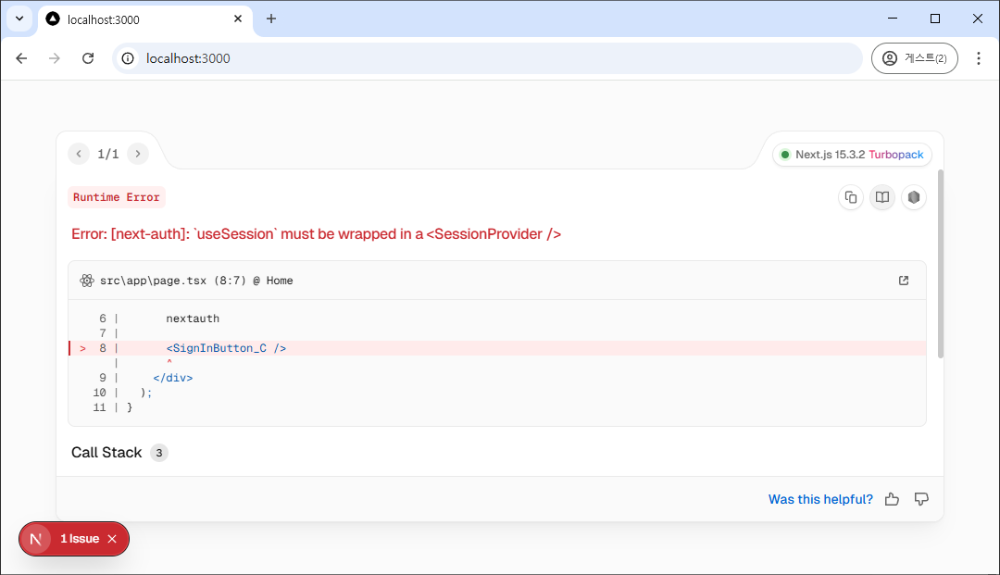


useSession 쓸 꺼면 \<SessionProvider> 로 감싸야 한단다.

그럼 Provider를 만들어 보자.

app/login/providers.tsx 파일을 생성하자.

```ts
// app/login/providers.tsx

"use client";

import { SessionProvider } from "next-auth/react";
import React, { ReactNode } from "react";

interface Props 
{
  children: ReactNode;
}

export default function Providers({ children }: Props) 
{
  return (
    <SessionProvider>{children}</SessionProvider>
  );
}
```

그냥 {children}을 \<SessionProvider>로 감싸기만 한다.

이제 우리의 SingInButton_C 컴퍼넌트를 감싸기 위해 app/page.tsx 파일을 수정하자.

```ts
// app/page.tsx

import Providers from "./login/providers";
import SignInButton_C from "./login/sign_in_button_c";

export default function Home() {
  return (
    <div>
      nextauth
      <Providers>
        <SignInButton_C />
      </Providers>
    </div>
  );
}
```
세션을 사용하는 모든 곳이 감싸지도록 해야 한다. 그래서 대부분 \<Providers> 컴퍼넌트를 return 문의 맨 위와 아래에서 사용한다.

만약 providers를 server component로 만들면(맨 위에 "use client"; 하지 않으면) 아래와 같은 에러를 보게 된다.

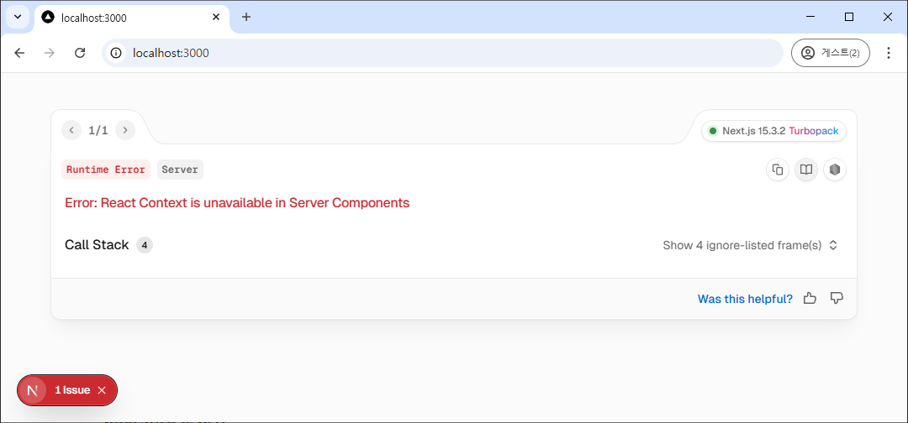

여기까지 진행하면, 

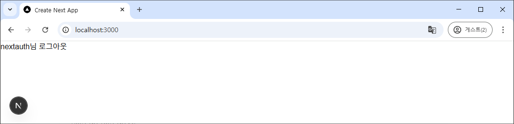

이렇게 나온다.

`session.user.nickname` 부분에 값이 나오지 않다는 걸 알 수 있다.

이제 다시 vscode 터미널의 로그 값을 확인해 보자.

```ps
------------------- [jwt callback] -------------------
[jwt] token =  {
  email: 'test@gmail.com',
  sub: 'user01',
  id: 'user01',
  nickname: 'nickname01',
  iat: 1746768710,
  exp: 1749360710,
  jti: '02e24704-ae76-4333-b8ee-163d5dbcde40'
}

[jwt] user =  undefined


------------------- [session] -------------------
[session] session =  {
  user: { name: undefined, email: 'test@gmail.com', image: undefined },
  expires: '2025-06-08T05:50:56.023Z'
}
[session] token =  {
  email: 'test@gmail.com',
  sub: 'user01',
  id: 'user01',
  nickname: 'nickname01',
  iat: 1746768710,
  exp: 1749360710,
  jti: '02e24704-ae76-4333-b8ee-163d5dbcde40'
}
```

로그인할 때마다 jwt() 함수가 콜백되어 로그에 나왔고, 로그인에 성공하면 `/`로 가도록 했는데 그럼 app/page.tsx를 호출한 거고, 거기서 useSession 훅을 사용하니 session() 함수가 콜백되었다. 그래서 세션 로그가 남은 것.

이 로그를 자세히 보면 파라미터로 넘어온 token에는 jwt() 함수 콜백때 적은 값이 그대로 있고, session.user는 처음 로그인했을 때 봤던 것과 같은 상태라는 걸 알 수 있다.

그리고 한 가지 더 알 수 있는 건 token에 jti(JWT ID)에 값이 들어가 있다는 거다. 이는 JWT를 구분하는데 사용된다. 만약 이상한 행동을 하는 사용자가 있으면 이 jti를 넘기는 사용자는(사용자 특정) 더 이상 아무 것도 하지 못하게 막을 수도 있다.

누군가 session 값을 요구하면 화면에 보여줄 내용들만 session.user에 담아 주자. 보안을 위해.

이제 app/login/sign_in_button_c.tsx 파일에서 `session.user.nickname` 값이 보이지 않았던 문제를 해결할 수 있을 거 같다. 

```ts
, async session({ session, token }) 
{
  console.log("\n\n");
  console.log("------------------- [session] -------------------");
  console.log("[session] session = ", session);
  console.log("[session] token = ", token);

  session.user = {
    id : token.id as string,
    nickname: token.nickname as string,
  };
  
  return session;
}
```

이렇게 session.user 값을 재설정해주면 로그인한 사람의 nickname을 제대로 보여준다.

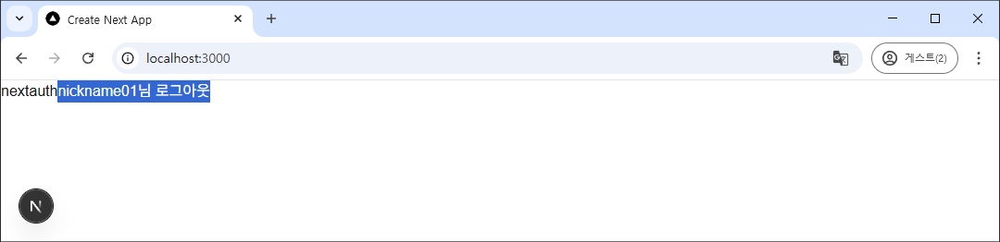

음.. 화면 보여지는 부분을 최소화하려니 이런 참사가.

암튼 여기까지 세션값에 따라 로그인과 로그아웃 버튼이 나오는 걸 확인할 수 있다.


## 로그인한 사람만 볼 수 있는 페이지

로그인한 사람만 볼 수 있는 페이지를 만들어 보겠다. 먼저 Restful API 서비스를 만들고 거기에 제한을 걸어보려 한다. 


### API 서비스 만들기

data 테이블의 값을 읽어서 보여주는 서비스를 만들어 보자.

먼저 DB에서 data 테이블의 값을 모두 가져오는 함수를 만들어야 한다. DBMan 클래스를 수정하자.

```ts
// app/lib/db.ts

    // 데이터 가져오기
    public async getData()
    {
        const sql = `
            select * from data
            `;
        
        const result = await this.client.query(sql);
  
        const data = result.rows;
        console.log("[db.ts getData] result.rows = ", data);

        return data;
    }
```

위와 같이 DBMan 클래스에 함수를 추가한다.

다음으로 app/api/data/route.ts 파일을 만들고 다음과 같이 작성하자.

```ts
// app/api/data/route.ts

import { NextRequest, NextResponse } from 'next/server';
import DBMan from '@/app/lib/db';

export async function GET(req: NextRequest) 
{  
  const db = new DBMan();
  const data = await db.getData();
  db.disconnect();

  return NextResponse.json(data);
}
```

data 테이블의 모든 내용을 보여주는 restful 서비스다. 

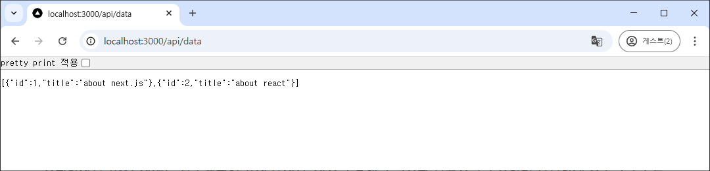

data 테이블의 모든 내용을 json 형태로 리턴해준다.

```json
[{"id":1,"title":"about next.js"},{"id":2,"title":"about react"}]
```

이 서비스의 문제는 로그인하지 않아도 아무나 이 사이트에 접속해 데이터를 볼 수 있다는 거다. 이제 여기에 로그인한 사람만 내용을 볼 수 있도록 수정해 보자.

route.ts는 서버 컴퍼넌트니까 useSession이 아니라 getServerSession() 함수를 이용해야 한다.

app/api/data/route.ts 파일을 수정해 보자.

```ts
import { NextRequest, NextResponse } from 'next/server';
import DBMan from '@/app/lib/db';

import { getServerSession } from 'next-auth';

export async function GET(req: NextRequest) 
{  
    const session = await getServerSession();
    console.log("\n\n[data/route.ts] session = ", session, "\n");

    const db = new DBMan();
    const data = await db.getData();
    db.disconnect();

    return NextResponse.json(data);
}
```

이렇게 하고 로그인 한 다음 

`http://localhost:3000/api/data` 에 접속하면 브라우저에서는 아무 문제가 없는 거 같은데 vscode 의 터미널에 나온 로그는 난리가 났다.

```ps
[next-auth][error][JWT_SESSION_ERROR] 
https://next-auth.js.org/errors#jwt_session_error decryption operation failed {
  message: 'decryption operation failed',
  stack: 'JWEDecryptionFailed: decryption operation failed\n' +
    '    at gcmDecrypt (D:\\test\\nextauth001\\src\\nextauth\\.next\\server\\chunks\\node_modules_jose_dist_node_cjs_b4a80197._.js:769:15)\n' 

    ... 20줄 정도 나온 거 삭제함.
    
  name: 'JWEDecryptionFailed'
}


[data/route.ts] session =  null
```

우선 제일 처음 드는 생각은 아.. \<Proders> 를 page.tsx가 아니라 layout.tsx에서 사용해야 겠구나. 였지만 일단 그 문제는 아닌거 같다.

getServerSession() 함수는 중요한 인자를 하나 받는다. 여태 클라이언트 컴퍼넌트에서 useSession 훅을 사용할 때는 큰 문제없이 쓸 수 있을 줄 알았는데 서버 컴퍼넌트에서 사용하기 위해서는 nextauth를 좀 더 제대로 설정해야 한다. getServerSession() 함수에 authOptions 인자를 추가하면서 nextauth를 좀 더 제대로, 보안을 강화해 가며 사용해 보자.

여태 우리는 app/api/auth/[...nextauth]/route.ts 파일에서 NextAuth() 함수에 복잡한 값을 파라미터로 던져줬다. 

getServerSession() 함수에서 필수인 파라미터인 authOptions: AuthOptions 의 값이 바로 NextAuth() 함수에 넘겨준 값이었다. 

그러니까 const authOptions = {} 과 같이 값이 설정해 주고, 

```ts
const handler = NextAuth(authOptions) 
```

와 같이 넘겨주면 되는 거였다.

이렇게 수정한 버전이 다음과 같다.

```ts
// app/api/auth/[...nextauth]/route.ts

import NextAuth from 'next-auth/next'
import CredentialsProvider from 'next-auth/providers/credentials'
import DBMan, { SMember } from '@/app/lib/db';
import { AuthOptions } from 'next-auth';

export const authOptions: AuthOptions = {
  providers: [
    CredentialsProvider({
      name: 'Credentials',
      credentials: {
        username: { label: '아이디', type: 'text', placeholder: '아이디 입력' },
        password: { label: '비밀번호', type: 'password', placeholder: '비밀번호 입력' },
      },

      async authorize(credentials, req) {
          const db = new DBMan();
          // console.log("credentials?.username", credentials?.username || "");
          // console.log("credentials?.password", credentials?.password || "");
          const member: SMember = await db.login(credentials?.username || "", credentials?.password || "")
          db.disconnect();
  
          console.log("[login] member: ", member);       
          
          if (member != null)
          {
            console.log("[login]로그인 성공. member: ", member);       
            return member;    // 로그인 성공
          }
          else          
          {
            console.log("[login] 로그인 실패: ", credentials?.username);
            return null;  // 로그인 실패
          }
      },
    }),
  ] 

  , pages: 
  {
      signIn: '/auth/signin', // Displays signin buttons
      // signOut: '/auth/signout', // Displays form with sign out button
      // error: '/auth/error', // Error code passed in query string as ?error=
      // verifyRequest: '/auth/verify-request', // (used for check email message)
      // newUser: null, // Will disable the new account creation screen
  }
  
  , callbacks: 
  {
      jwt({ token, user }) 
      {
          console.log("\n\n");
          console.log("------------------- [jwt callback] -------------------");
          console.log("[jwt] token = ", token, "\n");
          console.log("[jwt] user = ", user);

          if (user) 
          {
              token.id = user.id;
              token.nickname = user.nickname;
              token.email = user.email;
          }
          
          return token;
      }

      , async session({ session, token }) 
      {
        console.log("\n\n");
        console.log("------------------- [session] -------------------");
        console.log("[session] session = ", session);
        console.log("[session] token = ", token);

        session.user = {
          id : token.id as string,
          nickname: token.nickname as string,
        };
        
        return session;
      }
  }
};

const handler = NextAuth(authOptions)
  
export { handler as GET, handler as POST }
```

이것만으로는 아직 getServerSession() 함수가 정상동작하지 않는다. JWT가 서명하기 위해 필요한 키를 입력해 줘야 한다. 

프로젝트 루트 폴더(D:\test\nextauth001\src\nextauth)에 `.env` 파일을 하나 생성하고, 그 파일에 다음과 같이 적는다. 

```ts
// 프로젝트 루트 폴더 / .env

NEXTAUTH_SECRET=asdflkajweofjaweofawjawofj902384fawoeijfawoefjq2398fjsadffj0234jfalweka
```

이 `.env` 파일은 git에 올리지 않도록 .gitignore에 추가해 놔야 한다. 저 키는 JWT 서명할 때 사용하는 키라 외부로 나가면 안 된다.

이제 이 키를 사용하도록 authOptions에 추가해야 한다.

```ts
, secret: process.env.NEXTAUTH_SECRET
```

를 추가한다. 

여기까지 한 전체 코드는 다음과 같다.

```ts
import NextAuth from 'next-auth/next'
import CredentialsProvider from 'next-auth/providers/credentials'
import DBMan, { SMember } from '@/app/lib/db';
import { AuthOptions } from 'next-auth';

export const authOptions: AuthOptions = {
  providers: [
    CredentialsProvider({
      name: 'Credentials',
      credentials: {
        username: { label: '아이디', type: 'text', placeholder: '아이디 입력' },
        password: { label: '비밀번호', type: 'password', placeholder: '비밀번호 입력' },
      },

      async authorize(credentials, req) {
          const db = new DBMan();
          // console.log("credentials?.username", credentials?.username || "");
          // console.log("credentials?.password", credentials?.password || "");
          const member: SMember = await db.login(credentials?.username || "", credentials?.password || "")
          db.disconnect();
  
          console.log("[login] member: ", member);       
          
          if (member != null)
          {
            console.log("[login]로그인 성공. member: ", member);       
            return member;    // 로그인 성공
          }
          else          
          {
            console.log("[login] 로그인 실패: ", credentials?.username);
            return null;  // 로그인 실패
          }
      },
    }),
  ]
  , secret: process.env.NEXTAUTH_SECRET

  , pages: 
  {
      signIn: '/auth/signin', // Displays signin buttons
      // signOut: '/auth/signout', // Displays form with sign out button
      // error: '/auth/error', // Error code passed in query string as ?error=
      // verifyRequest: '/auth/verify-request', // (used for check email message)
      // newUser: null, // Will disable the new account creation screen
  }
  
  , callbacks: 
  {
      jwt({ token, user }) 
      {
          console.log("\n\n");
          console.log("------------------- [jwt callback] -------------------");
          console.log("[jwt] token = ", token, "\n");
          console.log("[jwt] user = ", user);

          if (user) 
          {
              token.id = user.id;
              token.nickname = user.nickname;
              token.email = user.email;
          }
          
          return token;
      }

      , async session({ session, token }) 
      {
        console.log("\n\n");
        console.log("------------------- [session] -------------------");
        console.log("[session] session = ", session);
        console.log("[session] token = ", token);

        session.user = {
          id : token.id as string,
          nickname: token.nickname as string,
        };
        
        return session;
      }
  }
};

const handler = NextAuth(authOptions)
  
export { handler as GET, handler as POST }
```

이제 다시 app/api/data/route.ts 파일을 수정해 위에 수정한 authOptions를 getServerSession() 함수에 파라미터로 넘기도록 해보자.

```ts
import { NextRequest, NextResponse } from 'next/server';
import DBMan from '@/app/lib/db';

import { getServerSession } from 'next-auth';
import { authOptions } from '@/app/api/auth/[...nextauth]/route';

export async function GET(req: NextRequest) 
{  
    console.log("authOptions: ", authOptions);
    console.log("process.env.NEXTAUTH_SECRET: ", process.env.NEXTAUTH_SECRET);
    
    const session = await getServerSession(authOptions);
    console.log("\n\n[data/route.ts] session = ", session, "\n");

    const db = new DBMan();
    const data = await db.getData();
    db.disconnect();

    return NextResponse.json(data);
}
```

다시 로그인하자. 그리고 `http://localhost:3000/api/data`에 접속한다.

이제 로그를 보면 다음과 같이 서버에서도 값을 제대로 가져오고 있다는 것을 알 수 있다.

```ps
authOptions:  {
  providers: [
    {
      id: 'credentials',
      name: 'Credentials',
      type: 'credentials',
      credentials: [Object],
      authorize: [Function: authorize],
      options: [Object]
    }
  ],
  secret: 'asdflkajweofjaweofawjawofj902384fawoeijfawoefjq2398fjsadffj0234jfalweka',
  pages: { signIn: '/auth/signin' },
  callbacks: { jwt: [Function: jwt], session: [AsyncFunction: session] }
}
process.env.NEXTAUTH_SECRET:  asdflkajweofjaweofawjawofj902384fawoeijfawoefjq2398fjsadffj0234jfalweka


------------------- [jwt callback] -------------------
[jwt] token =  {
  email: 'test@gmail.com',
  sub: 'user01',
  id: 'user01',
  nickname: 'nickname01',
  iat: 1746779367,
  exp: 1749371367,
  jti: 'b057cd20-d9e4-4df6-880a-cb4c3b619be7'
}

[jwt] user =  undefined


------------------- [session] -------------------
[session] session =  {
  user: { name: undefined, email: 'test@gmail.com', image: undefined },
  expires: '2025-06-08T08:29:32.449Z'
}
[session] token =  {
  email: 'test@gmail.com',
  sub: 'user01',
  id: 'user01',
  nickname: 'nickname01',
  iat: 1746779367,
  exp: 1749371367,
  jti: 'b057cd20-d9e4-4df6-880a-cb4c3b619be7'
}


[data/route.ts] session =  { user: { id: 'user01', nickname: 'nickname01' } }

connect 성공
[db.ts getData] result.rows =  [ { id: 1, title: 'about next.js' }, { id: 2, title: 'about react' } ]
```

이제 session 값이 없으면 튕겨내면 된다.

```ts
import { NextRequest, NextResponse } from 'next/server';
import DBMan from '@/app/lib/db';

import { getServerSession } from 'next-auth';
import { authOptions } from '@/app/api/auth/[...nextauth]/route';

export async function GET(req: NextRequest) 
{      
    const session = await getServerSession(authOptions);
    console.log("\n\n[data/route.ts] session = ", session, "\n");

    if (session)
    {
        const db = new DBMan();
        const data = await db.getData();
        db.disconnect();

        return NextResponse.json(data);
    }
    else
    {
        return NextResponse.json("권한 없음");
    }
}
```
다시 로그인하자. 그리고 `http://localhost:3000/api/data`에 접속해 보자.

```ps
[data/route.ts] session =  { user: { id: 'user01', nickname: 'nickname01' } }
```

로그인하면 session에 값이 제대로 들어온다.

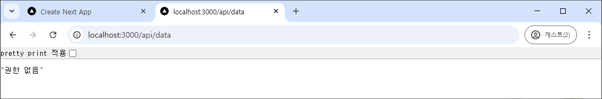

로그아웃하고 `http://localhost:3000/api/data`에 접속하면 위와 같은 메시지만 나오고 데이터는 보여주지 않는다.

getServerSession() 함수를 이용하면 내부적으로 JWT의 서명부분을 자동으로 확인해준다. 암호화하고 복호화하기 위해 authOptions에 NEXTAUTH_SECRET 가 필요했던 것.


## Session.User의 데이터 구조 변경

app/api/auth/[...nextauth]/route.ts 파일에서 jwt() 콜백 함수 내에서 아래와 같이 나타나는 걸 볼 수 있다. typescript에서는 이 문제를 해결해야 한다.


Session.user는 {id, name, email}으로 구성되어 있다. 그래서 nickname이 없다고 저렇게 빨간색으로 나오는 거다. 

이 문제는 Session.user의 타입을 새로 정의해 주면 된다.

app/types 폴더를 하나 만들자.

그 안에 next-auth.d.ts 파일을 생성하자.

```ts
// app/types/next-auth.d.ts

import NextAuth from "next-auth"

declare module "next-auth" {
  interface Session {
    user: {
        id: string;
        nickname: string;        
        email: string | null;
    }
  }

  interface User {
    id: string;
    nickname: string;    
    email: string | null;
  }

}
```

이렇게 타입을 재정의해주면 된다.

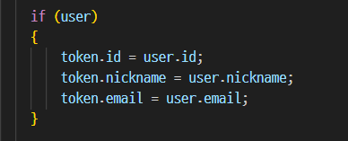

이제 빨간 줄이 없어졌다. 

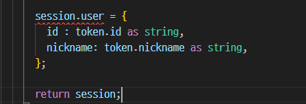

새롭게 여기에 빨간 줄이 새로 생겼는데, 이건 Session.user에 email이 있는데 들어가지 않아서 생긴거다. 

이거마저 안나오게 하고 싶다면

```ts
email?: string | null;
```
이렇게 해주면 된다.

```ts
// app/types/next-auth.d.ts

import NextAuth from "next-auth"

declare module "next-auth" {
  interface Session {
    user: {
        id: string;
        nickname: string;        
        email?: string | null;
    }
  }

  // jwt() 콜백 함수에 들어가는 user 파라미터 구조 변경
  interface User {
    id: string;
    nickname: string;    
    email?: string | null;
  }
}
```

이렇게 해주면 모든 문제가 해결된다.