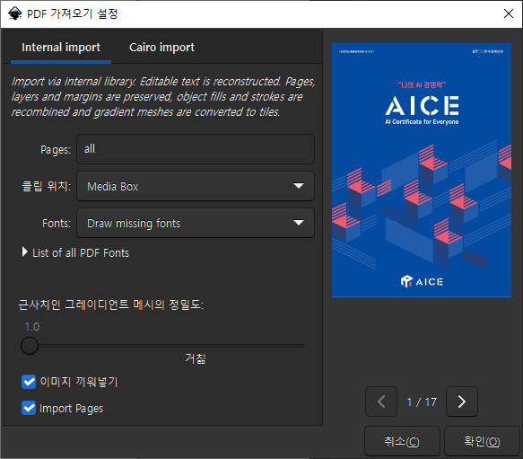
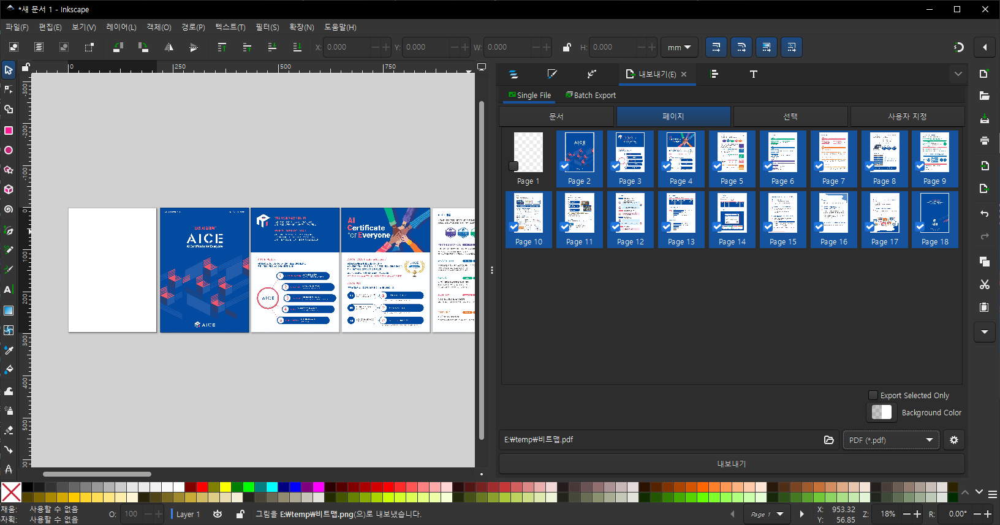
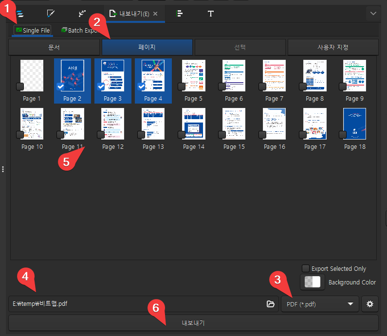

# pdf 내용 수정하기

## pdf 읽어들여 수정 - inkscape

pdf 파일을 inkscape에서 읽어들인다. inkscape 1.4.2 사용

첫 페이지는 빈 페이지고 그 다음 페이지부터 pdf 파일의 내용이 보여진다.

inkscape를 이용해 내용을 마음껏 수정한다.

그리고 내보내기를 하면서 '페이지' 탭을 선택한 후

1. single file 선택
2. 페이지 선택
3. 확장자를 'pdf'로 변경하면 여러 페이지를 선택할 수 있다. 
4. 저장될 파일명을 선택하고
5. 저장할 페이지들을 선택한다.

여기서 page1은 선택을 풀어준다. 이 페이지는 맨 처음 앱을 실행할 때 만들어져 있던 페이지로 내용이 비어있다.

이제 '내보내기' 버튼을 누르면 하나의 완성된 파일이 만들어진다.