# podman

- 공식 홈페이지: [https://podman.io](https://podman.io/)

- 윈도우에서 설치: [https://github.com/containers/podman/blob/main/docs/tutorials/podman-for-windows.md](https://github.com/containers/podman/blob/main/docs/tutorials/podman-for-windows.md)

## 설치(윈도우)

cli를 꼭 설치해야 하나, 나는 데스크탑만 설치하고 싶은데.. 싶지만 위 공식 설치 안내문서가 cli를 기반으로 하고 있기 때문에, 그리고 윈도우만 설치해서는 뭔가 안되는 거 같기도 하다.

그래도 나는 한 번 CLI는 설치하지 않고 Podman Desktop만 설치해 보기로 하겠다. (tl;dr: desktop 사용 중에 CLI를 설치하라고 안내한다.)

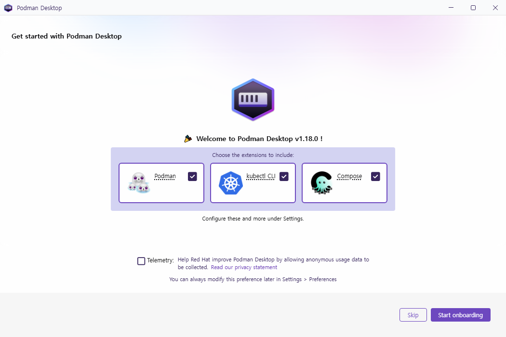

처음 설치 후 실행하면 이렇게 나온다. 

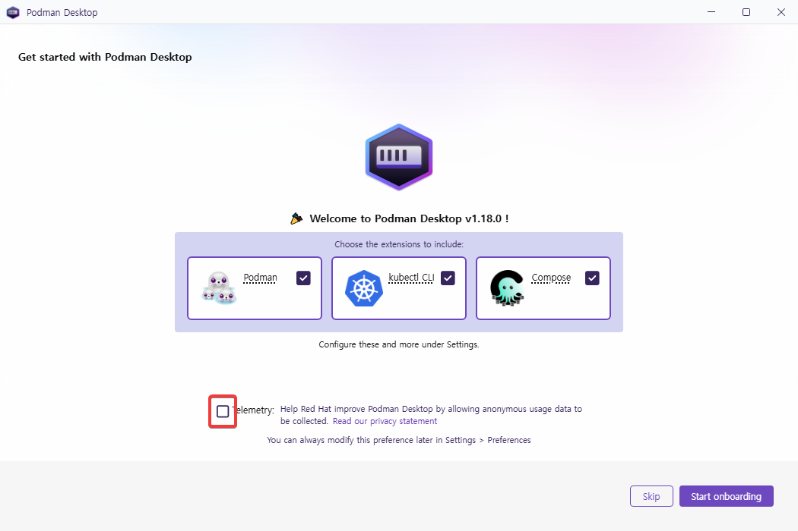

정보제공만 uncheck하고 [start onboarding] 버튼을 눌렀다.


음.. podman desktop을 실행했는데 podman이 없다니. [next]를 누르면

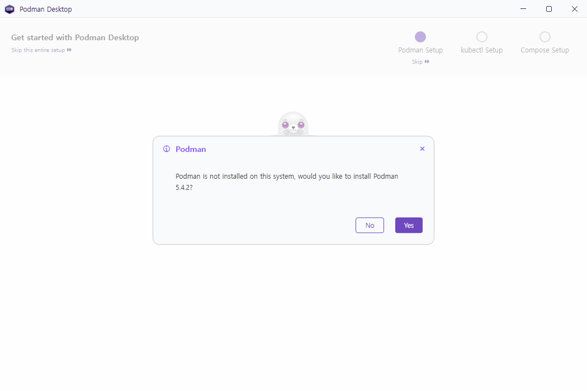

아.. 결국 podman 5.4.2를 설치하라고 한다. 아래 그림에서 알 수 있듯 이게 podman CLI임

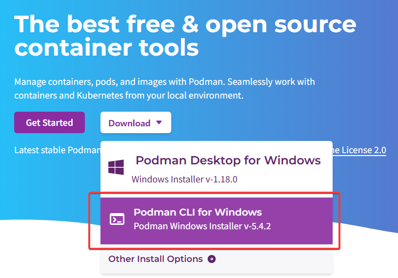

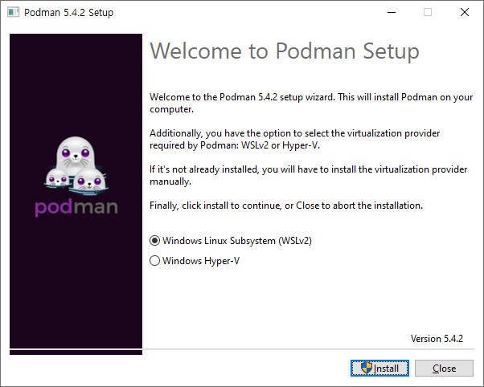

이렇게 WSL2로 설치한다.

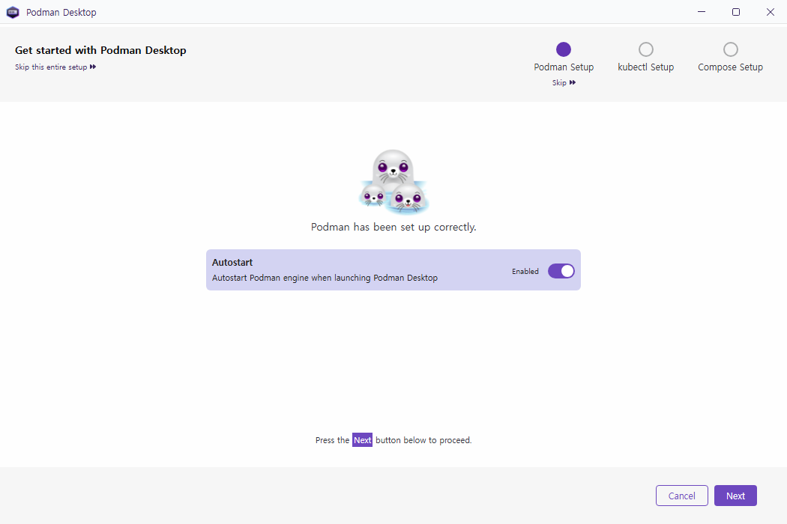

podman desktop을 실행하면 podman engine도 자동 실행한다는 옵션이 default로 설정되어 있다.

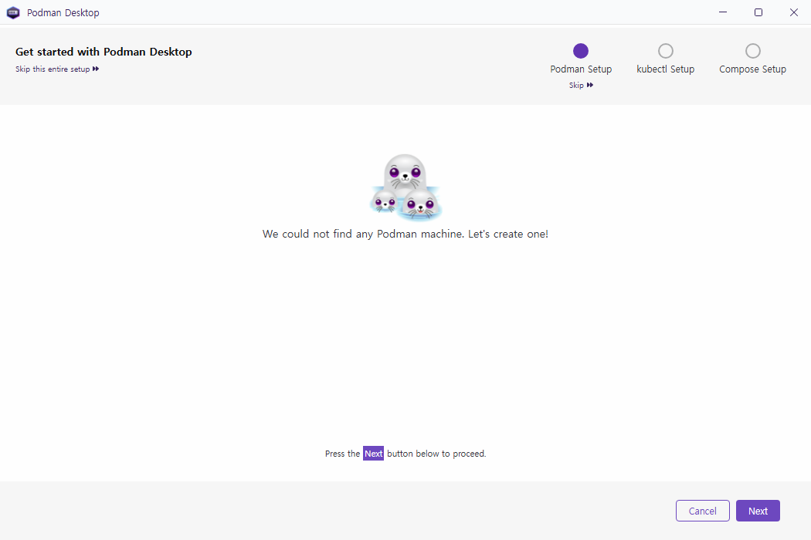

podman machine이 없다니.. 무슨 소리지. 일단 하나 만들러 가자.

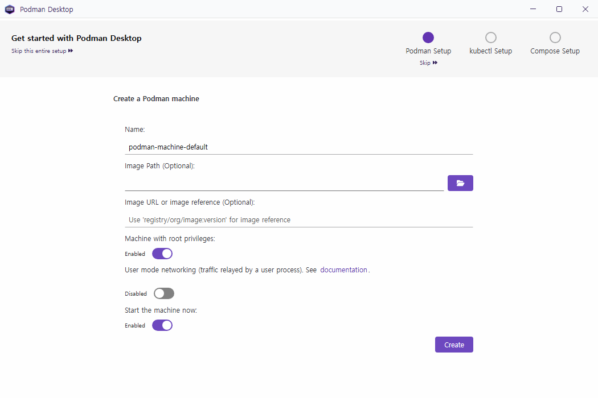

뭔지 모르니 기본값으로 머신을 만들자. 꽤 시간이 걸린다.

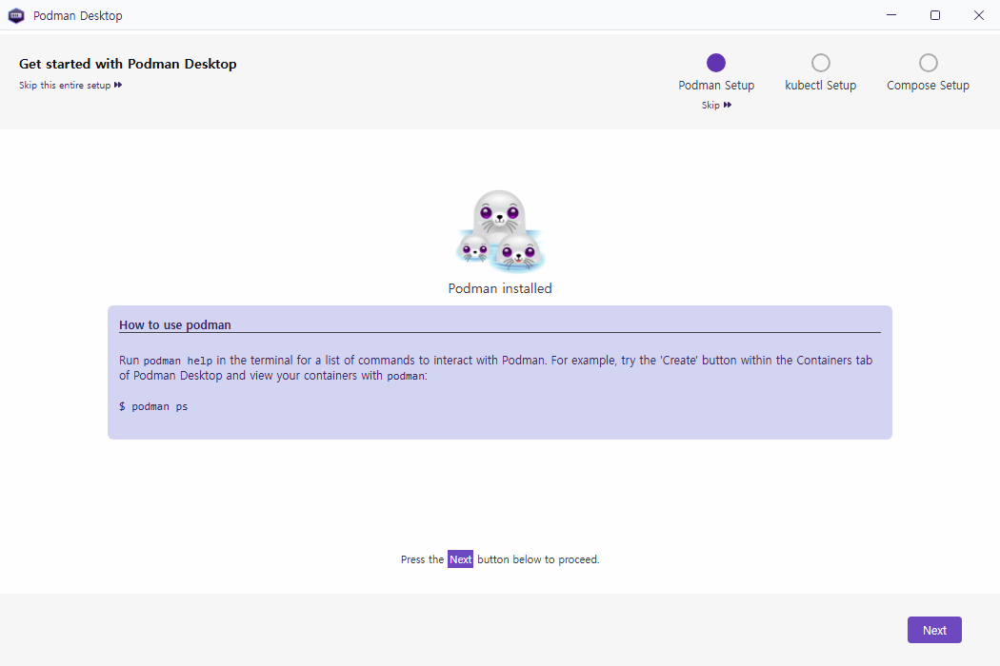

```
How to use podman
-----------------------------------------------------------------
Run podman help in the terminal for a list of commands to interact with Podman. 
For example, try the 'Create' button within the Containers tab of Podman Desktop and view your containers with podman:

$ podman ps
```

podman은 `windows terminal`을 설치해서 사용하길 원한다.

```
winget install Microsoft.WindowsTerminal
```

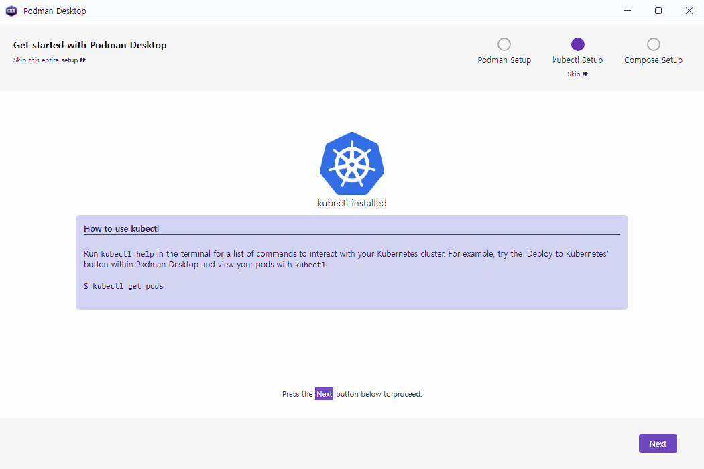

```
How to use kubectl
-----------------------------------------------------------------
Run kubectl help in the terminal for a list of commands to interact with your Kubernetes cluster. For example, try the 'Deploy to Kubernetes' button within Podman Desktop and view your pods with kubectl:

$ kubectl get pods
```


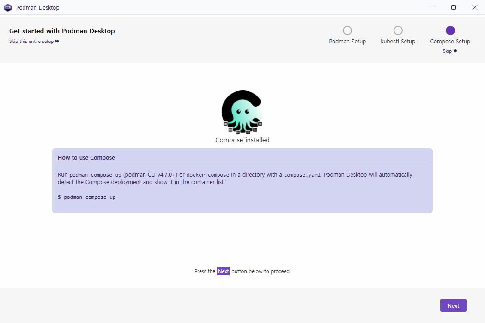
```
How to use Compose
-----------------------------------------------------------------
Run podman compose up (podman CLI v4.7.0+) or docker-compose in a directory with a compose.yaml. Podman Desktop will automatically detect the Compose deployment and show it in the container list.'

$ podman compose up
```

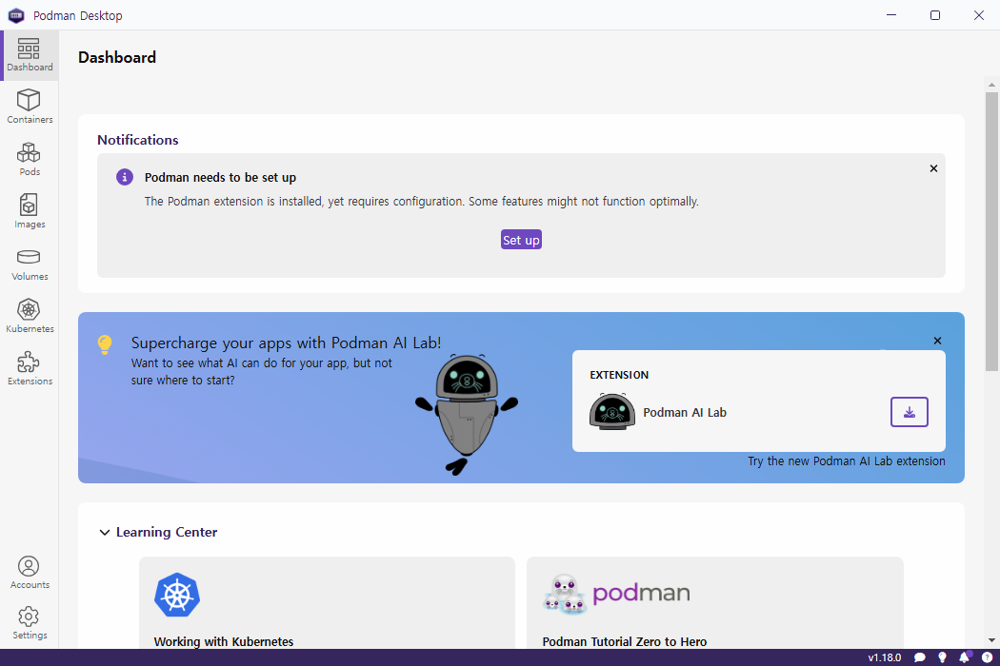

설정이 다 끝나면 dashboard가 나타난다.


## 이미지 다운로드: postgresql

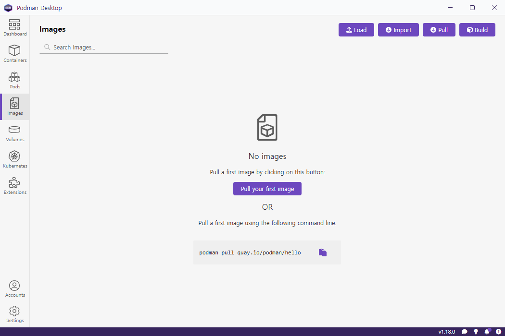

왼쪽 메뉴에서 [Images] 를 선택한다.

[pull your first image] 버튼을 누르면 자동으로 이미지 하나를 다운로드 받아준다. 이미지 이름은 `quay.io/podman/hello` 이다. 시간이 꽤 걸린다. 

이 이미지에 대한 정보는 [https://quay.io/repository/podman/hello?tab=info](https://quay.io/repository/podman/hello?tab=info)에서 볼 수 있다.

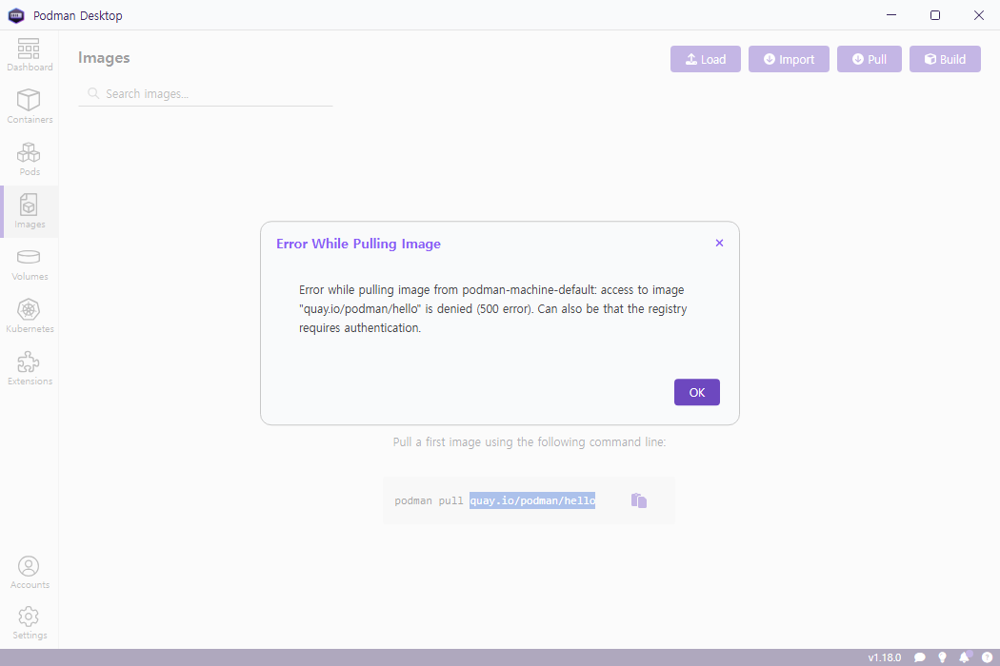

내 경우엔 이렇게 에러가 발생했다. 500에러다 따로 해결하지 않겠음. 이거 레드햇에 로그인해야 다운로드 되는 거 같다.


왼쪽 위에 "Search images..." 이 있는데 여기서 검색해도 아무것도 검색되지 않는다. 여기는 local 에 저장되어 있는 image를 검색하는 것이다. 

이미지를 다운로드 하기 위해 오른쪽 위 보라색 [Pull] 버튼을 누른다.


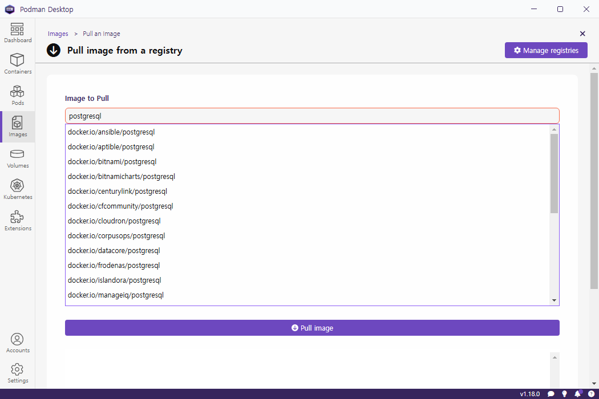

검색어를 넣기만 하고 엔터는 치지 말자. 자동으로 pull image 버튼까지 눌리기 때문이다.

검색결과가 나오긴 했는데 도커 desktop과 달리 메타데이터 같은 설명이 없어 뭘 다운로드 받아야 할 지 알 수가 없다. 

지금은 어디가서 봐야 상세 정보를 할지 알 수가 없다. 