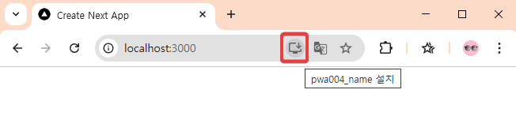
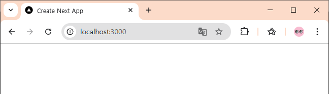
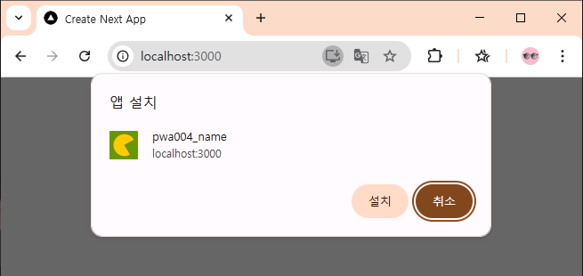
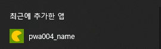
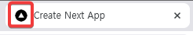

# next.js를 pwa로

[next.js에서 pwa 공식 문서](https://nextjs.org/docs/app/guides/progressive-web-apps)

**아래 그림처럼 주소창에 `앱 설치` 버튼을 나타내는 방법**




## 프로젝트 생성
```ps
S E:\test\nextjstest> npx create-next-app
√ What is your project named? ... pwa004
√ Would you like to use TypeScript? ... No / Yes
√ Would you like to use ESLint? ... No / Yes
√ Would you like to use Tailwind CSS? ... No / Yes
√ Would you like your code inside a `src/` directory? ... No / Yes
√ Would you like to use App Router? (recommended) ... No / Yes
√ Would you like to use Turbopack for `next dev`? ... No / Yes
√ Would you like to customize the import alias (`@/*` by default)? ... No / Yes
Creating a new Next.js app in E:\test\nextjstest\pwa004.

Using npm.

Initializing project with template: app-tw


Installing dependencies:
- react
- react-dom
- next

Installing devDependencies:
- typescript
- @types/node
- @types/react
- @types/react-dom
- @tailwindcss/postcss
- tailwindcss
- eslint
- eslint-config-next
- @eslint/eslintrc


added 397 packages, and audited 398 packages in 39s

161 packages are looking for funding
  run `npm fund` for details

found 0 vulnerabilities
Success! Created pwa004 at E:\test\nextjstest\pwa004

PS E:\test\nextjstest>
```


## 프로젝트 빌드
```ps
npm run build
npm run start
```



이렇게 주소창 옆에 `앱 설치 버튼`이 안 나온다.


## 패키지 설치
[next-pwa](https://github.com/shadowwalker/next-pwa#readme) 설치

```ps
npm install next-pwa
npm install --save-dev @types/next-pwa
```


## next.config.ts 파일 수정
```ts
import type { NextConfig } from "next";

const nextConfig: NextConfig = {
  /* config options here */
};

export default nextConfig;
```

파일을 아래처럼 수정한다.

```ts
import type { NextConfig } from "next";
import withPWA from "next-pwa";

const nextConfig: NextConfig = {
  /* config options here */
};

const pwaConfig = withPWA({
  ...nextConfig,
  dest: 'public'
});

export default pwaConfig;

```

음.. 그런데 이거 build할 때 warning 난다. 그래도 되기는 한다. 그래도 찝찝하다.

```
PS E:\test\nextjstest\pwa004> npm run build

> pwa004@0.1.0 build
> next build

 ⚠ Invalid next.config.ts options detected: 
 ⚠     Unrecognized key(s) in object: '0', '1', '2', '3', '4', '5', '6', '7', '8', '9', '10', '11', '12', '13', '14', '15', '16', '17', '18', '19', '20', '21'
 ⚠ See more info here: https://nextjs.org/docs/messages/invalid-next-config
   ▲ Next.js 15.3.2
```
해결한 방법은 다음과 같다. 언젠가는 위 방법의 문제를 찾아내겠다.  

```js
const withPWA = require('next-pwa')({
  dest: 'public',
});

/** @type {import('next').NextConfig} */
const nextConfig = {
  // 기존 Next.js 설정
};

module.exports = withPWA(nextConfig);
```


## manifest.json 파일 생성
`public` 폴더 안에 manifest.json 파일을 만들고 다음 내용을 넣는다.
```json
{
  "name": "pwa004_name",
  "short_name": "pwa004_short_name",
  "description": "pwa004_descript",
  "theme_color": "#ffc211",
  "background_color": "#ffffff",
  "display": "standalone",
  "scope": "/",
  "start_url": "/",
  "icons": [
    {
      "src": "/icons/images/icon-192.png",
      "sizes": "192x192",
      "type": "image/png"
    },
    {
      "src": "/icons/images/icon-512.png",
      "sizes": "512x512",
      "type": "image/png"
    }
  ]
}
```


## layout.tsx 파일 수정
metadata에 다음 한 줄 추가
```tsx
manifest: '/manifest.json'
```

전체 layout.tsx 파일은 다음과 같다.
```tsx
import type { Metadata } from "next";
import "./globals.css";


export const metadata: Metadata = {
  title: "Create Next App",
  description: "Generated by create next app",
  manifest: '/manifest.json'
};

export default function RootLayout({
  children,
}: Readonly<{
  children: React.ReactNode;
}>) {
  return (
    <html lang="en">
      <body>
        {children}
      </body>
    </html>
  );
}

```


## 이미지 파일 복사
public 폴더 밑에 

```ps
/icons/images/icon-192.png
/icons/images/icon-512.png
```
파일을 복사해 넣는다.


## 빌드하고 테스트
```ps
PS E:\test\nextjstest\pwa004> npm run build
PS E:\test\nextjstest\pwa004> npm run start
```







윈도우 키를 누르면 나오는 시작메뉴 맨 위에 `최근에 추가한 앱`에 표시된다.



브라우저의 저 이미지를 바꾸고 싶으면 `favicon.ico` 파일을 바꾼다.