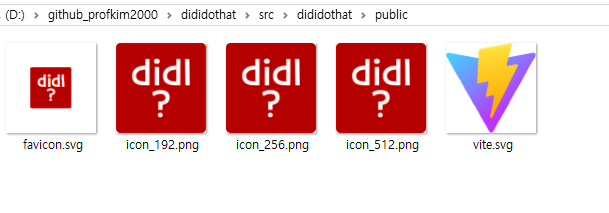

# vite react를 pwa로

출처: https://www.perplexity.ai/search/vite-pwa-zErU3jUtTyOFdxUfpvEOHA#1

## 1. pwa 플러그인 설치

홈페이지: [https://vite-pwa-org.netlify.app/](https://vite-pwa-org.netlify.app/)

```ps
npm install -D vite-plugin-pwa
```

```ps
PS D:\github_profkim2000\dididothat\src\dididothat> npm install -D vite-plugin-pwa
npm warn deprecated inflight@1.0.6: This module is not supported, and leaks memory. Do not use it. Check out lru-cache if you want a good and tested way to coalesce async requests by a key value, which is much more comprehensive and powerful.       
npm warn deprecated glob@7.2.3: Glob versions prior to v9 are no longer supported  
npm warn deprecated sourcemap-codec@1.4.8: Please use @jridgewell/sourcemap-codec instead

added 384 packages in 22s

96 packages are looking for funding
  run `npm fund` for details
PS D:\github_profkim2000\dididothat> 
```

deprecated가 많이 보인다. -.-;


## 2. vite.config.ts 설정

플러그인 import
```ts
import { VitePWA } from 'vite-plugin-pwa';
```

plugins 항목에 추가
```ts
plugins: [
    react(),
    VitePWA({
      registerType: 'autoUpdate', // 서비스 워커 자동 업데이트 설정
      devOptions: {
        enabled: true, // 개발 모드에서 PWA 활성화 (선택 사항)
      },
      workbox: {
        globPatterns: ['**/*.{js,css,html,ico,png,svg}'], // 캐싱할 파일 패턴
      },
      manifest: {
        name: '출퇴근 기록기',
        short_name: 'DidIDoThat?',
        description: '내가 그걸 했던가 기록하는 앱',
        theme_color: '#ffffff',
        icons: [
          {
            src: 'icon_192.png',
            sizes: '192x192',
            type: 'image/png',
          },
          {
            src: 'icon_256.png',
            sizes: '256X256',
            type: 'image/png',
          },
          {
            src: 'icon_512.png',
            sizes: '512x512',
            type: 'image/png',
          },
          {
            src: 'icon_512.png',
            sizes: '512x512',
            type: 'image/png',
            purpose: 'any maskable',
          },
        ],
      },
    }),
  ],
```  


## 3. 아이콘 추가

`favicon.ico` 파일과 위 vite.config.ts 파일 `icons` 항목에 넣은 파일들을 `public` 폴더에 넣는다. `public\image` 폴더 등 밑에 넣어도 되지만 public 폴더에 별 다른게 없으니 그냥 바로 public 폴더 바로 밑에 넣자.




## 4. index.html 수정
head 태그에 다음 link 추가

```html
<link rel="icon" href="/icon_192.png" sizes="192x192" />
<!--<link rel="apple-touch-icon" href="/apple-touch-icon.png" /> 애플에서 쓰는 건가봄.-->
<link rel="manifest" href="/manifest.webmanifest" />
```

만약 github.io에 올리는 등 서브 디렉토리 밑에 붙는 거라면, link 태그가 붙은 모든 링크 앞에 전부 다 그 서비 디렉토리를 반영해야 한다. 

만약 USERNAME.github.io/PROJECTNAME 에 올리는 거라면 아래와 같이 되어야 한다.

```html
<link rel="icon" href="/PROJECTNAME/icon_192.png" sizes="192x192" />
<!--<link rel="apple-touch-icon" href="/PROJECTNAME/apple-touch-icon.png" /> 애플에서 쓰는 건가봄.-->
<link rel="manifest" href="/PROJECTNAME/manifest.webmanifest" />
```

생성되는 파일은 `manifest.webmanifest` 인데 대부분의 자료는 `manifest.json`으로 표시되어 있다. 확인하자.

기본 생성되어 있는 
```html
<link rel="icon" type="image/svg+xml" href="/vite.svg" />
```
이 부분은 자동으로 PROJECTNAME 처리가 되니 건드리지 말자. 


## 5. build
dist 폴더에 `manifest.webmanifest` 파일도 자동 생성되었는지 확인한다. `manifest.webmanifest` 파일이 없으면 pwa가 제대로 안된다.