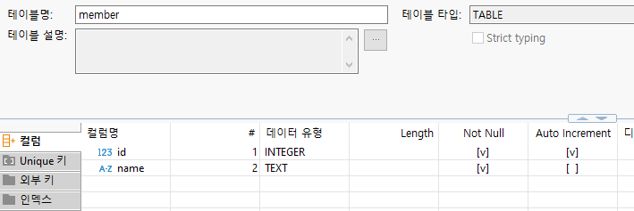

# SQLite3 in Next.js

## 프로젝트 생성
```ps
npx create-next-app
```

## sqlite3 설치
```ps
npm install sqlite3
npm install -D @types/sqlite3
```

## DB 연결
```tsx
// app/page.tsx

import sqlite3 from 'sqlite3';

export default function Home() {
  // 데이터베이스 연결
  const db = new sqlite3.Database('./sqlite3_001.sqlite');
  return (
    <div>
    </div>
  );
}
```

이 코드를 실행하는 순간 프로젝트 루트에 `sqlite3_001.sqlite` 파일이 생성된다.


## DB 연결 끊기
```tsx
// 데이터베이스 닫기
db.close();
```  

## DBeaver에서 테이블 생성



## 쿼리 실행
```tsx
import sqlite3 from 'sqlite3';

export default function Home() {
  // 데이터베이스 연결
  const db = new sqlite3.Database('./sqlite3_001.sqlite');

  // insert
  db.exec("insert into member (name) values ('steve')");

  // 데이터베이스 닫기
  db.close();

  return (
    <div>
    </div>
  );
}
```


## 여러 개의 row가 나올 것으로 예상되는 쿼리
```tsx
import sqlite3 from 'sqlite3';

interface SMember
{
  id: number;
  name: string;
}

export default function Home() {
  // 데이터베이스 연결
  const db = new sqlite3.Database('./sqlite3_001.sqlite');

  // insert
  //db.exec("insert into member (name) values ('steve')");

  // 여러 개의 row가 나올 것으로 예상되는 쿼리
  db.all("select * from member", [], (err, rows: Array<SMember>) =>
  {
    if (err)
    {
      console.error(err.message);
      return;
    }

    rows.forEach((row) => {
      console.log(`id: ${row.id}, 이름: ${row.name}`);
    })

  });

  // 데이터베이스 닫기
  db.close();

  return (
    <div>
    </div>
  );
}
```

## 데이터가 하나인 경우 쿼리

```tsx
// 한 개의 row가 나올 것으로 예상되는 쿼리
  db.get("select * from member where id = ?", [3], (err, row: SMember) =>
  {
    if (err)
    {
      console.error(err.message);
      return;
    }

    if (row)
    {
      console.log(`id: ${row.id}, 이름: ${row.name}`);
    }
  });
  ```