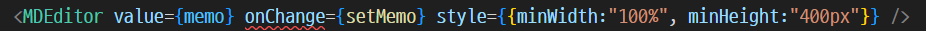

# typescript

## MDEditor의 change 이벤트 처리



이렇게 onChange에 빨간줄이 나온다. 
이게 setState에 걸려 있는데 아무리 해도 해결이 안된다. 

이럴 때는 vscode에서 저 `onChange` 부분을 ctrl + 클릭하면 설명이 나온다.


저 부분을 참조해서 함수를 새로 만들고 그 함수 안에서 setState 함수를 호출하도록 한다.

```tsx
//위 이미지 부분을 이렇게 수정하고,
<MDEditor value={memo} onChange={OnMemoChanged} style={{minWidth:"100%", minHeight:"400px"}} />    

// 처리하는 함수의 모양은 아래와 같이.
const OnMemoChanged = (value?: string, event?: React.ChangeEvent<HTMLTextAreaElement>, state?: ContextStore) =>
{
    if (value)
        setDescript(value);
}
```