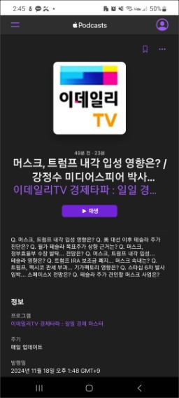

# podcast

역대 최고 편한 앱은 구글 팟캐스트였지만, 이제 android에서도 podcast를 비교적 쉽게 쓸 수 있게 되었음.  
apple이 [웹](https://podcasts.apple.com)에서 팟캐스트를 지원하기 시작했기 때문.

PC 브라우저에서 너무 잘 됨. 제일 편함. playlist 버튼이 바로 보임. playlist에 (전체) 지우기 버튼이 있음. playlist 내에서 순서바꾸기는 안됨.

android에서는 좀 불편해도 여튼 쓸 수 있음.

## web을 app으로 만들기
따로 설명 안함

## app으로 사용할 때 문제점

소리가 나고 있는데 아무리 찾아봐도 재생 창이 안 나타난다.  
재생창에 playlist 버튼이 있기 때문에 재생 창을 찾아야 한다.

## app으로 사용할 때 재생 창 보는 법

화면을 가로로 회전시키면 위에 저렇게 재생 창이 나타난다.

저 빨간 부분을 터치한다.

그럼 이렇게 재생 창이 나타난다. 그런데 여기서 아무리 찾아봐도 playlist 버튼이 안나온다. playlist를 보려면 다시 원래대로 세로로 회전시키면 된다.

** 2024. 12. 1. 추가 **  
1, 2주 전부터 이제 저렇게 회전 회전 하지 않아도 그냥 재생 창이 잘 보인다. 애플이 수정한듯.