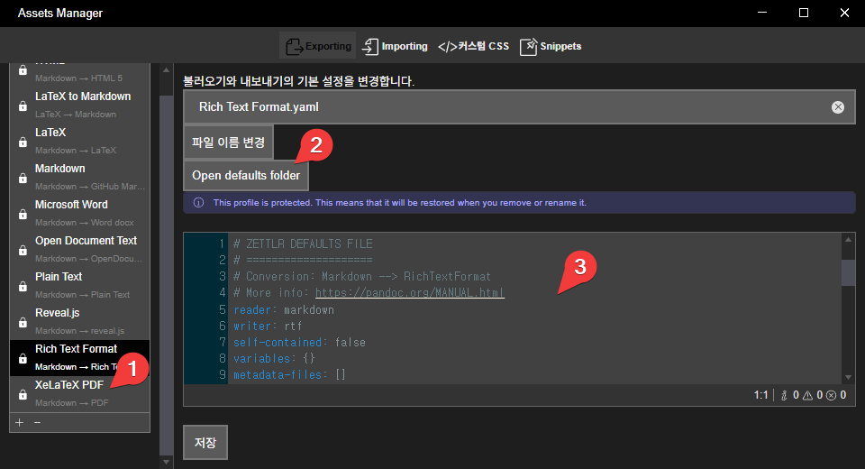

# zettlr

[https://www.zettlr.com](https://www.zettlr.com)

## pdf로 내보내기

### xelatex 설치
[miktex 설치](https://miktex.org/download). 금방 설치함. 

### pdf 파일에 한글 출력하게 만들기 

이거 안 하면 한글 출력이 안되고 그냥 아무 것도 출력 안됨



`파일 > 환경설정 > Asset Manager`를 한 후, 

2와 같이 `Open default folder`를 눌러서 `xelatex.pdf.yaml` 파일을 열어 편집하거나, 

3 부분을 수정한 다음 [저장] 버튼을 눌러준다.

수정할 내용은 다음과 같다. 

```yaml
variables:
  # Sets the size of the document's pages.
  papersize: a4 # Possible values: a0-a6, b0-b6, c0-c6,b0j, letter, executive, legal
  # Further variables are documented here: https://pandoc.org/MANUAL.html#variables-for-latex
  mainfont: "NanumGothic"
```

variables 부분에 NanumGothic을 사용하겠다고설정한다.


### pdf 파일 여백 주기

```yaml
variables:
  # Sets the size of the document's pages.
  papersize: a4 # Possible values: a0-a6, b0-b6, c0-c6,b0j, letter, executive, legal
  # Further variables are documented here: https://pandoc.org/MANUAL.html#variables-for-latex
  mainfont: "NanumGothic"
  geometry: a4paper,margin=2cm
```  

```yaml
geometry: a4paper,margin=2cm
```

여백을 전부 2cm로 주겠다고 했다.


### 이 md 파일은 새 페이지에서 출력하고 싶은 경우

맨 위에 

```
\newpage
```

를 추가한다.

```md
\newpage
# 제목
```

의 식이다.


### -로 시작했는데 리스트가 안되고 한 줄로 나온다. 

```md
- 리스트 내용
- 리스트 내용
```

리스트 내용이 시작하는 줄 바로 위는 비어있어야 한다. 그러니까 한 줄 띄우고 - 를 해야 한다. 

그리고 - 뒤에 꼭 스페이스가 하나 있어야 한다. 

여러 단계 리스트를 만들려면 두 번쨰 depth는 스페이스 2칸 쓰고 - 를 넣어야 한다.