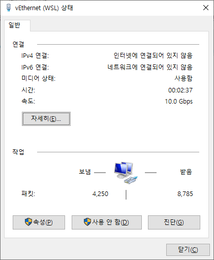
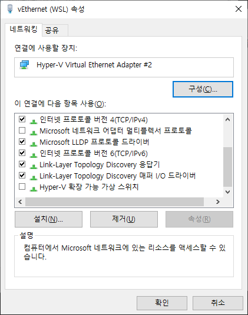
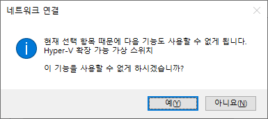
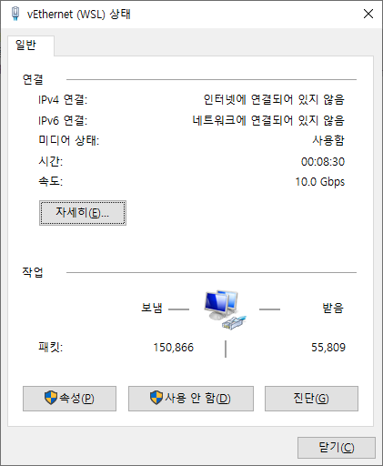

# WSL

## WSL vm에서 인터넷이 안 된다.





맨 아래 `hyper-v 확장 가능 가상 스위치`가 꺼져있다.

이걸 켜면



가 나옴.

Hyper-V 확장 가능 가상 서비스를 켜려고 하는건데.

일단 여기까지만 보고 건드리지는 말고 다른 걸 해보자.


### 문제 해결

다음 방법으로 해결함.

관리자 권한으로 명령 프롬프트 실행한 다음,

```ps
netsh interface ip reset
netsh winsock reset
```
재부팅하고 나니 인터넷 연결이 수동으로 바뀌어서 DHCP로 돌려줘야 했음

그리고 멀티 모니터의 위치 등 설정이 바뀌어 있었음.




그런데 인터넷은 잘 되는데 여전히 인터넷에 연결되어 있지 않다고 나옴.

